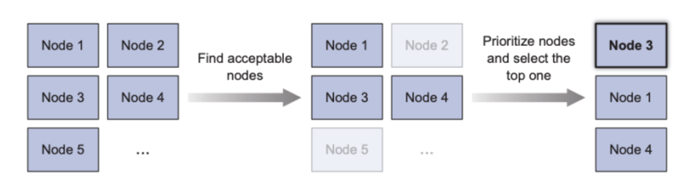

## 목차
- [목차](#목차)
- [쿠버네티스 아키텍쳐](#쿠버네티스-아키텍쳐)
- [컨트롤 플레인(마스터 노드)](#컨트롤-플레인마스터-노드)
  - [etcd](#etcd)
  - [etcd 데이터 조회](#etcd-데이터-조회)
  - [클러스터링된 etcd의 일관성 보장](#클러스터링된-etcd의-일관성-보장)
  - [API 서버](#api-서버)
  - [API 서버 낙관적 잠금](#api-서버-낙관적-잠금)
  - [스케줄러](#스케줄러)
  - [컨트롤러 매니저](#컨트롤러-매니저)
  - [컨트롤러 동작 방식](#컨트롤러-동작-방식)
- [워커 노드](#워커-노드)
  - [kubelet](#kubelet)
  - [kube-proxy](#kube-proxy)
  - [kube-proxy iptables 방식](#kube-proxy-iptables-방식)
- [사례](#사례)
  - [디플로이먼트 생성 시 컴포넌트 동작](#디플로이먼트-생성-시-컴포넌트-동작)


## 쿠버네티스 아키텍쳐


## 컨트롤 플레인(마스터 노드)
컨트롤 플레이은 클러스터 기능을 제어하고 전체 클러스터가 동작하게 만드는 역할을 합니다.
구성 요소는 다음고 같습니다.
- etcd(분산 저장 스토리지)
- API 서버
- 스케줄러
- 컨트롤러 매니저


이 구성요들은 클러스터 상태를 저장하고 관리하지만, 애플리케이션 컨테이너를 직접 실행하진 않습니다.

### etcd
- 클러스터의 모든 정보를 영구히 저장하는 (key, value) 저장소
- 둘 이상(홀수)의 etcd 인스턴스를 실행하여 고가용성을 보장할 수 있음
- 쿠버네티스 구성 요소 중 API를 통해서만 직접적으로 접근 가능
- RAFT 합의 알고리즘 사용

### etcd 데이터 조회
```
# 조회할 파드(default namespace)
NAME                           READY   STATUS    RESTARTS   AGE     IP               NODE               NOMINATED NODE   READINESS GATES
nginx                          1/1     Running   0          124m    172.32.146.127   hkim-host-master   <none>           <none>
```

etcdctl을 사용하여 etcd에 위에서 조회한 파드의 데이터를 조회합니다.([etcdctl](https://etcd.io/docs/v3.4/dev-guide/interacting_v3/))


파드가 etcd에 존재하는지 확인했습니다. 이제 상세 데이터를 조회해봅니다.


### 클러스터링된 etcd의 일관성 보장
고가용성을 보장하기 위해 2개 이상(홀수)의 etcd 인스턴스를 실행하는 것이 일반적입니다.

RAFT 합의 알고리즘을 사용하여, 대다수의 노드가 현재 상태(데이터 일관)를 보장합니다.

RAFT 합의 알고리즘은 다음 상태(데이터 변경)가 되기 위해서는 과반수가 필요합니다.


### API 서버
- 다른 모든 구성 요소와 통신하며 RESTful API를 통해 상태에 대해 CRUD 작업을 수행하며, etcd에 제이터를 저장합니다.
- 두 개 이상의 인스턴스를 실행하여 고가용성 보장할 수 있음


API 서버는 다음과 같은 과정을 진행합니다.

1. 인증 플러그인으로 클라이언트 인증 

먼저 API 서버는 요청을 보낸 클라이언트를 인증합니다. 이 작업은 API 서버에 구성된 하나 이상의 플러그인으로 수행됩니다.
- 인증서(Client Certificate(x509))
- 토큰
- 사용자 이름과 비밀번호(권장 X)


2. 인가 플러그인을 통한 클라이언트 인가

API 서버는 하나 이상의 인가 플러그인을 사용하도록 설정되어 있습니다.(기본은 rbac) 이 작업은 인증된 사용자가 요청한 작업이 리소스에 수행 가능한지 확인합니다.
- ABAC
- RBAC
- Webhook

3. 어드미션 컨트롤 플러그인으로 요청 리소스 확인 및 수정

생성, 수정, 삭제 하려는 요청인 경우 어드미션 컨트롤로 보내지며, 어드미션 컨트롤러에 의해 다음과 같은 기능이 수행됩니다.
- 누락된 필드 기본값으로 생성
- 요청에 없는 관계된 리소스를 수정하거나 요청을 거부

어드미션 컨트롤러 종류는 다음과 같습니다.
- AlwaysPullImages: 파드의 imagePullPolicy를 Always로 변경해 파드가 배포될 때 마다 이미지를 가져오도록 재정의
- ServiceAccount: 명시적으로 서비스어카운트를 지정하지 않은 경우 default 적용
- NamespaceLifecycle: 삭제되는 과정에 있는 네임스페이스와 존재하지 않는 네임스페이스 안에 파드 생성 방지
- LimitRanger: 기본 limitrange가 정의되어 있는 경우, 리소스 요청과 제한을 위반하는지 확인하며, 기본 리소스를 설정

### API 서버 낙관적 잠금
낙관적 잠금은 데이터 변경이 발생할 때 리소스버전(metadata.resourceVersion)이 etcd에 있는 리소스버전과 일치해야 데이터가 변경됩니다.

리로스버전이 일치하지 않은 경우 내용은 거부되고(409 status code)를 반환합니다.

metadata.resourceVersion은 모든 쿠버네티스 리소스에 존재합니다.

### 스케줄러
- 노드가 없는 파드를 찾으면 노드에 파드를 할당
- 파드를 노드에 효율적으로 할당하기 위해 필터링, 스코어링 과정을 거침
- 스케줄러는 파드를 노드에 할당한 후, kubelet이 해당 노드에서 파드를 실행하도록 함



파드의 스케줄링 과정을 그림과 같이 설명합니다.

1. 필터링

모든 노드 중에서 파드를 스케줄링할 수 있는 노드 목록을 필터링합니다. 이 때 찾는 노드의 조건은 다음과 같습니다.
- 노드의 리소스
  - 파드에 리소스 요청이 있는 경우, 해당 리소스를 수용 가능 한가
- 노드가 파드 정의 안에 있는 노드 셀렉터와 일치하는 레이블을 가지고 있는가

2. 스코어링

필터링한 노드 목록 중 우선순위를 정하여 점수가 높은 노드를 선택합니다. 여러 노드가 높은 점수를 가지고 있으면 라운드 로빈 방식으로 고르게 파드가 배포되도록 합니다.

### 컨트롤러 매니저
API 서버는 리소스를 etcd에 저장하고 변경 사항을 클라이언트에 통보하는 것 외에 다른 일은 하지 않습니다.

컨트롤러들은 복잡성을 낮추기 위해 컨트롤러 매니저 프로세스에서 실행됩니다. 각 컨트롤러들은 리소스를 모니터링하고 리소스가 목표 상태를 유지하도록 보장합니다.

컨트롤러의 목록은 다음과 같습니다.
- 레플리카셋, 데몬셋, 잡
- 디플로이먼트
- 스테이트풀셋
- 노드
- 서비스
- 엔드포인트
- 네임스페이스
- 퍼시스턴트

### 컨트롤러 동작 방식
컨트롤러는 API 서버를 감시하며, 리소스가 변경되는 것을 감지하고 작업을 수행합니다. 대부분의 작업은 리소스 생성, 변경, 삭제입니다.


엔드포인트 컨트롤러는 레이블 셀렉터와 일치하는 파드의 IP와 포트로 엔드포인트 리스트를 갱신하는 작업을 수행합니다.

서비스 또는 파드의 정보가 변경된 경우 파드 셀렉터와 일치하는 파드의 IP, 포트 정보를 엔드포인트 리소스에 추가/변경/삭제 합니다. 

이처럼 컨트롤러는 API 서버로 부터 직접적으로 요청을 받는게 아닌 지속적으로 API 서버를 감시하며, 변경을 감지하면 각 리소스에 맞는 컨트롤러가 요청을 작업을 수행합니다.

또한 컨트롤러는 서로 간의 존재를 모르며, kubelet에 직접 명령하지 않습니다.

## 워커 노드

### kubelet
- kubelet은 워커 노드에서 실행하는 모든 것을 담당하는 구성요소
- 노드에 할당된 파드를 감지하면 컨테이너 런타임을 통해 파드의 컨테이너를 실행 하도록 지시 
- 주기적으로 노드의 상태(cpu, 메모리, 디스크)를 API 서버에 보고함
- 실행중인 컨테이너를 계속 모니터링하면서 상태, 이벤트, 리소스 사용량을 API 서버에 보고함
- 라이브니스 프로브를 실행하는 구성 요소이며, 프로브가 실패할 경우 컨테이너를 재시작함

### kube-proxy
- kube-proxy는 클러스터 내외부에서 서비스 IP, 포트로 오는 트래픽을 적절한 파드로 라우팅함
- 이를 통해 서비스가 특정 파드에 종속되지 않고 트래픽이 여러 파드로 분산됨
- 주요 모드는 `userspace`, `iptables` 방식이 있고 현재는 `iptables(기본값)` 방식을 사용

### kube-proxy iptables 방식


API 서버에서 서비스가 생성되거나 변경되면 서비스에 대한 엔드포인트가 생성되고 업데이트됩니다. 이는 서비스와 연결된 파드의 IP와 포트를 포함합니다.

이후 kube-proxy는 API서버로 부터 서비스와 엔드포인트가 변경됨을 감지하여, 해당 정보를 iptables에 업데이트 합니다.

그림의 파드A -> 서비스B 호출이 일어나면 동작은 다음과 같습니다.
1. 목적지는 서비스의 IP와 포트로 지정됩니다.
2. 노드에 설정된 iptables 규칙을 먼저 확인합니다.
3. 서비스B의 파드 중 하나의 파드로 목적지 IP와 포트가 변경됩니다.
4. 목적지 파드로 서비스를 통하지 않고 직접 요청합니다.

## 사례
### 디플로이먼트 생성 시 컴포넌트 동작
디플로이먼트를 생성하면 어떻게 파드가 만들어지고 각 컴포넌트는 어떻게 동작하는지 확인해보겠습니다.


kubectl을 통해 디플로이먼트가 생성되었을 때를 가정합니다.

1. 디플로이먼트 컨트롤러

디플로이먼트 컨트롤러는 API 서버를 감시하며, 디플로이먼트 정의를 이용해 레플리카셋을 생성합니다. 디플로이먼트는 개별 파드 생성에 관여하지 않습니다.

2. 레플리카셋 컨트롤러

레플리카셋 생성을 감지하면, 레플리카셋에 정의된 레플리카 수와 파드 셀렉터가 일치하는 실행 중인 파드를 확인합니다. 그리고 파드 템플릿을 기반으로 파드를 생성합니다.

레플리카 수, 파드 템플릿 정보는 디플로이먼트 컨트롤러가 레플리카셋을 생성할 때 복사합니다.

3. 스케줄러

새로 생성된 파드를 감지하며, 필터링과 스코어링 과정을 거쳐 노드에 파드를 할당합니다.

4. kubelet

kubelet은 API 서버에서 파드 변경 사항을 감지하며, 노드에 스케줄링된 파드를 발견하면 컨테이너 런타임에 파드 컨테이너를 시작하도록 지시합니다.

