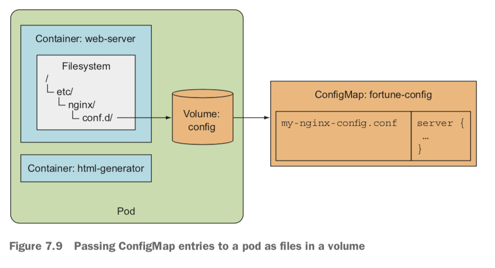
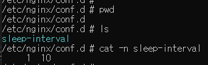

## 목차
- [목차](#목차)
  - [컨테이너에 명령 인수 전달](#컨테이너에-명령-인수-전달)
  - [컨테이너 환경변수 설정](#컨테이너-환경변수-설정)
  - [컨피그맵(ConfigMap)](#컨피그맵configmap)
  - [컨피그맵은 왜 필요할까?](#컨피그맵은-왜-필요할까)
  - [컨피그맵 생성(환경변수)](#컨피그맵-생성환경변수)
  - [컨피그맵 생성(볼륨)](#컨피그맵-생성볼륨)
  - [컨피그맵 파일 권한](#컨피그맵-파일-권한)
  - [애플리케이션을 시작하지 않고 설정 업데이트](#애플리케이션을-시작하지-않고-설정-업데이트)
  - [주의할 점(파드에 존재하지 않는 컨피그맵 참조)](#주의할-점파드에-존재하지-않는-컨피그맵-참조)

### 컨테이너에 명령 인수 전달
쿠버네티스에서 파드 안 컨테이너에 명령과 인자를 전달할 땐 다음과 같은 속성을 정의해서 사용합니다.
```
apiVersion: v1
kind: Pod
metadata:
  name: kimho-pod
spec:
  containers:
    - name: kimho-container
      image: kimo-image
      command: ["/bin/commend"]
      args: ["arg1", "arg2", "arg3"]
```

형식으로 실행할 명령(command), 인수(args)형태로 명령과 인자를 전달할 수 있습니다.

도커로 비유를 하면
- ENTRYPOINT == command : 컨테이너 안에서 실행할 명령
- CMD == args : 명령에 전달될 인자값

실제로 사용한 예시이다.
```

apiVersion: v1
kind: Pod
metadata:
  name: fortune2s
spec:
  containers:
  - image: luksa/fortune:args
    args: ["5"]
    name: html-generator
    volumeMounts:
    - name: html
      mountPath: /var/htdocs
  volumes:
  - name: html
    emptyDir: {}
```
html-generaator 컨테이너는 args로 전달된 인수 간격(초) 마다 특정한 작업을 수행한다. 이런 식으로 파드를 생성할 때 인수를 전달합니다.

### 컨테이너 환경변수 설정
컨테이너 환경에서 환경변수를 설정의 옵션으로 사용하는 경우도 있습니다. 실제로 MySQL 공식 이미지는 슈퍼 루트 사용자 계정의 암호를 `MYSQL_ROOT_PASSWORD` 환경변수 값을 사용합니다.

```
apiVersion: v1
kind: Pod
metadata:
  name: fortune-env
spec:
  containers:
  - image: luksa/fortune:env
    env:
    - name: INTERVAL
      value: "30"
    - name: CURRENT_INTERVAL
      value: "$(INTERVAL) second"
    name: html-generator
    volumeMounts:
    - name: html
      mountPath: /var/htdocs
  volumes:
  - name: html
    emptyDir: {}
```
- spec
  - containers
    - env
      - 컨테이너의 환경 변수에 INTERVAL:30을 설정했다.

컨테이너의 환경변수는 `파드에서 직접 설정하는 것이 아닌 컨테이너를 정의`할 때 직접 설정합니다.
- spec
  - containers
    - env
      - name: CURRENT_INTERVAL
        value: "$(INTERVAL) second"
형식과 같이 이미 정의된 환경변수를 사용하여 다른 환경변수를 재정의 하는 것도 가능하다.

파드를 정의할 때 컨테이너에 `인수, 환경변수`를 하드코딩하여 정의하는 것은 굉장히 위험하다. 쿠버네티스는 이 문제를 해결하기 위해 `컨피그맵` 리소스를 지원한다.

### 컨피그맵(ConfigMap)
애플리케이션을 구성할 때 환경에 따라 변경되는 설정 옵션들은 애플리케이션 소스 코드와 별도로 유지해야 합니다. 쿠버네티스에서는 컨피그맵이라는 별도의 오브젝트 기능을 제공함으로 써 설정 옵션을 애플리케이션과 분리할 수 있습니다.
컨피그맵은 (키, 값) 형태로 `기밀이 아닌` 데이터를 저장되는데 사용하는 API 오브젝트입니다. 
`주의할 점은 컨피그맵은 보안/암호화를 제공하지 않습니다. 만약 컨피그맵에 저장되는 데이터가 노출되면 안되는 경우, 시크릿(Secret) 기능을 사용`해야 합니다.

컨피그맵은 약 1MiB를 초과할 수 없습니다. 이 보다 더 큰 값을 저장해야 하는 경우, 별도로 볼륨을 마운트하거나 별도의 서비스를 이용 해야합니다.

### 컨피그맵은 왜 필요할까?
많은 애플리케이션들은 실행할 때 외부에서 `환경 변수, 설정 파일(toml, yaml)`등을 통해 데이터를 주입받습니다.

컨테이너화된 애플리케이션의 경우 설정 파일을 이미지 안에 포함시키면 어떨까 하지만 이는 이미지에 접근할 수 있으면 설정값을 누구나 볼 수 있기 때문에 설정 파일을 하드코딩 하는 것과 동일한 매우 위험한 행동입니다.
물론 미리 설정 파일을 마운트하여 사용하는 방법도 있지만 이는 컨테이너를 실행하기 전 볼륨을 확인해야하는 과정이 필요합니다.

쿠버네티스는 컨테이너가 각각 설정 파일을 가지는게 아닌 최상위 레벨의 리소스에 이를 저장(etcd)하고 이를 기타 다른 리소스 정의와 같이 파일 스토리지로 저장하는 기능을 제공한다.
이 설정 데이터를 저장하는 리소스를 `컨피그맵`이라고 합니다.
컨피그맵은 다음과 같이 애플리케이션을 구성할 수 있습니다.
- 컨테이너에 명령줄 인수 전달
- 각 컨테이너에 환경변수 설정
- 볼륨을 통해 컨피그맵 파일을 컨테이너에 마운트

### 컨피그맵 생성(환경변수)
```
apiVersion: v1
kind: ConfigMap
metadata:
  name: kimho-config
data:
  sleep-interval: "10"
  ho-key: "ho-value"
```
`kubectl create -f <configmap.yaml>`
이 매니페스트로 간단하게 컨피그맵을 생성할 수 있다.

그리고 이 컨피그 맵을 사용한 매니페스트입니다.
```
apiVersion: v1
kind: Pod
metadata:
  name: fortune-env-from-configmap
spec:
  containers:
  - image: luksa/fortune:env
    env:
    - name: INTERVAL
      valueFrom: 
        configMapKeyRef:
          name: kimho-config
          key: sleep-interval
    name: html-generator
    volumeMounts:
    - name: html
      mountPath: /var/htdocs
  - image: nginx:alpine
    name: web-server
    volumeMounts:
    - name: html
      mountPath: /usr/share/nginx/html
      readOnly: true
    ports:
    - containerPort: 80
      protocol: TCP
  volumes:
  - name: html
    emptyDir: {}
```

여기서
```
env:
- name: INTERVAL
  valueFrom: 
    configMapKeyRef:
      name: kimho-config
      key: sleep-interval
```
이 부분을 보면 `kimho-config` 컨피그맵에서 sleep-interval 키를 가지는 값을 INTERVAL 환경변수로 생성한다는 의미입니다.

```
spce:
  containers:
  - image: nginx
    envFrom:
      - prefix: CONFIG_
      configMapRef:
        name: kimho-config
```
컨피그맵에 있는 모든 값들을 prefix를 통해 `CONFIG_<KEY>` 형식으로 할당할 수 있습니다.

이렇게 `컨피그맵을 통해 컨테이너의 환경변수에 값을 할당`할 수 있습니다.

### 컨피그맵 생성(볼륨)
매니페스트 정의에서 명령으로 설정 옵션을 전달할 수 있습니다.
```
spec:
  containers:
  - image: luksa/fortune:env
    env:
    - name: INTERVAL
      valueFrom: 
        configMapKeyRef:
          name: kimho-config
          key: sleep-interval
    args: ["$(INTERVAL)]
```
방식과 같이 정의한 환경변수를 바로 명령어의 인수로 전달할 수 있습니다.

환경변수 그리고 명령 인자로 옵션 전달하는 방법도 있지만 `많은 데이터를 매니페스트 파일에 정의`하는건 쉽지 않습니다.

그래서 컨피그맵은 볼륨을 사용하여 파일의 형태로 설정 파일을 컨테이너에 전달할 수 있습니다.

먼저 그림을 봅니다.


nginx는 기본적으로 `/etc/nginx/nginx.conf` 파일의 설정을 읽는다. 그리고 기본 설정 파일은 `/etc/nginx/conf.d/` 안에 .conf파일을 모두 포함하기 때문에 원하는 설정값이 있는 경우 /etc/nginx/conf.d/안에 .conf 파일로 넣어두면된다.
그래서 컨피그맵에 있는 설정 값을 볼륨을 통해 원하는 위치에 마운트합니다.

```
apiVersion: v1
kind: Pod
metadata:
  name: fortune-configmap-volume
spec:
  containers:
  - image: luksa/fortune:env
    env:
    - name: INTERVAL
      valueFrom:
        configMapKeyRef:
          name: fortune-config
          key: sleep-interval
    name: html-generator
    volumeMounts:
    - name: html
      mountPath: /var/htdocs
  - image: nginx:alpine
    name: web-server
    volumeMounts:
    - name: html
      mountPath: /usr/share/nginx/html
      readOnly: true
    - name: config
      mountPath: /etc/nginx/conf.d
      readOnly: true
    - name: config
      mountPath: /tmp/whole-fortune-config-volume
      readOnly: true
    ports:
      - containerPort: 80
        name: http
        protocol: TCP
  volumes:
  - name: html
    emptyDir: {}
  - name: config
    configMap:
      name: fortune-config
```
맨 아래를 보면
- volumes
  - name
    - configMap
      - name: <config-map-name>
이 설정을 통해 
sleep-interval: "10" 값을 가지고 있는 볼륨을 설정 `config` 라는 이름으로 설정합니다.

- VolumeMounts
  - name
    - mountPath
      - /etc/nginx/conf.d
      - /tmp/whole-fortune-config-volume
      - 위치에 `config` 컨피그맵을 마운트합니다.
 

`kubectl.exe exec fortune-configmap-volume -c web-server -it -- /bin/sh` 해당 컨테이너로 접속 후 경로를 확인해보면



실제 두 경로중 한 곳을 보면 컨피그맵 파일이 파일의 형태로 마운트 되었다.

### 컨피그맵 파일 권한
컨피그맵 볼륨의 모든 파일들은 644의 권한을 가집니다.
```
  volumes:
  - name: html
    emptyDir: {}
  - name: config
    configMap:
      name: fortune-config
      defaultMode: "6600"
```
같이 임의로 파일의 권한을 수정할 수 있습니다.

### 애플리케이션을 시작하지 않고 설정 업데이트
환경변수나 인수로 전달하는 것은 애플리케이션이 실핼중이면 값을 업데이트할 수 없습니다.

컨피그맵을 사용해서 볼륨으로 노출하면 파드를 다시 만들거나 컨테이너를 다시 시작할 필요 없이 설정을 업데이트할 수 있습니다. `컨피그맵이 수정되면, 컨피그맵을 사용하는 모든 볼륨의 파일은 업데이트`됩니다. 이후 설정이 변경된걸 감지하고 다시 프로세스가 재실행 하는 것은 프로세스에 따라 다릅니다.

쿠버네티스에서 컨피그맵이 변경된 경우, 애플리케이션을 자동으로 다시 시작하게 하려면 다음과 같은 방법을 사용해야 합니다.
1. sidecar 컨테이너 패턴 사용

설정 변경을 감시하는 별도의 컨테이너를 배치하여, 설정이 변경된 경우 컨테이너를 재시작하게 합니다.

2. configMap 변경 시, 파드 재시작

가장 사용을 많이 하는 방법으로 설정이 변경되면 해당 파드를 재시작하도록 하는 것입니다. 파드가 생성되고 컨테이너가 다시 실행하면서 변경된 설정값을 불러옵니다.

### 주의할 점(파드에 존재하지 않는 컨피그맵 참조)
파드를 생성할 때, 존재하지 않는 컨피그맵을 지정하면, 해당 컨테이너를 시작할 때 실패하게 됩니다.
하지만 존재하는 컨피그맵을 참조하거나, 참조하지 않는 다른 컨테이너는 정상적으로 실행합니다. 그래서 컨피그맵이 참조되는지 확인이 필요합니다.

물론 `configMapKeyRef.optional: true`로 설정하면 컨피그맵을 참조하지 못해도 컨테이너가 실행할 수 있지만 이는 많은 문제를 불러올 수 있습니다.

