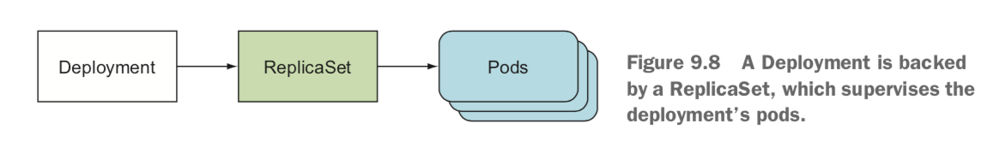
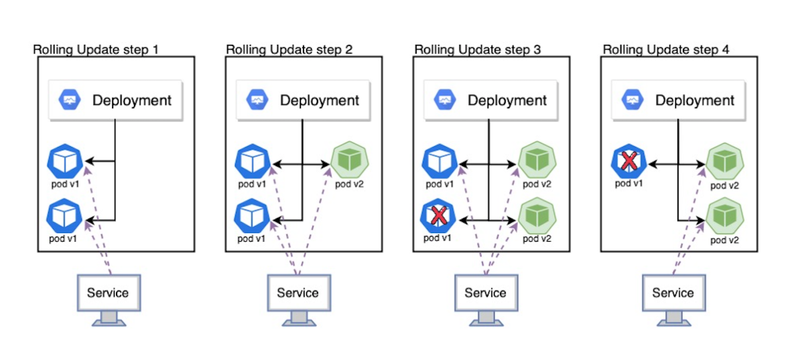
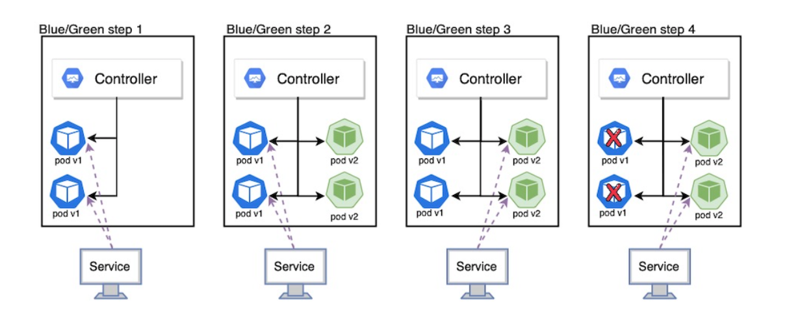

## 디플로이먼트

### 디플로이먼트
디플로이먼트는 애플리케이션을 배포하고 파드와 레플리카셋에 대한 `선언적 업데이트`를 제공합니다.

선언적 업데이트는 `사용자가 의도하는(원하는) 상태`를 달성하기 위해 필요한 모든 작업을 자동으로 수행하는걸 의미합니다.

의도하는 상태는 다음과 같은 요소들입니다.
- 레플리카 수: 몇 개의 파드가 실행되어야 하는 것을 의미합니다.
- 컨테이너 이미지: 어떤 이미지가 사용되어야 하는 것을 의미합니다.
- 업데이트 전략: 새로운 버전을 어떻게 업데이트 할 것인지를 의미합니다.

사용자는 의도하는 상태를 정의하고, 디플로이먼트 컨트롤러는 현재 상태를 모니터링하며 의도하는 상태를 유지합니다.



그림과 같이, 디플로이먼트가 생성되면 레플리카셋이 생성되고, 이어서 파드가 생성이 됩니다.

### 디플로이먼트 생성
직접 디플로이먼트를 생성하고 조회합니다.

```YAML
apiVersion: apps/v1
kind: Deployment
metadata:
  name: nginx-deployment
  labels:
    app: nginx
spec:
  replicas: 3
  selector:
    matchLabels:
      app: nginx
  template:
    metadata:
      labels:
        app: nginx
    spec:
      containers:
      - name: nginx
        image: nginx:1.14.2
        ports:
        - containerPort: 80
```
매니페스트 파일에서 각 옵션에 대한 설명입니다.

- .spec
  - replicas
    - 디플로이먼트는 N개의 파드를 가지는 레플리카셋을 생성합니다. 즉 생성 될 파드의 수 입니다.
  - selector
    - matchLabels
      - 생성된 레플리카셋이 관리할 파드를 선택하는 방법을 정의합니다.
      - 이 규칙은 파드의 레이블을 기반으로 합니다.
  - template
    - metadata
      - labels
        - 생성될 파드에 추가할 레이블입니다.
    - spec
      - containers(생성될 파드의 템플릿)
        - name
          - 생성될 파드의 이름입니다.
        - image
          - 생성될 파드의 이미지입니다.
        - ports:
          - containerPort
            - 컨테이너가 사용할 포트입니다.


```
# 디플로이먼트 조회
# kubectl get deployment
NAME               READY   UP-TO-DATE   AVAILABLE   AGE
nginx-deployment   3/3     3            3           23s
```
- Name: 디플로이먼트의 이름
- READY: 사용자가 사용할 수 있는 애플리케이션 레플리카의 수 필드는 `ready(사용자가 사용할 수 있는 준비된 파드 수) / desired(디플로이먼트에서 의도한 파드 수)` 패턴을 따릅니다.
- UP-TO-DATE: 의도한 상태를 얻기 위해 업데이트된 레플리카의 수
  - 디플로이먼트에서 최신 상태를 반영하기 위해 업데이트된 파드의 수 입니다.
  - 의도한 레플리카가 3개이고 이 값이 3이면 모든 파드는 최신 상태를 의미합니다.
  - 최신 상태를 반영하는 레플리카의 수지만 해당 레플리카가 준비 상태가 아니어도 최신 템플릿이 사용되면 카운트 됩니다.
- AVAILABLE: 사용자가 사용할 수 있는 애플리케이션 레플리카의 수
  - 종료 중인 레플리카의 수는 포함하지 않습니다.

```
# 레플리카셋 조회
# kubectl get replicaset
NAME                         DESIRED   CURRENT   READY   AGE
nginx-deployment-cbdccf466   3         3         3       95s
```
- NAME: 레플리카셋의 이름입니다.
  - 레플리카셋의 이름은 항상 `<디플로이먼트이름>-HASH` 형식으로 되어있습니다.
  - HASH 문자열은 레플리카셋과 파드의 `pod-template-hash` 레이블과 같습니다.
- DESIRED: 디플로이먼트에서 원하는 레플리카의 수 입니다.
- CURRENT: 현재 실행중인 레플리카의 수 입니다.
- READY: 사용자가 사용할 수 있는 애플리케이션 레플리카의 수 입니다.
  - 사용할 수 있는 애플리케이션 레플리카는 `프로브`를 통과하여 요청을 수행할 수 있는 컨테이너를 의미합니다.

```
# 파드 조회
# kubect get pod
NAME                               READY   STATUS      RESTARTS          AGE
nginx-deployment-cbdccf466-6nfh2   1/1     Running     0                 116s
nginx-deployment-cbdccf466-7l782   1/1     Running     0                 116s
nginx-deployment-cbdccf466-dq5ft   1/1     Running     0                 116s
```
- NAME: 파드의 이름입니다.
  - 파드의 이름은 항상 `<디플로이먼트이름>-<pod-template-hash>-HASH` 형식으로 되어있습니다.
- READY: 파드 내에서 사용자가 사용할 수 있는 컨테이너의 수 입니다. `ready/total` 형식으로 되어 있습니다.
- STATUS: 파드의 상태입니다.

### 롤아웃
디플로이먼트에서 롤아웃은 애플리케이션의 새로운 버전이 배포되거나 구성 변경을 반영하기 위해 기존 파드를 새로운 파드로 교체하는 과정을 의미합니다. 

디플로이먼트의 `파드 템플릿(.spec.template)이 변경된 경우에만`(레이블 또는 컨테이너 이미지가 변경된 경우) 디플로이먼트의 `롤아웃이 트리거`됩니다. 하지만 `스케일링(레플리카 수 변경) 업데이트는 롤아웃을 트리거 하지 않습`니다.

### 디플로이먼트 업데이트

**1. 롤아웃 및 롤아웃 기록 확인**

```
# 롤아웃이 트리거됨(파드 템플릿 수정)
kubectl set image deployment nginx-deployment nginx=nginx:1.16.1

# 롤아웃 상태 확인
kubectl rollout status deployment <deployment 이름>
```
파드 템플릿의 이미지를 수정하면 롤아웃이 트리거됩니다. 위의 명령어를 입력하면 롤아웃이 트리거되며, 실제 실행한 결과입니다.

```
Waiting for deployment "nginx-deployment" rollout to finish: 1 out of 3 new replicas have been updated...
Waiting for deployment "nginx-deployment" rollout to finish: 1 out of 3 new replicas have been updated...
Waiting for deployment "nginx-deployment" rollout to finish: 1 out of 3 new replicas have been updated...
Waiting for deployment "nginx-deployment" rollout to finish: 2 out of 3 new replicas have been updated...
Waiting for deployment "nginx-deployment" rollout to finish: 2 out of 3 new replicas have been updated...
Waiting for deployment "nginx-deployment" rollout to finish: 2 out of 3 new replicas have been updated...
Waiting for deployment "nginx-deployment" rollout to finish: 1 old replicas are pending termination...
Waiting for deployment "nginx-deployment" rollout to finish: 1 old replicas are pending termination...
deployment "nginx-deployment" successfully rolled out
```
3개의 레플리카중 1개씩 천천히 진행하며 완료되었다는 메시지를 확인할 수 있습니다.

```
Events:
  Type    Reason             Age    From                   Message
  ----    ------             ----   ----                   -------
  Normal  ScalingReplicaSet  49m    deployment-controller  Scaled up replica set nginx-deployment-cbdccf466 to 3
  Normal  ScalingReplicaSet  3m29s  deployment-controller  Scaled up replica set nginx-deployment-74b6b979f to 1
  Normal  ScalingReplicaSet  3m17s  deployment-controller  Scaled down replica set nginx-deployment-cbdccf466 to 2 from 3
  Normal  ScalingReplicaSet  3m17s  deployment-controller  Scaled up replica set nginx-deployment-74b6b979f to 2 from 1
  Normal  ScalingReplicaSet  3m4s   deployment-controller  Scaled down replica set nginx-deployment-cbdccf466 to 1 from 2
  Normal  ScalingReplicaSet  3m4s   deployment-controller  Scaled up replica set nginx-deployment-74b6b979f to 3 from 2
  Normal  ScalingReplicaSet  3m3s   deployment-controller  Scaled down replica set nginx-deployment-cbdccf466 to 0 from 1
```
디플로이먼트의 이벤트를 통해서도 확인할 수 있습니다.

롤아웃에 대한 기록을 조회하려면 `kubectl rollout history` 명령어를 사용합니다.
```
#kubectl rollout history deployment <deployment 이름>
deployment.apps/nginx-deployment
REVISION  CHANGE-CAUSE
1         <none>
2         <none>
```
- REVISION: 디플로이먼트의 변경 버전입니다. 업데이트될 때 마다 1씩 증가합니다.
- CHANGE-CAUSE: 디플로이먼트 변경 원인을 설명하는 주석입니다.
  - kubernetes.io/change-cause="업데이트 내용" 이렇게 명시하고 롤아웃을 진행하면 내용이 기록됩니다.

```
kubectl annotate deployment nginx-deployment kubernetes.io/change-cause="업데이트 내용"
REVISION  CHANGE-CAUSE
11        nginx 1.15.1
12        nginx 1.17.1
```
직접 어노테이션을 추가하여 CHANGE-CAUSE에 기록되는지 확인한 결과입니다.

```
deployment.apps/nginx-deployment with revision #12
Pod Template:
  Labels:       app=nginx
        pod-template-hash=5bb75b59c4
  Annotations:  kubernetes.io/change-cause: nginx 1.17.1
  Containers:
   nginx:
    Image:      nginx:1.17.1
    Port:       80/TCP
    Host Port:  0/TCP
    Environment:        <none>
    Mounts:     <none>
  Volumes:      <none>
```
`kubectl rollout history deploy nginx-deployment --revision=<revision 값>` 명령을 수행하여 리비전 별 상세한 값을 확인할 수 있습니다.

2. **롤아웃 시, 레플리카셋**

디플로이먼트가 롤아웃을 진행하면 새 레플리카셋을 생성하여 레플리카 수 만큼 레플리카를 `스케일 업` 하고, 이전 레플리카셋을 0개로 `스케일 다운`합니다.

```
kubectl get rs
NAME                          DESIRED   CURRENT   READY   AGE
nginx-deployment-55865595d4   0         0         0       14m
nginx-deployment-5bb75b59c4   3         3         3       25m
nginx-deployment-5cf6fcbc8f   0         0         0       14m
nginx-deployment-6987dfc6bf   0         0         0       17m
nginx-deployment-74b6b979f    0         0         0       32m
nginx-deployment-cbdccf466    0         0         0       77m
```
롤아웃되면 레플리카셋이 새로 생기고 기존 레플리카는 0으로 스케일 다운됩니다.

그리고 이전 레플리카셋은 `.spec.temterminationGracePeriodSeconds` 값을 설정하여 유지할 리비전, 레플리카셋 수를 설정할 수 있습니다.

이 값은 생략할 시 기본 10으로 설정되며, 설정된 값 만큼 최근의 정보를 저장합니다. 만약 11번째 롤아웃이 진행되면 1 번째로 지정한 리비전, 레플리카셋은 삭제됩니다.

### 디플로이먼트 롤백
디플로이먼트를 롤아웃 중에 문제가 발생하면, 이전 상태로 되돌리고 싶을 때 디플로이먼트를 롤백할 수 있습니다. 

임의로 잘못된 이미지로 롤아웃을 진행해보겠습니다.
```
kubectl set image deployment nginx-deployment nginx=nginx:1.161 
```
실행하고 나서 임플로이먼트 파드, 레플리카셋 조회를 합니다.
```
# 디플로이먼트
NAME               READY   UP-TO-DATE   AVAILABLE   AGE
nginx-deployment   3/3     1            3           98m

# 레플리카셋
NAME                          DESIRED   CURRENT   READY   AGE
nginx-deployment-5bb75b59c4   3         3         3       47m
nginx-deployment-c87494649    1         1         0       5m4s

# 파드
NAME                                READY   STATUS             RESTARTS   AGE
nginx-deployment-5bb75b59c4-76cd5   1/1     Running            0          4m49s
nginx-deployment-5bb75b59c4-hwhlq   1/1     Running            0          4m49s
nginx-deployment-5bb75b59c4-kkdwz   1/1     Running            0          4m49s
nginx-deployment-c87494649-db7k7    0/1     ImagePullBackOff   0          4m49s

# 롤아웃 상태
Waiting for deployment "nginx-deployment" rollout to finish: 1 out of 3 new replicas have been updated...
```
현재 상황 롤아웃 중 잘못된 이미지로 인하여 파드가 계속 실패 상태(ImagePullBackOff)에 있습니다.

디플로이먼트
- READY: 3/3
  - 현재 3개의 파드(기존)가 준비상태에 있으며, 의도한 파드 수 도 3개입니다.
- UP-TO-DATE: 1
  - 최신 상태로 업데이트 된 파드의 수는 1개입니다. 새롭게 생긴 레플리카셋에 의해 관리가 되는 파드로 실패 상태에 있지만 최신 템플릿을 사용하여 카운트됩니다.
- AVAILABLE: 3
  - 사용 가능한 파드의 수 입니다.

레플리카셋
- nginx-deployment-5bb75b59c4(이전 레플리카셋)
  - DESIRED, CURRENT, READY 모두 3개로 정상동작 하고 있습니다.
- nginx-deployment-c87494649(새롭게 생긴 레플리카셋)
  - DESIRED: 1
    - 1개의 파드로 설정되어 있습니다. 롤아웃을 진행하며, 스케일 업을 하지만 파드에 문제가 있어서 진행되지 않고 있습니다.
  - CURRENT: 1
    - 현재 동작중인 실행중인 레플리카 수는 1개입니다.
  - READY: 0
    - 사용자의 사용할 수 있는 레플리카가 없으므로 0개입니다.

파드
- nginx-deployment-5bb75b59c4(이전)
  - 이전 파드 3개가 정상적으로 실행되고 있습니다.
- nginx-deployment-c87494649(새롭게 생긴 파드)
  - 이미지에 문제가 있어 컨테이너가 시작되지 않고 있습니다.
  
이 과정에서 `디플로이먼트 컨트롤러는 새로운 파드를 생성하는 과정에서 문제가 발생하면 이를 감지하고, 잘못된 롤아웃을 자동으로 중지`합니다.

문제라고 판단되는 요인은 다음과 같습니다.
- 할당량 부족
- 준비성 프로브(readiness probe)의 실패
- 이미지 풀 에러
- 애플리케이션 런타임의 잘못된 구성

디플로이먼트 컨트롤러는 지수 백오프 방식으로 다시 재시도 요청을 하며, `spec.progressDeadlineSeconds`(기본 10분) 시간이 지나면 롤아웃을 실패로 간주하고 중지합니다.


이전 버전으로 롤백하는 방법은 다음과 같습니다. 롤백도 rollout history에 기록됩니다.
```
# 현재 롤아웃 취소 및 이전 버전으로 롤백
kubectl rollout undo deployment <nginx-deployment>

# 특정 리비전으로 롤백
kubectl rollout undo deployment <nginx-deployment> --to-revision=2
```

### 디플로이먼트 스케일 아웃
디플로이먼트는 스케일링으로 파드의 수를 변경할 수 있습니다.

```
kubectl scale deployment nginx-deployment --replicas=8

# 디플로이먼트
kubectl.exe get deploy nginx-deployment
NAME               READY   UP-TO-DATE   AVAILABLE   AGE
nginx-deployment   8/8     8            8           141m

# 레플리카셋
NAME                         DESIRED   CURRENT   READY   AGE
nginx-deployment-74b6b979f   8         8         8       96m

# 파드
NAME                               READY   STATUS    RESTARTS   AGE
nginx-deployment-74b6b979f-7s8kr   1/1     Running   0          4m1s
nginx-deployment-74b6b979f-b5djt   1/1     Running   0          4m1s
nginx-deployment-74b6b979f-cvxc7   1/1     Running   0          4m1s
nginx-deployment-74b6b979f-d42xc   1/1     Running   0          7m35s
nginx-deployment-74b6b979f-kmd64   1/1     Running   0          7m38s
nginx-deployment-74b6b979f-pml8w   1/1     Running   0          4m1s
nginx-deployment-74b6b979f-qpg2g   1/1     Running   0          7m37s
nginx-deployment-74b6b979f-v8rxl   1/1     Running   0          4m1s
```

파드의 개수가 8개로 늘어난걸 확인할 수 있습니다.

만약 스케일링 중 리소스가 부족하여 새로 파드를 생성할 수 없는 경우, 새로 생성될 파드들은 `pending` 상태로 남게되며, 리소스가 확보될 때 까지 주기적으로 파드를 생성하려고 시도합니다.

### 디플로이먼트 상태
디플로이먼트는 라이프사이클 동안 다양한 상태로 전환됩니다.

1. 진행중
   
디플로이먼트 상태가 진행중인 경우 다음중 하나를 수행하고 있습니다.
- 새 레플리카셋 생성
- 기존 레플리카셋 스케일링
- 파드가 새롭게 생성되어 준비 상태로 변환

디플로이먼트가 진행중일 때, `.status.condition`에는 다음과 같은 컨디션이 추가됩니다.

```
type: Progressing
status: "True"
reason: NewReplicaSetCreated | FoundNewReplicaSet | ReplicaSetUpdated
```

2. 진행 완료

디플로이먼트가 완료 상태가 되기 위한 조건은 다음과 같습니다.
- 모든 레플리카가 지정된 최신 버전으로 업데이트됨
- 모든 레플리카가 사용할 수 있음
- 이전 복제본이 실행되지 않음

디플로이먼트가 완료되면 `.status.condition`에 다음과 같은 컨디션이 추가됩니다.
```
type: Progressing
status: "True"
reason: NewReplicaSetAvailable
```

실제 조회한 경우 아래와 같이 나옵니다.
```YAML
status:
  conditions:
    message: ReplicaSet "nginx-deployment-74b6b979f" has successfully progressed.
    reason: NewReplicaSetAvailable
    status: "True"
    type: Progressing
```

3. 실패
디플로이먼트가 실패 상태가 될 수 있는 요인은 아래와 같습니다.
- 할당량 부족
- 준비성 프로브(readiness probe)의 실패
- 이미지 풀 에러
- 애플리케이션 런타임의 잘못된 구성

디플로이먼트 컨트롤러는 지수 백오프 방식으로 다시 재시도 요청을 하며, `spec.progressDeadlineSeconds`(기본 10분) 시간이 지나면 디플로이먼트가 실패 상태로 롤아웃을 중지합니다.

### 디플로이먼트 배포 전략
쿠버네티스 디플로이먼트 배포 전략은 여러 가지가 있으며, 각 전략은 `애플리케이션을 중단 없이 또는 최소한의 중단으로 업데이트할 수 있도록` 도움을 줍니다. 주요 배포 전략으론 롤링 업데이트, 블루 그린, 카나리 배포가 있습니다.

1. 롤링 업데이트

롤링 업데이트는 쿠버네티스의 기본 배포 전략입니다.

새 버전의 파드를 점진적으로 배포하고, 기존 파드를 하나씩 교체하는 방식으로 진행합니다.



동작 방식은 다음과 같습니다.
1. 새로운 파드 생성
2. 기존 파드 삭제
3. 위 과정을 반복합니다.

장점
- 새로운 버전이 생성된 후, 과거 버전의 파드가 삭제되므로 서비스의 중단이 없습니다.
- 업데이트를 진행하며 배포를 계속를 진행할 수 있습니다.
- 설정된 레플리카를 초과하는 파드의 수가 일시적으로 생성될 수 있습니다.

단점
- 새로운 버전과 과거 버전이 둘 다 요청됩니다.
- 이전 버전과 호환되지 않으면 배포할 수 없습니다.

```YAML
apiVersion: apps/v1
kind: Deployment
metadata:
  name: nginx-deployment
spec:
  replicas: 10
  strategy:
    type: RollingUpdate
    rollingUpdate:
      maxUnavailable: 2
      maxSurge: 3
  template:
    metadata:
      labels:
        app: nginx
    spec:
      containers:
      - name: nginx
        image: nginx:1.16.1
```

- spec
  - strategy
    - type: RollingUpdate
      - 배포 전략을 설정합니다.
    - rollingUpdate
      - maxUnavailable:2 (기본값 25%)
        - 롤링업데이트 프로세스 중 사용할 수 없는 최대 파드의 수 입니다.
        - `동시에 삭제할 수 있는 파드의 최대 개수`를 의미합니다.
        - 정수 또는 비율을 입력합니다. ex) 3 or 20%
      - maxSurge
        - 롤링업데이트 중 추가로 생성할 수 있는 최대 파드의 수 (기본값 25%)
        - 정수 또는 비율을 입력합니다. ex) 3 or 20%

실제 실행한 이벤트 입니다.
```
Events:
  Type    Reason             Age                From                   Message
  ----    ------             ----               ----                   -------
  Normal  ScalingReplicaSet  115s               deployment-controller  Scaled up replica set nginx-deployment-65b96545dd to 10
  Normal  ScalingReplicaSet  68s                deployment-controller  Scaled up replica set nginx-deployment-5fbbcd4996 to 3
  Normal  ScalingReplicaSet  68s                deployment-controller  Scaled down replica set nginx-deployment-65b96545dd to 8 from 10
  Normal  ScalingReplicaSet  68s                deployment-controller  Scaled up replica set nginx-deployment-5fbbcd4996 to 5 from 3
  Normal  ScalingReplicaSet  39s                deployment-controller  Scaled down replica set nginx-deployment-65b96545dd to 7 from 8
  Normal  ScalingReplicaSet  39s                deployment-controller  Scaled up replica set nginx-deployment-5fbbcd4996 to 6 from 5
  Normal  ScalingReplicaSet  38s                deployment-controller  Scaled down replica set nginx-deployment-65b96545dd to 6 from 7
  Normal  ScalingReplicaSet  38s                deployment-controller  Scaled up replica set nginx-deployment-5fbbcd4996 to 7 from 6
  Normal  ScalingReplicaSet  36s                deployment-controller  Scaled down replica set nginx-deployment-65b96545dd to 5 from 6
  Normal  ScalingReplicaSet  12s (x8 over 36s)  deployment-controller  (combined from similar events): Scaled down replica set nginx-deployment-65b96545dd to 0 from 1
  ```
  
  동작은 다음과 같습니다.
- 첫 번째 동작
  - 새로운 레플리카셋이 3개의 파드로 확장
  - 기존 레플리카셋 8개로 축소
- 두 번째 동작
  - 새로운 레플리카셋 5개로 확장
  - 기존 레플리카셋 7개로 축소
- 세 번째 동작
  - 새로운 레플리카셋 6개로 확장
  - 기존 레플리카셋 6개로 축소
- 이후 동작
  - 새로운 레플리카셋 1개씩 확장
  - 기존 레플리카셋 1개씩 축소

과정으로 진행된 이벤트를 확인할 수 있습니다.

2. 블루/그린 배포

블루 그린 배포는 두개의 환경(기존, 새로운 버전)을 사용하여 배포하는 전략입니다.

현재 활성화된 버전 블루(기존) 환경에 배포되어 있고, 그린(새로운 버전) 환경에 배포가 된 후 요청을 그린 쪽으로 전환합니다. 



동작 방식
1. 블루 환경: 현재 실행중인 버전이 배포된 환경입니다.
2. 그린 환경: 새로운 버전의 버전이 배포된 환경입니다.
3. 서비스 전환: 트래픽을 블루 환경에서 그린 환경으로 전환합니다.

장점
- 서비스의 중단이 없습니다.
- 문제가 생긴 경우 롤백을 빠르게 할 수 있습니다.
- 새롭게 배포된 그린환경에 대해 테스트 등 안정적인 버전인지 확인할 수 있습니다.
단점
- 두 개의 배포 환경을 가지므로 2배의 리소스가 필요합니다.

```YAML
# 블루 디플로이먼트
apiVersion: apps/v1
kind: Deployment
metadata:
  name: nginx-deployment-blue
  labels:
    app: nginx
    version: blue
spec:
  replicas: 10
  selector:
    matchLabels:
      app: nginx
      version: blue
  template:
    metadata:
      labels:
        app: nginx
        version: blue
    spec:
      containers:
      - name: nginx
        image: nginx:1.16.1
--
# 그린 디플로이먼트
apiVersion: apps/v1
kind: Deployment
metadata:
  name: nginx-deployment-green
  labels:
    app: nginx
    version: green
spec:
  replicas: 10
  selector:
    matchLabels:
      app: nginx
      version: green
  template:
    metadata:
      labels:
        app: nginx
        version: green
    spec:
      containers:
      - name: nginx
        image: nginx:1.17.0
--
# 서비스 (블루 -> 그린 전환)
apiVersion: v1
kind: Service
metadata:
  name: nginx-service
spec:
  selector:
    app: nginx
    version: blue
  ports:
  - port: 80
    targetPort: 80
```

배포 과정
1. 블루 환경 배포 및 서비스 배포
2. 그린 환경 배포
3. 서비스의 셀렉터 `version:blue`를 green으로 수정하여 트래픽이 그린으로 가도록 변경
4. 필요 시 롤백

```
# 디플로이먼트
NAME                     READY   UP-TO-DATE   AVAILABLE   AGE
nginx-deployment-blue    10/10   10           10          3m50s
nginx-deployment-green   10/10   10           10          3m47s

# 레플리카셋
NAME                                DESIRED   CURRENT   READY   AGE
nginx-deployment-blue-65dd6789db    10        10        10      4m11s
nginx-deployment-green-6465f5897c   10        10        10      4m8s

# 파드
NAME                                      READY   STATUS    RESTARTS   AGE     IP               NODE               NOMINATED NODE   READINESS GATES
nginx-deployment-blue-65dd6789db-5k79g    1/1     Running   0          7m35s   172.32.146.118   hkim-host-master   <none>           <none>
nginx-deployment-blue-65dd6789db-79qnc    1/1     Running   0          7m35s   172.32.103.57    hkim-host-node     <none>           <none>
nginx-deployment-blue-65dd6789db-84tb6    1/1     Running   0          7m35s   172.32.103.13    hkim-host-node     <none>           <none>
nginx-deployment-blue-65dd6789db-k4rl8    1/1     Running   0          7m35s   172.32.146.97    hkim-host-master   <none>           <none>
nginx-deployment-blue-65dd6789db-mz4nx    1/1     Running   0          7m35s   172.32.146.82    hkim-host-master   <none>           <none>
nginx-deployment-green-6465f5897c-8nw8q   1/1     Running   0          7m32s   172.32.146.94    hkim-host-master   <none>           <none>
nginx-deployment-green-6465f5897c-8rpr9   1/1     Running   0          7m32s   172.32.103.56    hkim-host-node     <none>           <none>
nginx-deployment-green-6465f5897c-9nv6c   1/1     Running   0          7m32s   172.32.146.114   hkim-host-master   <none>           <none>
nginx-deployment-green-6465f5897c-f5mdl   1/1     Running   0          7m32s   172.32.103.46    hkim-host-node     <none>           <none>
nginx-deployment-green-6465f5897c-fpl5m   1/1     Running   0          7m32s   172.32.103.55    hkim-host-node     <none>           <none>

# 서비스
NAME                  TYPE           CLUSTER-IP       EXTERNAL-IP   PORT(S)                  AGE 
nginx-service         ClusterIP      10.97.195.48     <none>        80/TCP                   17s 

# 엔드포인트
NAME                  ENDPOINTS                                                        AGE
nginx-service         172.32.103.12:80,172.32.103.13:80,172.32.103.3:80 + 7 more...    116s
```

현재 서비스는 블루로 되어 있습니다.
```
kubectl patch service nginx-service -p '{"spec":{"selector":{"app":"nginx","version":"green"}}}'
```
명령을 통해 `version:green`으로 서비스의 셀렉터를 변경합니다.

```
# 엔드포인트
NAME                  ENDPOINTS                                                        AGE
nginx-service         172.32.103.46:80,172.32.103.55:80,172.32.103.56:80 + 7 more...   2m56s
```

ip를 보니 green에 `172.32.103.55`가 있습니다. 그린쪽으로 서비스가 변경된 걸 확인할 수 있습니다.