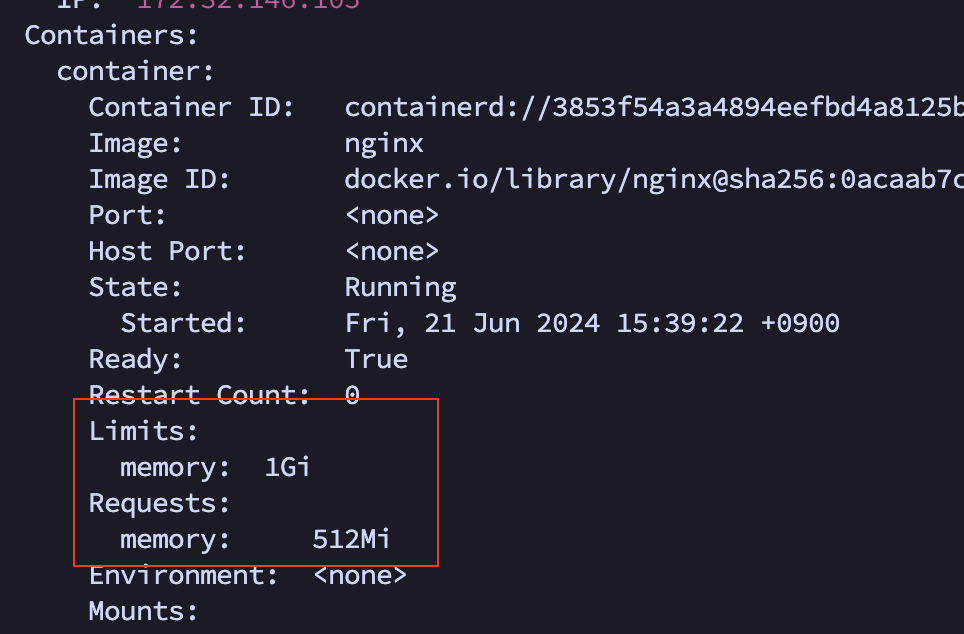
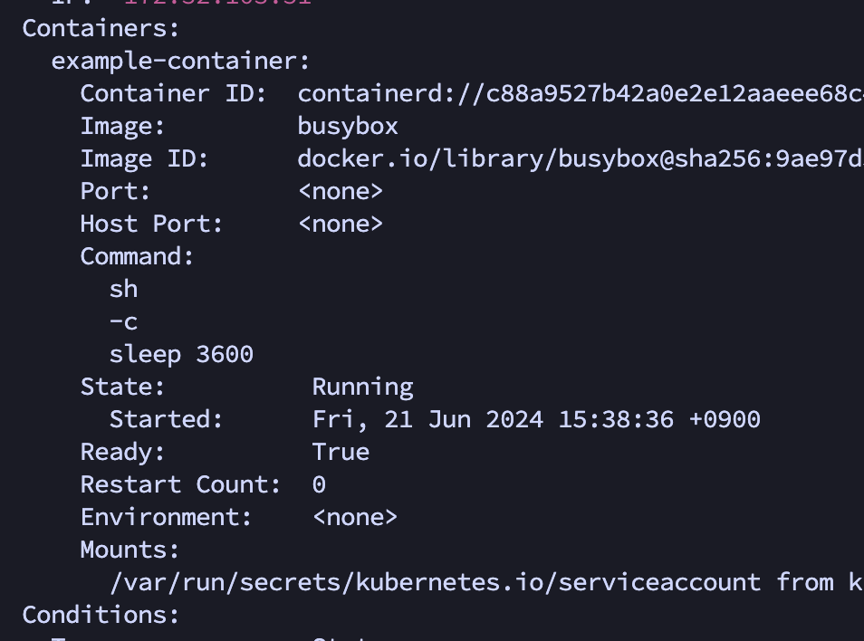

- [etc 페이지](#etc-페이지)
  - [파드 요청 과정](#파드-요청-과정)
  - [LimitRange](#limitrange)

## etc 페이지
학습한 내용중 파드와 관련이 없거나 중요도가 떨어지는 내용은 이 페이지에 정리됩니다.

### 파드 요청 과정
`kubectl get pods`

일반적으로 파드를 조회할 때 위의 명령어를 사용한다. 그럼 위의 명령어는 어떻게 파드의 정보를 가져올까?
어떻게 동작되는지 확인하기 위해 명령의 로그 상세 레벨을 확인하는 명령어가 있다.
```
kubectl get pods --v={1~9} # 숫자가 클수록 자세하게 로깅
```

굉장히 여러 단계에 걸치고 값이 많지만 하나씩 단계를 확인한다.

1. kubeconfig 파일 로드

API 서버와 통신하기 위한 설정을 불러온다. 서버 정보, 클러스터 정보, 인증서 등등을 가지며 아래에 있는 내용은 실제 kubeconfig 파일의 내용이다.
```
apiVersion: v1
clusters:
- cluster:
    certificate-authority: C:\Users\kimho\.minikube\ca.crt
    extensions:
    - extension:
        last-update: Thu, 13 Jun 2024 20:44:08 KST
        provider: minikube.sigs.k8s.io
        version: v1.33.1
      name: cluster_info
    server: https://127.0.0.1:50581
  name: minikube
contexts:
- context:
    cluster: minikube
    extensions:
    - extension:
        last-update: Thu, 13 Jun 2024 20:44:08 KST
        provider: minikube.sigs.k8s.io
        version: v1.33.1
      name: context_info
    namespace: default
    user: minikube
  name: minikube
current-context: minikube
kind: Config
preferences: {}
users:
- name: minikube
  user:
    client-certificate: C:\Users\kimho\.minikube\profiles\minikube\client.crt
    client-key: C:\Users\kimho\.minikube\profiles\minikube\client.key

```

2. 인증서 회전
```
I0613 22:21:58.114634    9156 cert_rotation.go:137] Starting client certificate rotation controller
```
인증서는 유효기간을 가지고 있어 보안을 위해 주기적으로 갱신을 해야한다. `인증서 회전`이라는 과정을 통해 인증서를 갱신하며, `인증서 회전 컨트롤러`가 이 역할을 수행한다.

3. API 서버 요청 및 응답 확인
```
curl -v -XGET  -H "Accept: application/json;as=Table;v=v1;g=meta.k8s.io,application/json;as=Table;v=v1beta1;g=meta.k8s.io,application/json" -H "User-Agent: kubectl.exe/v1.29.1 (windows/amd64) kubernetes/bc401b9" 'https://127.0.0.1:50581/api/v1/namespaces/default/pods?limit=500'

HTTP Trace: Dial to tcp:127.0.0.1:50581 succeed

GET https://127.0.0.1:50581/api/v1/namespaces/default/pods?limit=500 200 OK in 5 milliseconds
```
`https://127.0.0.1:50581/api/v1/namespaces/default/pods?limit=500` 주소로 요청을 보냈고, 200 status code를 통해 요청이 성공적으로 이루어진걸 볼 수 있다.

4. 응답
  
응답된 response body를 보면 굉장히 많은 데이터가 왔지만 json parser을 통해 필요한 부분만 확인한다.


json을 확인하면 실제로 파드에 조회되는 정보들(cells), 파드 이름, 파드에서 실행되는 container name까지 확인할 수 있다.


### LimitRange
파드를 정의할 때 각 컨테이너의 리소스를 요청, 제한할 수 있습니다. 하지만 이 리소스 값을 정의하지 않으면 2가지 중 1개의 동작이 일어납니다.
- 아무 노드에 배치될 수 있으며, 제한이 없어 자원을 무제한으로 사용할 수 있는 컨테이너
- LimitRange 객체에 의해 디폴트 값이 설정됨

확인을 위해 요청과 제한이 있는 파드와 리로스 제한이 없는 파드를 생성하겠습니다.
```YAML
# 리소스 요청과 제한
apiVersion: v1
kind: Pod
metadata:
  name: resource-limit
spec:
  containers:
  - name: container
    image: nginx
    resources:
      requests:
        memory: "512Mi"
      limits:
        memory: "1024Mi"
--
# 리소스 무제한
apiVersion: v1
kind: Pod
metadata:
  name: no-resource-limits
spec:
  containers:
  - name: container
    image: busybox
    command: ["sh", "-c", "sleep 3600"]
```



각각 생성된 파드를 보면 리소스에 제한이 걸린게 있고 리로스 필드 자체가 없는걸 볼 수 있습니다.

리소스에 제한이 없는 컨테이너는 파드내의 모든 자원을 혼자 사용할 수 있으므로 반드시 생성되지 않게 해야합니다.
쿠버네티스에선 이를위해 LimitRange를 지원하여 네임스페이스 단위로 디폴트 값을 설정할 수 있습니다.

```YAML
apiVersion: v1
kind: LimitRange
metadata:
  name: limit-range
  namespace: default
spec:
  limits:
  - max:
      cpu: "2"
      memory: "2Gi"
    min:
      cpu: "200m"
      memory: "512Mi"
    default:
      cpu: "500m"
      memory: "1Gi"
    defaultRequest:
      cpu: "200m"
      memory: "512Mi"
    type: Container
```
- max
  - 컨테이너가 요청할 수 있는 최대 리소스
- min
  - 컨테이너가 요청할 수 있는 최소 리소스
- default
  - 컨테이너에 리소스 `제한`이 설정되어 있지 않으면 설정되는 값
- defaultRequest
  - 컨테이너에 리소스 `요청`이 설정되어 있지 않으면 설정되는 값

만약 min ~ max의 범위를 벗어나는 값을 할당하면
```
Error from server (Forbidden): error when creating "rs.yaml": pods "resource-limit" is forbidden: maximum memory usage per Container is 2Gi, but limit is 6000Mi
```
파드를 생성할 때 에러가 발생하여 생성할 수 없습니다.
그리고 이제 리소스 요청, 제한 없이 `default namespace`에서 파드를 생성하면


리소스가 자동으로 할당된 걸 확인할 수 있었습니다.


다른 네임스페이스(kube-public)에서 파드를 생성했지만 리소스에 대한 디폴트 값이 적용되지 않은 것도 확인할 수 있었습니다.

