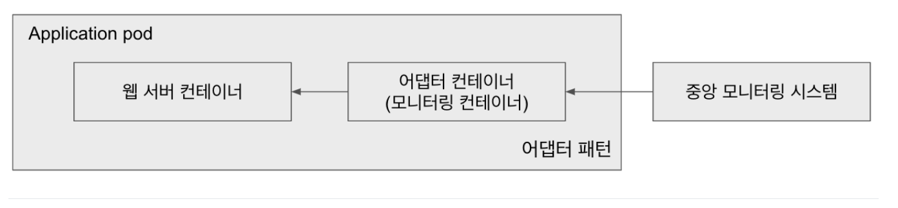
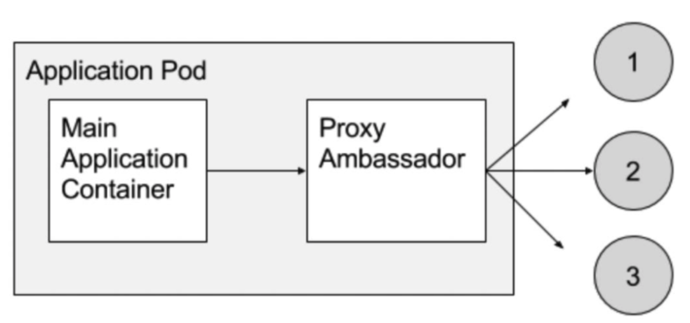

### 멀티 컨테이너
쿠버네티스는 파드안에 한 개의 컨테이너 사용을 권장한다. 하지만 파드 내에 있는 컨테이너들은 네트워크와 스토리지를 공유하므로, 상황에 따라 한 파드 안에 여러 개의 컨테이너를 사용하는게 더 유용한 경우가 있다.

멀티 컨테이너를 사용할 때 장점과 단점 그리고 `멀티컨테이너 패턴`이라고 하는 여러 개의 컨테이너를 유용하게 사용하는 방법을 알아본다.

### 멀티 컨테이너 장점
1. 통신이 유용함
같은 파드내에 컨테이너들은 별도의 과정없이 로컬 환경에 접근하듯 다른 컨테이너에 접근할 수 있어 속도가 빠르고 네트워크 지연, 트래픽에 대한 비용을 줄여준다.
2. 데이터 공유
공유 볼륨을 사용하여 설정 파일, 로그, 캐시등 공유가 필요한 데이터에 쉽게 접근할 수 있다.
3. 애플리케이션 디자인 유용성
보조 작업을 수행하는 사이드카 컨테이너같은 특정 패턴을 사용하여 컨테이너간 기능을 분리할 수 있다.
4. 개발 및 테스트 용이성
개발 구성 요소를 하나의 파드이 배치하여, 통합된 환경에서 개발 및 테스트를 진행할 수 있다.

### 멀티컨테이너 단점
1. 복잡성 증가
한 파드내에 여러 컨테이너를 관리할 때, 컨테이너간 의존성이 발생하여 복잡해질 수 있다. 그리고 컨테이너가 자원 공유 하므로 파드에서 자원 할당, 모니터링등이 복잡해진다.

2. 오류 격리
한 컨테이너에서 발생한 오류(리소스 포함)가 같은 파드내의 컨테이너에 영향을 미칠 수 있다.

3. 스케일링 제약
같은 그룹으로 스케일링을 편하게 할 수 있는 장점이 있지만 항상 동일한 파드가 스케일링 되므로, 의도치 않는 컨테이너 또한 늘어날 수 있다.

### 사이드카 패턴
사이드카 패턴은 `메인 애플리케이션 컨테이너`와 `보조 기능을 수행하는 컨테이너(사이드카 컨테이너)`를 배치하는 패턴이다.
사이드카 컨테이너는 메인 애플리케이션 컨테이너과 독립적(영향을 미치지 않음)으로 실행되지만 같은 파드내에서 실행되므로 보조 기능을 수행할 수 있다.


```
apiVersion: v1
kind: Pod
metadata:
  name: sidecar
spec:
  containers:
  - name: kimho-app
    image: kimho-app-image
    volumeMounts:
    - name: shared-logs
      mountPath: /var/log/kimho-app
  - name: log-collector
    image: log-collector-image
    volumeMounts:
    - name: shared-logs
      mountPath: /var/log/kimho-app
  volumes:
  - name: shared-logs
    emptyDir: {}
```
그림과 매니페스트 파일을 보면 `메인 애플리케이션`, `사이드카 컨테이너(로그 수집)` 으로 동작한다.

/var/log/kimho-app 디렉토리를 마운트하여 서로 스토리지를 공유하고 애플리케이션에서 발생한 표준 출력, 에러를 /var/log-kimho-app 경로에 저장하면 사이드카 컨테이너가 /var/log-kimho-app의 로그를 수집한다.

### 어댑터 패턴
어댑터 패턴은 데이터 변환, 요청 중계를 수행하는 `어댑터 컨테이너`를 배치하는 패턴이다.
메인 애플리케이션이 처리하기 어려운 일을 어댑터 컨테이너가 실행하고, 외부 시스템과 인터페이스를 관리한다.


```
apiVersion: v1
kind: Pod
metadata:
  name: adapter
spec:
  containers:
  - name: kimho-app
    image: kimho-app-image
    ports:
    - containerPort: 80
  - name: adapter-monitoring
    image: adapter-monitoring-image
    ports:
    - containerPort: 8080
```
어댑터 컨테이너를 통해 외부에서 들어오는 다양한 정보를 표준형식으로 변환하고 이를 통해 모니터링을 할 수 있다.

메인외의 다른 컨테이너가 보조 역할을 수행하므로 사이드카 패턴이랑 어댑터 패턴은 굉장히 유사하게 느껴진다.

하지만 다른 점은 사이드카 패턴은 서로 컨테이너가 독립적으로 실행된다면 어댑터 패턴은 서로 메인 컨테이너와 보조 컨테이너가 의존 관계를 가지고 있다.

### 앰버서더(프록시) 패턴
앰버서더 패턴은 파드 외부 요청을 내부 서비스로 전달하는 프록시 역할을 수행하는 패턴이다.
내부 -> 외부, 외부 - 내부 요청에 대해서 앰버서더 컨테이너를 통해서만 가능하다.
주요 사용으론 리버스 프록시, 로드 밸런싱등에 사용되는 패턴이다.




메인 애플리케이션이 직접 요청을 받지 않고 프록시 컨테이너를 통해 통신한다.