### 파드 기본 개념
파드는 쿠버네티스에서 생성하고 관리할 수 있는 배포 가능한 가장 작은 단위로 표현한다.
파드는 하나 이상의 컨테이너의 그룹이다. 파드 안에 여러 개의 컨테이너가 있으면 이 컨테이너는 네트워크, 스토리지 같이 같은 환경에서 사용되는 자원은 공유한다.(가능하면 1개의 컨테이너만 실행 권장)
또한 모든 파드는 하나의 워커 노드에서 실행되며, 여러 워커 노드에 의해 실행되지 않는다(즉 2개의 노드에서 1개의 파드에 대해 공유할 수 없다)


### 파드가 필요한 이유
굳이 파드를 사용하지 않고 워커 노드에서 직접 컨테이너를 사용할 수 있다.
하지만 이런 경우 많은 문제가 생긴다.
1. 네트워크 및 스토리지 설정
하나의 노드에서 많은 컨테이너를 사용할 경우 네트워크 및 스토리지 설정을 다 구성해야 하므로 복잡성이 증가한다.
2. 일관된 배포 단위
파드는 여러 컨테이너를 그룹화하여 관리할 수 있다. 예를 들면 주 애플리케이션 컨테이너와 이를 보조하는 `사이드카 컨테이너`를 함께 배치할 수 있다.
3. 확장성
파드는 디플로이먼트, 레플리카셋 기능을 이용해 쉽게 확장할 수 있다. 파드를 직접 확장/축소 하는 작업이 직접 컨테이너를 사용하여 확장/축소를 하는 것보다 더 효율성이 뛰어나다.

결과적으로 컨테이너를 그룹화하여 관리할 수 있는 구조가 필요하며 그게 바로 `파드`이다.

### 파드 내부
파드 내부의 모든 컨테이너는 LAN환경과 같이 접근할 수 있다. localhost를 사용하여 컨테이너간 통신을 할 수 있고, 공유 스토리지 볼륨을 설정하여 데이터를 공유할 수 있다. 단 같은 네트워크를 사용하기에 포트번호가 중복되면 안된다.

### yaml 매니페스트 구조
파드를 포함한 쿠버네티스의 자원들은 REST API 엔드포인트에 JSON, YAML 매니페스트를 전송해 생성한다.
yaml은 버전 정의, 리소스를 명시 한다음 크게 3가지 부분으로 구분된다.
- metadata : 이름, 네임스페이스, 레이블, 파트 정보를 갖는다.
- spec : 파드 컨테이너, 볼륨, 파드에 대한 실제 명세를 가진다.
- Status : 파드 상태, 컨테이너 설명과 상태, 파드 내부 IP등 실행 중인 파드에 관한 정보를 갖는다.

```
apiVersion : v1
kind : Pod
metadata:
  name: nginx-pod # 파드 이름
spec:
  containers:
  - image: nginx
    name: nginx-container # 컨테이너 이름
    ports:
    - containerPort: 8080
      protocol: TCP
```

작성한 YAML을 통해 파드를 생성하려면 아래와 같이 명령어를 작성한다


```
# kubectl create -f {YAML파일이름}
kubectl create -f 

# 파드 리스트 확인
kubectl get pods -o wide

# 생성된 파드 정보 상세 조회
kubectl describe pod nginx-pod
```

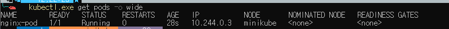
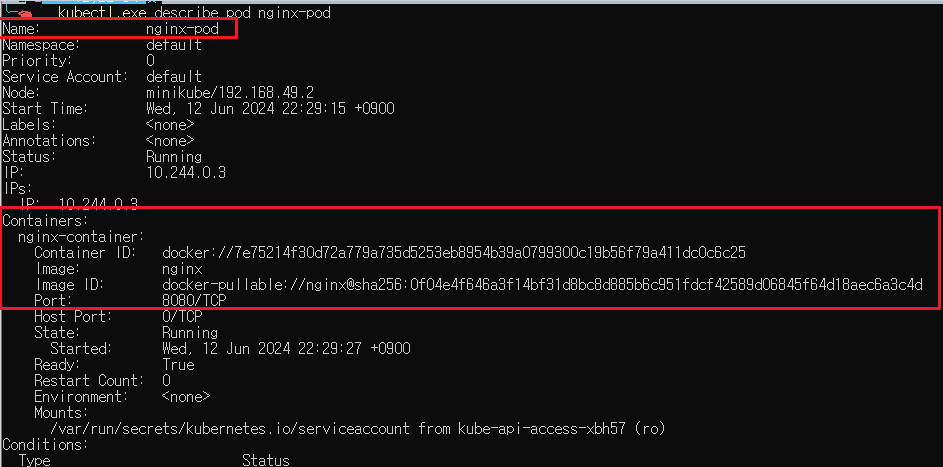

파드 리스트 조회를 통해 생성된 걸 확인하고, 파드를 상세 조회를 통해 YAML파일을 통해 생성된 걸 확인할 수 있다.

### 파드 로그


파드의 로그는 각 컨테이너에 출력되는 `표준 출력`, `표준 에러` 로그들을 기록한다.

로그를 저장하는 위치는 컨테이너 런타임에 따라 다르지만 containerd를 사용하는 경우 `/var/log/pods/{pod-uid}/{container-name}/` 경로에 생성된다(실제로 확인한 결과 `/var/log/nginx`의 경로에 있었다)

파드의 로그를 조회하는 방법은 아래와 같다.
```
kubectl logs {pod 이름}

kubectl logs {pod 이름} -c {컨테이너 이름}

# 리눅스의 tail 명령 처럼 마지막 N줄의 로그 조회
kubectl logs --tail=N {pod 이름}

# 실시간으로 출력되는 로그 조회
kubectl logs -f {pod 이름}
```

해당 예제는 `nginx-pod` 라는 파드이름을 갖고 파드 안에서 `nginx-container`라는 이름의 컨테이너로 실행된다. 그래서 결과적으로 같은 로그가 출력된다.

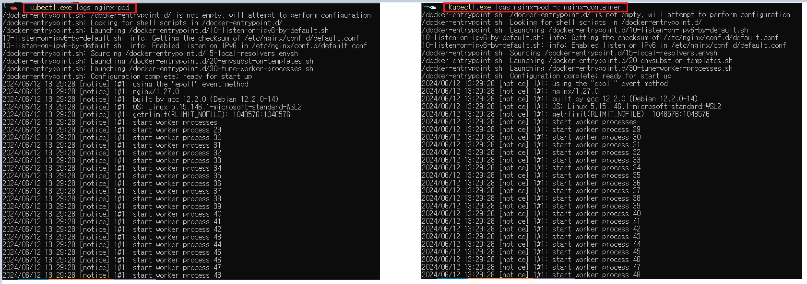

### 파드 요청(port-forward)
파드에 디버깅 목적으로 직접 접속할 경우 포트 포워딩을 이용해 접근할 수 있다. 포트 포워딩을 이용하여 서비스를 만들지 않고 직접 파드에 접속한다.

```
# kubectl port-forward {pod 이름} {port:port}
kubectl port-forward nginx-pod 8888:80
```

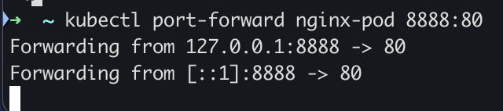

포트 포워드 명령을 통해 `nginx-pod`는 localhost:8888로 접근할 수 있게 되었다.

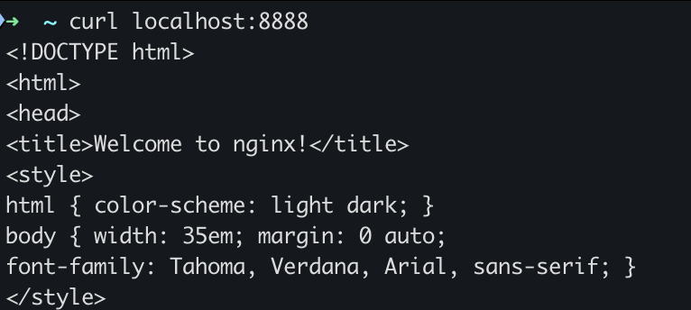

직접 `localhost:88888`로 접근했을 때 요청이 성공한걸 볼 수 있다.

이렇게 서비스를 사용하지 않고 개발 및 디버깅 용도로 사용할 수 있다.

### 파드 요청 과정
`kubectl get pods`

일반적으로 파드를 조회할 때 위의 명령어를 사용한다. 그럼 위의 명령어는 어떻게 파드의 정보를 가져올까?
어떻게 동작되는지 확인하기 위해 명령의 로그 상세 레벨을 확인하는 명령어가 있다.
```
kubectl get pods --v={1~9} # 숫자가 클수록 자세하게 로깅
```
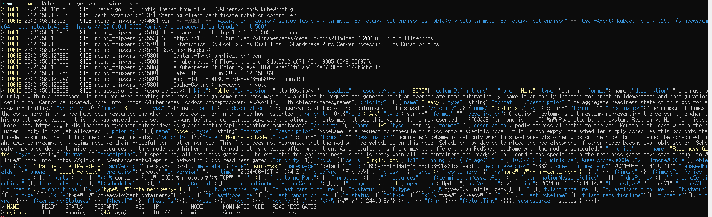
굉장히 여러 단계에 걸치고 값이 많지만 하나씩 단계를 확인한다.

1. kubeconfig 파일 로드

API 서버와 통신하기 위한 설정을 불러온다. 서버 정보, 클러스터 정보, 인증서 등등을 가지며 아래에 있는 내용은 실제 kubeconfig 파일의 내용이다.
```
apiVersion: v1
clusters:
- cluster:
    certificate-authority: C:\Users\kimho\.minikube\ca.crt
    extensions:
    - extension:
        last-update: Thu, 13 Jun 2024 20:44:08 KST
        provider: minikube.sigs.k8s.io
        version: v1.33.1
      name: cluster_info
    server: https://127.0.0.1:50581
  name: minikube
contexts:
- context:
    cluster: minikube
    extensions:
    - extension:
        last-update: Thu, 13 Jun 2024 20:44:08 KST
        provider: minikube.sigs.k8s.io
        version: v1.33.1
      name: context_info
    namespace: default
    user: minikube
  name: minikube
current-context: minikube
kind: Config
preferences: {}
users:
- name: minikube
  user:
    client-certificate: C:\Users\kimho\.minikube\profiles\minikube\client.crt
    client-key: C:\Users\kimho\.minikube\profiles\minikube\client.key

```

2. 인증서 회전
```
I0613 22:21:58.114634    9156 cert_rotation.go:137] Starting client certificate rotation controller
```
인증서는 유효기간을 가지고 있어 보안을 위해 주기적으로 갱신을 해야한다. `인증서 회전`이라는 과정을 통해 인증서를 갱신하며, `인증서 회전 컨트롤러`가 이 역할을 수행한다.

3. API 서버 요청 및 응답 확인
```
curl -v -XGET  -H "Accept: application/json;as=Table;v=v1;g=meta.k8s.io,application/json;as=Table;v=v1beta1;g=meta.k8s.io,application/json" -H "User-Agent: kubectl.exe/v1.29.1 (windows/amd64) kubernetes/bc401b9" 'https://127.0.0.1:50581/api/v1/namespaces/default/pods?limit=500'

HTTP Trace: Dial to tcp:127.0.0.1:50581 succeed

GET https://127.0.0.1:50581/api/v1/namespaces/default/pods?limit=500 200 OK in 5 milliseconds
```
`https://127.0.0.1:50581/api/v1/namespaces/default/pods?limit=500` 주소로 요청을 보냈고, 200 status code를 통해 요청이 성공적으로 이루어진걸 볼 수 있다.

4. 응답
  
응답된 response body를 보면 굉장히 많은 데이터가 왔지만 json parser을 통해 필요한 부분만 확인한다.
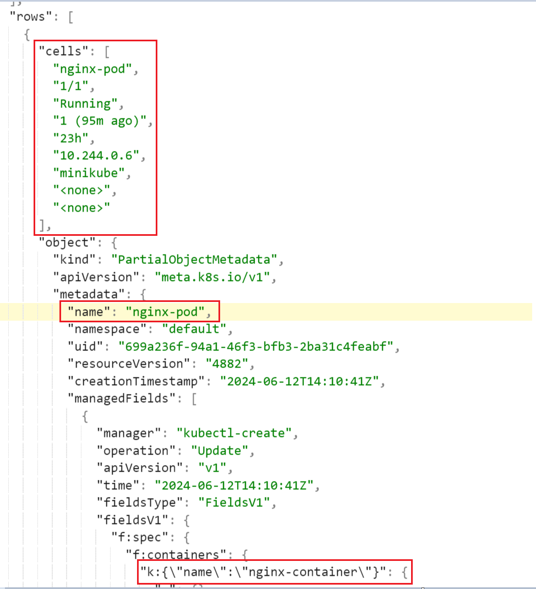

json을 확인하면 실제로 파드에 조회되는 정보들(cells), 파드 이름, 파드에서 실행되는 container name까지 확인할 수 있다.

### 레이블
레이블은 쿠버네티스 모든 오브젝트에 첨부된 (키, 값) 형태의 값이다.
어떻게 보면 각 오브젝트에 할당된 태그와 같다.
이 값들은 레이블 셀렉터를 사용해 리소스를 선택할 때 활용된다.
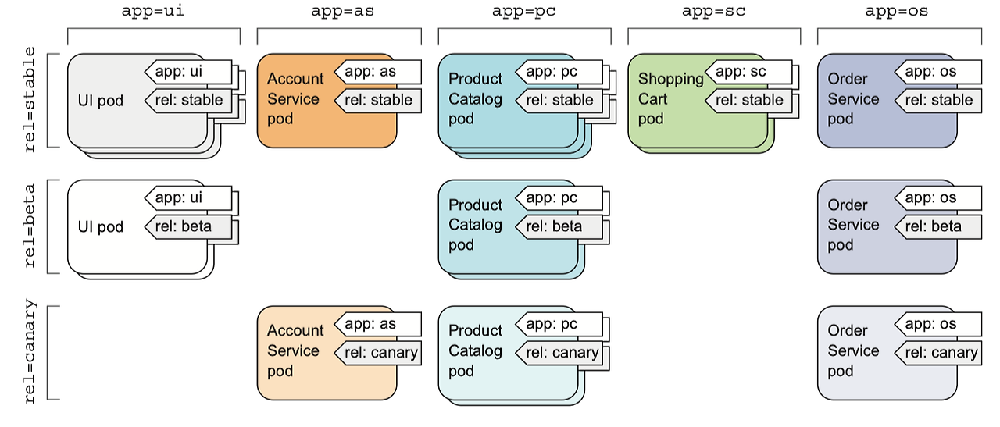

그림을 보면
- app={ui, as, pc, sc, os}
- rel={beta, stable, canary}
형태로 레이블을 갖고 오브젝트들은 1개 이상의 레이블을 가질 수 있다.
레이블은 파드를 생성할 때 할당할 수 있고 도중에 수정할 수 있다.

```
apiVersion: v1
kind: Pod
metadata:
  name: kubia-manual-v2
  labels:
    creation_method: manual
    env: prod
spec:
  containers:
  - image: luksa/kubia
    name: kubia
    ports:
    - containerPort: 8080
      protocol: TCP
```
이 YAML을 보면 metadata에 레이블을 2개 추가 했다.

```
# 레이블 조회
kubectl get pod --show-labels

# created_method, env 레이블을 포함하는 파드 조회
kubectl get pod -L created_method,env

# 파드내 라벨 수정
kubectl label pod nginx-pod created_method=manual --overwrite
```

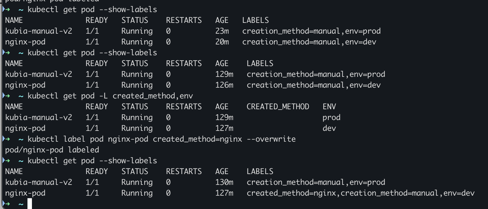

2개의 pod의 레이블을 포함하는 파드를 조회하고, 수정하는 명령어다.

### 레이블 셀렉터
레이블 셀렉터를 이용하면 조건에 맞는 리소스를 가져올 수 있다.
```
# creation_method, manual의 (키, 값)을 가지는 파드 필터링
kubectl get pod -l creation_method=manual

# env 레이블을 가지는 파드 조회
kubectl get pod -l env
```

- key!=value : 키 레이블을 가지는 파드중 값이 value가 아닌 파드 조회
- key in (v1, v2) : 키 레이블을 가지는 파드중 v1 또는 v2값을 가지는 파드 조회

이런식으로 원하는 레이블을 가진 파드를 조회할 수 있다.

### 네임스페이스
쿠버네티스의 네임스페이스는 오브젝트를 그룹화한 것이다.
리눅스의 격리 수준의 네임스페이스가 아닌 오브젝트 이름 범위를 제공한다.

그럼 왜 네임스페이스를 사용하여 오브젝트를 그룹화 하는 것인가??
복잡한 구성 요소를 관리하기 용이하게 작은 개별 그룹으로 분할할 수 있다. 이는 개발, 운영, QA등 다양한 기준으로 나뉜다.

모든 오브젝트가 네임스페이스에 속한 것은 아니다 `노드 리소스`의 경우 네임스페이스에 얽매이지 않고 전역적인 속성을 가진다.

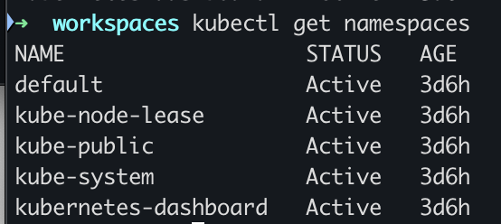
```
kubectl get namespace
```
명령을 통해 네임스페이스를 조회할 수 있다.

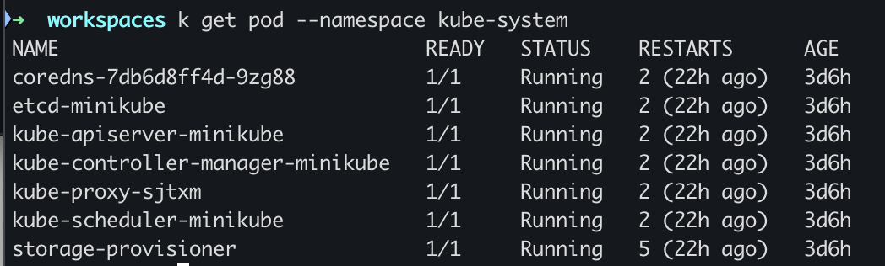
`kube-system` 네임스페이스를 조회하면 이미 배웠던 컨트롤러, 매니저, etcd등 실제로 노드에서 동작하는 리소스들이 조회된다.

이렇게 서로 관계없는 리소스를 그룹으로 분리하여 여러 사용자 또는 그룹이 고유한 네임스페이스를 사용하여, 다른 사람의 리소스에 접근 범위를 제한해야 한다.

### 네임스페이스 생성
네임스페이스 생성은 YAML 파일 또는 kubectl 명령을 통해 CLI로 만들 수 있다.

```
# namespace.yaml
apiVersion: v1
kind: Namespace
metadata:
  name: test-namespace
```

```
# YAML로 네임스페이스 생성
kubectl create -f {yaml 파일}

# CLI로 네임스페이스 생성
kubectl create namespace test-namespace
```

YAML 매니페스트를 서버에 전송해서 네임스페이스를 생성/읽기/갱신/삭제 등 API 서버에 직접 전송해 실행할 수 있다.

### 파드 삭제
파드를 삭제할 때 `그레이스풀, 논 그레이스풀` 삭제 방식이 있다.
그레이스풀 종료는 파드 내의 컨테이너가 종료 신호를 받으면, 상태를 저장하고 연결을 정리할 시간을 갖고 종료하는 작업을 말합니다.
종료 시간은 기본적으로 `30초`이며 이는 명령어를 통해 수정할수 있습니다.

그레이스풀 종료 방식은 다음과 같습니다.
1. 파드 삭제 요청
    
`kubectl delete pod {pod name} -n {namespace}` 명령어가 실행되면, 쿠버네티스 API 서버에 파드 요청을 보냄

2. API 서버 요청 처리

API서버에 파드 삭제 요청이 오면 API 서버는 etcd에 해당 파드의 상태를 업데이트하며, 파드를 가지고 있는 노드의 `kubelet`에 파드 삭제 신호를 보낸다. kubelet는 파드내의 모든 컨테이너에 `TERM`신호를 보낸다.

3. 컨테이너 종료

TERM 신호를 받은 컨테이너는 프로세스를 종료하며, 이때 연결을 종료하고 리소스를 정리한 후 프로세스를 종료한다.
이는 그레이스풀 종료 시간(기본 30초)동안 종료되지 않으면 kubelet은 `kill`신호를 보내 강제로 종료한다.

4. 종료 확인

모든 컨테이너가 종료되면 kubelet은 API서버에 삭제가 완료되었다고 알리고 API 서버는 etcd에서 파드 객체를 삭제한다.
이후 워커노드는 해당 파드가 사용중인 리소스를 해제한다.

논 그레이스풀 종료는 위의 `3번과정`에서 컨테이너들을 강제로 kill 신호를 통해 즉시 종료하며 이 과정중 데이터의 손실이 발생할 수 있다.
빠르게 컨테이너(파드)를 삭제하고 리소스를 해제할 순 있지만 데이터가 손실될 우려가 있다.

## 2024.06.17 리뷰 보충 내용

### 초기화 컨테이너
초기화 컨테이너는 파드 내의 컨테이너가 실행되기 전에 실행되는 특수한 컨테이너입니다.
애플리케이션 컨테이너의 실행을 준비하는데 필요한 설정이나 작업을 수행할 수 있습니다. 이 작업을 위해 앱 이미지에는 없는 유틸리티나 스크립트 파일을 포함할 수 있습니다.

초기화 컨테이너는 `하나 이상의 단계`로 구성될 수 있으며, 각 초기화 컨테이너는 `다음 초기화 컨테이너가 시작되기 전에 성공적으로 실행`되어야 합니다.
만약 초기화 컨테이너가 실패한 경우, `kubelet`은 초기화 컨테이너가 성공할 때 까지 반복적으로 재시작합니다.
하지만 이 동작은 `restartPolicy` 옵션을 통해 제어할 수 있습니다.

메인 애플리케이션 컨테이너가 실행되기 전 실행, 하나 이상의 단계로 순차적 실행을 보장하는 초기화 컨테이너는 다음과 같은 용도로 사용됩니다.
- 네트워크 설정
  - 메인 컨테이너 컨테이너 실행 전 네트워크 관련 설정을 미리 작업할 수 있음
- 파일 다운로드
  - 메인 컨테이너에 필요한 파일을 실행 전 필요한 파일을 미리 다운로드할 수 있음
- 설정 검증
  - 미리 네트워크, 파일 다운로드 등 의존성들이 설정되는걸 보장하고 실행할 수 있음

```
apiVersion: v1
kind: Pod
metadata:
  name: myapp-pod
spec:
  initContainers:
  - name: init-myservice
    image: busybox
    command: ['sh', '-c', 'echo Initializing... && sleep 10']
  - name: init-other
    image: busybox
    command: ['sh', '-c', 'echo Performing another init task... && sleep 10']
  containers:
  - name: myapp-container
    image: nginx
    ports:
    - containerPort: 80
```
매니페스트 파일을 보면
- spec
  - initContainers
    - 여기에 순차적으로 실행할 컨테이너들을 정의
  
각 초기화 컨테이너는 10초씩 sleep을 한다 그래서 약 20초 뒤 메인 컨테이너가 실행하게 된다.

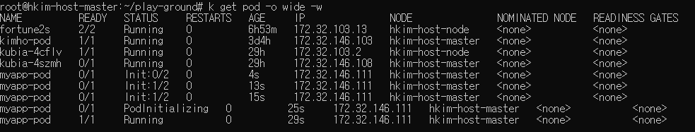

캡쳐한 사진을 보면 실제로 `Init:0/2` 의 상태가 보이며 시간에 지남에 따라 메인컨테이너가 실행된걸 알수 있다.

그럼 초기화 컨테이너를 사용했을 때 어떤 큰 이점이 있을까?
1. 초기화 작업 분리
초기화 작업을 분리하여, 실패하더라도 해당 지점만 재실행하여 전체가 다시 초기화 되는 상황을 막을 수 있습니다.
2. 의존성
각 초기화 컨테이너가 성공적으로 실행되었다는 건 필요한 작업들 즉 의존성들이 준비가 됐다는걸 보장합니다.

### 컨테이너 리소스 제한
파드를 생성할 때 각 컨테이너별 `필요한 리소스의 양을 요청하고 제한`할 수 있습니다.
컨테이너에서 리소스를 설정하면 `kubelet`은 컨테이너가 설정한 제한보다 많은 리소스를 사용할 수 없도록 제한을 적용합니다.

- spec.containers[].resources
  - request
    - cpu
    - memory
    - hugepages-<size>
  - limit
    - cpu
    - memory
    - hugepages-<size>
  
매니페스트의 위와 같은 yaml파일로 리소스를 요청하고 제한할 수 있습니다.

```
apiVersion: v1
kind: Pod
metadata:
  name: frontend
spec:
  containers:
  - name: app
    image: images.my-company.example/app:v4
    resources:
      requests:
        memory: "64Mi"
        cpu: "250m"
      limits:
        memory: "128Mi"
        cpu: "500m"
```
해당 컨테이너는 
- memory: 64Mi
- cpu: 250m
  
만큼의 리소스를 요청하고
- memory: 128Mi
- cpu: 500m
  
만큼의 리소스를 초과하여 사용할 수 없습니다.

파드가 생성될 때, `스케줄러에 의해 파드를 배치할 노드를 필터링 할 때, reqeust의 리소스를 수용할 수 있으면 해당 노드는 선택`됩니다.

노드에 리소스가 충분하면 `request보다 많은 리소스를 사용할 수 있지만 limit 보다 더 많은 리소스를 사용할 수 없습니다.`

이렇게 리소스를 `요청과 제한`함으로 써 컨테이너가 동작하는 최소한의 사양을 맞출 수 있고, 제한(limit)함으로 써 노드의 리소스를 과도하게 사용하는 걸 방지합니다.

### 어노테이션
어노테이션은 `쿠버네티스 객체(리소스)`에 `추가적인 정보`를 저장하기 위한 (키, 값) 형태의 쌍입니다.

레이블과 형태가 똑같지만 사용하는 용도에 차이가 있습니다. 레이블은 셀렉터를 사용하여 파드를 선택하거나 그룹화할 수 있습니다.
하지만 어노테이션은 그런 기능을 제공하지 않습니다.

레이블과 다른점은 `용도`입니다. 어노테이션은 추가적인 정보를 저장하기 위한 값인 만큼 다음과 같은 용도로써 사용됩니다.
- 메타데이터 저장
  - 버전, 작성자, 릴리즈등 메타 정보를 어노테이션에 저장하여 사용
- 외부 도구 통합
  - CI/CD 파이프라인 정보, 모니터링 정보 등 외부 도구와의 통합 정보를 저장
- 정책
  - 리소스(객체)에 특정 정책을 적용하기 위한 설정 정보 저장

```
apiVersion: v1
kind: Pod
metadata:
  name: myapp-pod
  annotations:
    version: "4.0.6"
    author: "Jane Doe"
    release-date: "2024-06-17"
    debug: "true"
    debug-info: "Initial deployment failed due to misconfiguration"
    cicd-pipeline: "Jenkins"
    monitoring: "Prometheus"
    deployment-id: "cicd-2024-06-17-01"
    network-policy: "isolated"
    security: "restricted"
    compliance: "PCI-DSS"
spec:
  containers:
  - name: myapp-container
    image: myapp:4.0.6
```
이렇게 버전, 작성자, 릴리즈 부터 CI/CD, 외부도구 등 위에서 언급한 정보들을 실제로 어노테이션에 설정한 매니페스트 파일입니다.
물론 이렇게 한번에 다 어노테이션을 할당하진 않지만 이런식으로 필요한 정보를 저장할 수 있습니다.

레이블과 더 차이점이 뭐가 있을까요?

어노테이션은 정보를 저장, 레이블은 특정 레이블을 그룹하기 위함입니다. 그래서 어노테이션이 레이블보다 더 많은 양의 (키, 값)을 가질 수 있습니다.

레이블은 키, 값이 최대 63자, 어노테이션은 키 253자, 값은 제한없이 저장할 수 있습니다.


### Known Labels
Known Labels(노운 레이블)은 `쿠버네티스와 관련된 기능 및 메타데이터를 나타내기 위해 미리 정의된 표준 레이블`을 의미합니다.

[노운 레이블 공식문서](https://kubernetes.io/ko/docs/reference/labels-annotations-taints/)
문서를 통해 어떤 노운 레이블이 있고, 어떤 오브젝트에 적용되는지 그리고 사용/중지를 확인할 수 있습니다.

많이 사용하는 노운 레이블은 다음과 같습니다.

- 애플리케이션 관련 레이블
  - app.kubernetes.io/name: 애플리케이션의 이름
  - app.kubernetes.io/version: 애플리케이션 버전
  - app.kubernetes.io/component: 애플리케이션의 구성 요소
  - app.kubernetes.io/instance: 애플리케이션을 인스턴스를 식별하는 고유 이름
- 운영 관련 테이블
  - kubernetes.io/hostname: 노드의 호스트 이름
  - kubernetes.io/os: 노드의 운영체제

굉장히 다양한 레이블들이 있고 공식 문서를 통해 확인할 수 있습니다.

### ImagePullPolicy
이미지 풀 정책은 `kubelet`이 컨테이너가 이미지를 언제 가져올지 결정하는 정책을 의미합니다.
정책은 3개의 옵션을 가지고 있습니다.
- Always
  - kubelet이 컨테이너를 가동할 때마다, 이미지를 풀링 시도
  - 이미 로컬에 컨테이미지가 있는 경우 캐시된 이미지를 사용
- IfNotPresent
  - 이미지가 로컬에 없는 경우 풀링 시도
- Never
  - 이미지를 풀링하지 않으며 로컬에 이미지가 있는 경우 컨테이너를 실행
  - 이미지가 로컬에 존재하지 않는 경우 실패함

Always옵션을 사용하여 항상 이미지를 풀링 하더라도 kubelet이 캐싱된 이미지가 있으면 사용하기 때문에 always를 사용해도 일반적인 상황에선 효율적입니다.

### kubectl get
쿠버네티스는 `kubectl` CLI 도구를 통해 쿠버네티스 API와 소통합니다. 그 중 `kubectl get ...` 명령은 쿠버네티스의 오브젝트를 조회하는 명령어로 굉장히 많이 사용됩니다.

[kubectl get 문서](https://kubernetes.io/docs/reference/generated/kubectl/kubectl-commands#get)
실제 무수히 많은 옵션이 있지만 가장 많이 사용되는 옵션들만 미리 알아봅니다.

`kubectl get <resource-type> <option> <resource-name>` 형태로 사용되며, 리소스 타입은 pod, services, node등등 쿠버네티스의 오브젝트를 의미합니다.

- option
  - o(출력 형식 지정)
    - wide: 추가 정보를 출력
      - kubectl get pods -o wide
    - json: JSON 형식 출력
      - kubectl get pods -o json
    - yaml: YAML 형식 출력
      - kubectl get pods -o yaml
  - w(실시간으로 변경 사항 감지, 종료되지 않고 계속 감시)
    - kube get pods -w
  - l(레이블 셀렉터)
    - 특정 레이블을 가진 리소스만 조회
    - kubectl get pods -l key=value
  - --all-namespaces
    - 모든 네임스페이스의 리소스 조회
    - kubectl get pods --all-namespaces
  - n(네임 스페이스 명시)
    - 옵션을 사용하지 않을 경우 `default` 네임스페이스 사용
    - kubectl get pods -n my-namespace
    - kubectl get pods -n kube-system
  - 유용한 옵션
    - kubectl get pods --show-labels: 모든 파드의 레이블 조회
    - kubectl get events --sort-by=.metadata.creationTimestamp: 타임스탬프로 정렬된 이벤트 조회
    - kubectl events --types=Warning: 모든 Warning 타입 이벤트 조회
    - kubectl get pods --field-selector=status.phase=Running -n <namespace>: 네임스페이스의 모든 실핼중인 파드 조회

모든 옵션, 명령어를 이해하고 사용하기 힘드므로 필요할 때 공식문서를 참조하여 확인합니다.

### 라이브니스 프로브
컨테이너에 문제가 생겨 제대로 동작되지 않는 경우, `kubectl`이 해당 컨테이너를 재시작한다.
하지만 무한 루프나 데드락 같이 문제가 있지만 정상적으로 동작하는 것처럼 보이는 경우 어떻게 해야할까? 그래서 애플리케이션의 내부에서 문제를 파악하기 보단 외부에서 애플리케이션의 상태를 체크해야 한다.

쿠버네티스는 `라이브니스 프로브`를 통해 컨테이너가 살아 있는지 확인할 수 있다.
주기적으로 라이브니스 프로브를 실행하고 프로브가 실패할 경우, 해당 컨테이너를 다시 시작한다.

세 가지 메커니즘으로 컨테이너에 프로브를 실행한다.
1. GET 프로브
지정된 ip, port, path에  HTTP GET 메소드로 요청하고, status code(200, 300번대)로 문제를 판단한다.
잘못된 응답 코드나, 응답이 없는 경우, 해당 컨테이너를 다시 시작한다.
2. TCP 소켓 프로브
컨테이너 지정된 포트에 TCP연결을 시도하고 연결이 실패한 경우, 해당 컨테이너를 다시 시작한다.
3. Exec 프로브
컨테이너내의 임의의 명령을 실행하고 명령의 종료 상태코드를 확인한다. 0이면 성공, 0이외의 값이면 실패로 간주한다.

결과적으로 컨테이너에서 에러가 발생하거나, 라이브니스 프로브가 실패한 경우 노드의 `kubelet`은 해당 컨테이너를 재시작한다.


### 레디니스 프로브
레디니스 프로브는 `주기적으로 호출되며 특정 파드가 클라이언트 요청을 수신할 수 있는지 결정`한다. 컨테이너의 레디니스 프로브가 성공을 반환하며 요청을 처리할 준비가 됐다는 의미이다.

레디니스 프로브 유형
- Exec 프로브
  - 컨테이너 상태를 프로세스의 종료 상태 코드로 결정
- HTTP GET 프로브
  - HTTP GET 요청을 보내고 응답의 상태코드에 따라 준비 여부를 확인하는 프로브(Heartbeat)
- TCP 소켓 프로브
  - 컨테이너의 지정된 포트로 TCP 연결을 확인해 준비 여부를 확인하는 프로브
  
컨테이너가 시작될 떄 바로 레디니스 프로브가 동작할 수 있지만 임의의 시간이 경과된 후 레디니스 프로브로 검사하게 할 수 있다 이는 `initialDelaySeconds`옵션을 통해 설정할 수 있다.
이후 주기적으로 프로브를 호출하여 파드가 준비되면 서비스(엔드포인트 리소스)에 추가된다.

그럼 라이브니스 프로브랑 어떤 다른점이 있을까?
라이브니스 프로브는 상태 점검에 실패하면 컨테이너를 제거하고 새로 만든다. 하지만 레디니스 프로브는 상태 점검에 실패하더라도 삭제되지 않고 상태 점검에 성공한 파드만 요청을 수신하도록 한다.

레디니스 프로브의 중요성
만약 파드 그룹이 다른 파드에서 제공하는 서비스에 의존하는 상황에서 문제가 발생한 경우, 레디니스 프로브를 통해 해당 파드가 요청을 처리할 준비가 되지 않음을 쿠버네시트에 알린다. 이를 통해 문제가 발생한 파드로 요청을 보내지 않고 정상 상태인 파드하고 통신하여 문제가 발생했음에도 사용자는 문제를 인식하지 못하고 안정적으로 서비스를 사용할 수 있다.

예를 들어 백엔드 애플레이케이션 서버가 데이터베이스 파드에 의존하는 상황에서 문제가 발생한 경우, 문제가 생긴 파드말고 정상적으로 동작하는 파드로 요청하여 안정적인 상태를 유지할 수 있다.

```
apiVersion: v1
kind: ReplicationController
metadata:
  name: kubia
spec:
  replicas: 3
  selector:
    app: kimho
  template:
    metadata:
      labels:
        app: kimho
    spec:
      containers:
      - name: kubia
        image: luksa/kubia
        ports:
        - name: http
          containerPort: 8080
        readinessProbe:
          exec:
            command:
            - ls
            - /var/ready
```

레디니스 프로브는 컨테이너 내부에서 `spec.template.spec.containers.readinessProbe.exec`
명령을 주기적으로 수행한다. 이 예시는 주기적으로 `ls /var/ready` 명령어를 실행한다.
ls 명령어는 파일이 있으면 종료 코드 0을 반환하고 아니면 0 이외의 값을 반환한다.

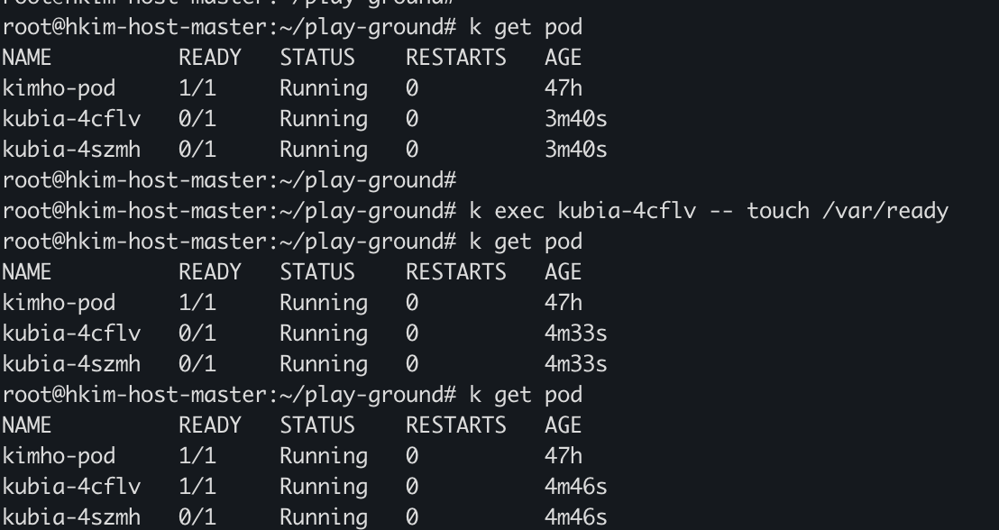

결과를 보면 이미 생성된 파드 1개를 제외하고 나머지 2개가 생성되었다. 하지만 실제 컨테이너는 실행하지 않았다. 이는 레디니스 프로브에 의해 아직 실패 상태이기 때문이다.

`k exec {pod-name} -- touch /var/ready` 명령을 통해 파일을 만들었지만 컨테이너는 바로 생성되지 않고 일정 시간뒤에 생성되었다. 레디니스 프로브는 기본 10초 마다 프로브를 실행하여 검사하므로 실제론 파일이 생성되었지만 아직 상태 검사가 이루어지지 않아 발생한 일이다.

마지막으로 레디니스 프로브는 항상 정의되어야 한다. 그렇지 않으면 `파드가 생성되는 즉시 서비스 엔드포인트가 되므로 요청을 수행 받을 준비가 되어 있지 않더라도 요청을 받을 수 있다.` 그래서 항상 레디니스 프로브를 정의헤야 한다.

### Kubeconfig
기본적으로 kubectl은 `$HOME/.kube` 디렉토리에 config 파일을 찾습니다.
kubeconfig는 다음과 같은 정보를 가지고 있습니다.(아래에 값들은 내부 클러스터에 있는 kubeconfig파일이며 보안를 위해 일부 값들을 축소해서 표현했습니다.)
1. clusters
클러스터에 대한 정보를 정의합니다.

```YAML
clusters:
- cluster:
    certificate-authority-data: LS0tLS1CRUdJTiBDRVJUSUZJQ0FURS0tLS==...
    server: https://10.60.160.171:6443
  name: kubernetes
```
- name: 클러스터 이름을 명시합니다.
- cluster
  - server: 클러스터 내부 API 서버의 주소입니다.
  - certificate-authority-data: 클러스터가 생성되면 CA인증서가 만들어지고 base64로 인코딩되어 저장됩니다.

```
certificate-authority-data(CA)값에 있는 인증서 파일을 통해 쿠버네티스 API 서버를 신뢰할 수 있는지 검증합니다.

클라이언트는 API 서버의 인증서를 CA 인증서로 서명이 되어 있는지 확인하여 신뢰할 수 있는지 확인합니다.
```

2. users
클라이언트의 인증 정보를 정의합니다.

```YAML
users:
- name: kubernetes-admin
  user:
    client-certificate-data: LS0tLS1CRUdJTiBDRVJUSUZJ==
    client-key-data: LS0tLS1CRUdJTiBQUklWQVRFIE=
```

`clinert-certificate-data`는 클라이언트 인증서 데이터를 base64로 인코딩한 값입니다. 클라이언트가 API서버에 접근 할 때 . 이인증서를 사용하여 자신을 인증합니다. 이 인증서는 클러스터의 CA 인증서로 서명되어 있어야 합니다.
`client-key-data`는 클라이언트의 개인 키를 base64로 인코딩한 값입니다.
클라이언트 인증서와 함께 사용되어 클라이언트의 신원을 증명하는데 필요한 암호화 작업을 수행합니다.


3. context
쿠버네티스 클러스터와 상호 작용할 때, 사용할 클러스터, 사용자, 네임스페이스를 가지고 있습니다. kubectl은 현재 컨텍스트의 매개 변수를 사용하여 클러스터와 통신합니다.
네임스페이스가 없는 경우 `default` 네임스페이스를 사용합니다.

```YAML
contexts:
- context:
    cluster: kubernetes
    user: kubernetes-admin
  name: kubernetes-admin@kubernetes
current-context: kubernetes-admin@kubernetes
```
클러스터, user, name을 확인할 수 있고 현재 어떤 클러스트를 사용 중인지 알 수 있습니다.
