### 파드 기본 개념
파드는 쿠버네티스에서 생성하고 관리할 수 있는 배포 가능한 가장 작은 단위로 표현한다.
파드는 하나 이상의 컨테이너의 그룹이다. 파드 안에 여러 개의 컨테이너가 있으면 이 컨테이너는 네트워크, 스토리지 같이 같은 환경에서 사용되는 자원은 공유한다.(가능하면 1개의 컨테이너만 실행 권장)
또한 모든 파드는 하나의 워커 노드에서 실행되며, 여러 워커 노드에 의해 실행되지 않는다(즉 2개의 노드에서 1개의 파드에 대해 공유할 수 없다)


### 파드가 필요한 이유
굳이 파드를 사용하지 않고 워커 노드에서 직접 컨테이너를 사용할 수 있다.
하지만 이런 경우 많은 문제가 생긴다.
1. 네트워크 및 스토리지 설정
하나의 노드에서 많은 컨테이너를 사용할 경우 네트워크 및 스토리지 설정을 다 구성해야 하므로 복잡성이 증가한다.
2. 일관된 배포 단위
파드는 여러 컨테이너를 그룹화하여 관리할 수 있다. 예를 들면 주 애플리케이션 컨테이너와 이를 보조하는 `사이드카 컨테이너`를 함께 배치할 수 있다.
3. 확장성
파드는 디플로이먼트, 레플리카셋 기능을 이용해 쉽게 확장할 수 있다. 파드를 직접 확장/축소 하는 작업이 직접 컨테이너를 사용하여 확장/축소를 하는 것보다 더 효율성이 뛰어나다.

결과적으로 컨테이너를 그룹화하여 관리할 수 있는 구조가 필요하며 그게 바로 `파드`이다.

### 파드 내부
파드 내부의 모든 컨테이너는 LAN환경과 같이 접근할 수 있다. localhost를 사용하여 컨테이너간 통신을 할 수 있고, 공유 스토리지 볼륨을 설정하여 데이터를 공유할 수 있다. 단 같은 네트워크를 사용하기에 포트번호가 중복되면 안된다.

### yaml 매니페스트 구조
파드를 포함한 쿠버네티스의 자원들은 REST API 엔드포인트에 JSON, YAML 매니페스트를 전송해 생성한다.
yaml은 버전 정의, 리소스를 명시 한다음 크게 3가지 부분으로 구분된다.
- metadata : 이름, 네임스페이스, 레이블, 파트 정보를 갖는다.
- spec : 파드 컨테이너, 볼륨, 파드에 대한 실제 명세를 가진다.
- Status : 파드 상태, 컨테이너 설명과 상태, 파드 내부 IP등 실행 중인 파드에 관한 정보를 갖는다.

```
apiVersion : v1
kind : Pod
metadata:
  name: nginx-pod # 파드 이름
spec:
  containers:
  - image: nginx
    name: nginx-container # 컨테이너 이름
    ports:
    - containerPort: 8080
      protocol: TCP
```

작성한 YAML을 통해 파드를 생성하려면 아래와 같이 명령어를 작성한다


```
# kubectl create -f {YAML파일이름}
kubectl create -f 

# 파드 리스트 확인
kubectl get pods -o wide

# 생성된 파드 정보 상세 조회
kubectl describe pod nginx-pod
```


파드 리스트 조회를 통해 생성된 걸 확인하고, 파드를 상세 조회를 통해 YAML파일을 통해 생성된 걸 확인할 수 있다.

### 파드 로그


파드의 로그는 각 컨테이너에 출력되는 `표준 출력`, `표준 에러` 로그들을 기록한다.

로그를 저장하는 위치는 컨테이너 런타임에 따라 다르지만 containerd를 사용하는 경우 `/var/log/pods/{pod-uid}/{container-name}/` 경로에 생성된다(실제로 확인한 결과 `/var/log/nginx`의 경로에 있었다)

파드의 로그를 조회하는 방법은 아래와 같다.
```
kubectl logs {pod 이름}

kubectl logs {pod 이름} -c {컨테이너 이름}

# 리눅스의 tail 명령 처럼 마지막 N줄의 로그 조회
kubectl logs --tail=N {pod 이름}

# 실시간으로 출력되는 로그 조회
kubectl logs -f {pod 이름}
```

해당 예제는 `nginx-pod` 라는 파드이름을 갖고 파드 안에서 `nginx-container`라는 이름의 컨테이너로 실행된다. 그래서 결과적으로 같은 로그가 출력된다.


### 파드 요청(port-forward)
파드에 디버깅 목적으로 직접 접속할 경우 포트 포워딩을 이용해 접근할 수 있다. 포트 포워딩을 이용하여 서비스를 만들지 않고 직접 파드에 접속한다.

```
# kubectl port-forward {pod 이름} {port:port}
kubectl port-forward nginx-pod 8888:80
```


포트 포워드 명령을 통해 `nginx-pod`는 localhost:8888로 접근할 수 있게 되었다.


직접 `localhost:88888`로 접근했을 때 요청이 성공한걸 볼 수 있다.

이렇게 서비스를 사용하지 않고 개발 및 디버깅 용도로 사용할 수 있다.

### 파드 요청 과정
`kubectl get pods`

일반적으로 파드를 조회할 때 위의 명령어를 사용한다. 그럼 위의 명령어는 어떻게 파드의 정보를 가져올까?
어떻게 동작되는지 확인하기 위해 명령의 로그 상세 레벨을 확인하는 명령어가 있다.
```
kubectl get pods --v={1~9} # 숫자가 클수록 자세하게 로깅
```

굉장히 여러 단계에 걸치고 값이 많지만 하나씩 단계를 확인한다.

1. kubeconfig 파일 로드

API 서버와 통신하기 위한 설정을 불러온다. 서버 정보, 클러스터 정보, 인증서 등등을 가지며 아래에 있는 내용은 실제 kubeconfig 파일의 내용이다.
```
apiVersion: v1
clusters:
- cluster:
    certificate-authority: C:\Users\kimho\.minikube\ca.crt
    extensions:
    - extension:
        last-update: Thu, 13 Jun 2024 20:44:08 KST
        provider: minikube.sigs.k8s.io
        version: v1.33.1
      name: cluster_info
    server: https://127.0.0.1:50581
  name: minikube
contexts:
- context:
    cluster: minikube
    extensions:
    - extension:
        last-update: Thu, 13 Jun 2024 20:44:08 KST
        provider: minikube.sigs.k8s.io
        version: v1.33.1
      name: context_info
    namespace: default
    user: minikube
  name: minikube
current-context: minikube
kind: Config
preferences: {}
users:
- name: minikube
  user:
    client-certificate: C:\Users\kimho\.minikube\profiles\minikube\client.crt
    client-key: C:\Users\kimho\.minikube\profiles\minikube\client.key

```

2. 인증서 회전
```
I0613 22:21:58.114634    9156 cert_rotation.go:137] Starting client certificate rotation controller
```
인증서는 유효기간을 가지고 있어 보안을 위해 주기적으로 갱신을 해야한다. `인증서 회전`이라는 과정을 통해 인증서를 갱신하며, `인증서 회전 컨트롤러`가 이 역할을 수행한다.

3. API 서버 요청 및 응답 확인
```
curl -v -XGET  -H "Accept: application/json;as=Table;v=v1;g=meta.k8s.io,application/json;as=Table;v=v1beta1;g=meta.k8s.io,application/json" -H "User-Agent: kubectl.exe/v1.29.1 (windows/amd64) kubernetes/bc401b9" 'https://127.0.0.1:50581/api/v1/namespaces/default/pods?limit=500'

HTTP Trace: Dial to tcp:127.0.0.1:50581 succeed

GET https://127.0.0.1:50581/api/v1/namespaces/default/pods?limit=500 200 OK in 5 milliseconds
```
`https://127.0.0.1:50581/api/v1/namespaces/default/pods?limit=500` 주소로 요청을 보냈고, 200 status code를 통해 요청이 성공적으로 이루어진걸 볼 수 있다.

4. 응답
  
응답된 response body를 보면 굉장히 많은 데이터가 왔지만 json parser을 통해 필요한 부분만 확인한다.


json을 확인하면 실제로 파드에 조회되는 정보들(cells), 파드 이름, 파드에서 실행되는 container name까지 확인할 수 있다.

### 레이블
레이블은 쿠버네티스 모든 오브젝트에 첨부된 (키, 값) 형태의 값이다.
어떻게 보면 각 오브젝트에 할당된 태그와 같다.
이 값들은 레이블 셀렉터를 사용해 리소스를 선택할 때 활용된다.


그림을 보면
- app={ui, as, pc, sc, os}
- rel={beta, stable, canary}
형태로 레이블을 갖고 오브젝트들은 1개 이상의 레이블을 가질 수 있다.
레이블은 파드를 생성할 때 할당할 수 있고 도중에 수정할 수 있다.

```
apiVersion: v1
kind: Pod
metadata:
  name: kubia-manual-v2
  labels:
    creation_method: manual
    env: prod
spec:
  containers:
  - image: luksa/kubia
    name: kubia
    ports:
    - containerPort: 8080
      protocol: TCP
```
이 YAML을 보면 metadata에 레이블을 2개 추가 했다.

```
# 레이블 조회
kubectl get pod --show-labels

# created_method, env 레이블을 포함하는 파드 조회
kubectl get pod -L created_method,env

# 파드내 라벨 수정
kubectl label pod nginx-pod created_method=manual --overwrite
```


2개의 pod의 레이블을 포함하는 파드를 조회하고, 수정하는 명령어다.

### 레이블 셀렉터
레이블 셀렉터를 이용하면 조건에 맞는 리소스를 가져올 수 있다.
```
# creation_method, manual의 (키, 값)을 가지는 파드 필터링
kubectl get pod -l creation_method=manual

# env 레이블을 가지는 파드 조회
kubectl get pod -l env
```

- key!=value : 키 레이블을 가지는 파드중 값이 value가 아닌 파드 조회
- key in (v1, v2) : 키 레이블을 가지는 파드중 v1 또는 v2값을 가지는 파드 조회

이런식으로 원하는 레이블을 가진 파드를 조회할 수 있다.

### 네임스페이스
쿠버네티스의 네임스페이스는 오브젝트를 그룹화한 것이다.
리눅스의 격리 수준의 네임스페이스가 아닌 오브젝트 이름 범위를 제공한다.

그럼 왜 네임스페이스를 사용하여 오브젝트를 그룹화 하는 것인가??
복잡한 구성 요소를 관리하기 용이하게 작은 개별 그룹으로 분할할 수 있다. 이는 개발, 운영, QA등 다양한 기준으로 나뉜다.

모든 오브젝트가 네임스페이스에 속한 것은 아니다 `노드 리소스`의 경우 네임스페이스에 얽매이지 않고 전역적인 속성을 가진다.


```
kubectl get namespace
```
명령을 통해 네임스페이스를 조회할 수 있다.


`kube-system` 네임스페이스를 조회하면 이미 배웠던 컨트롤러, 매니저, etcd등 실제로 노드에서 동작하는 리소스들이 조회된다.

이렇게 서로 관계없는 리소스를 그룹으로 분리하여 여러 사용자 또는 그룹이 고유한 네임스페이스를 사용하여, 다른 사람의 리소스에 접근 범위를 제한해야 한다.

### 네임스페이스 생성
네임스페이스 생성은 YAML 파일 또는 kubectl 명령을 통해 CLI로 만들 수 있다.

```
# namespace.yaml
apiVersion: v1
kind: Namespace
metadata:
  name: test-namespace
```

```
# YAML로 네임스페이스 생성
kubectl create -f {yaml 파일}

# CLI로 네임스페이스 생성
kubectl create namespace test-namespace
```

YAML 매니페스트를 서버에 전송해서 네임스페이스를 생성/읽기/갱신/삭제 등 API 서버에 직접 전송해 실행할 수 있다.

### 파드 삭제
파드를 삭제할 때 `그레이스풀, 논 그레이스풀` 삭제 방식이 있다.
그레이스풀 종료는 파드 내의 컨테이너가 종료 신호를 받으면, 상태를 저장하고 연결을 정리할 시간을 갖고 종료하는 작업을 말합니다.
종료 시간은 기본적으로 `30초`이며 이는 명령어를 통해 수정할수 있습니다.

그레이스풀 종료 방식은 다음과 같습니다.
1. 파드 삭제 요청
    
`kubectl delete pod {pod name} -n {namespace}` 명령어가 실행되면, 쿠버네티스 API 서버에 파드 요청을 보냄

2. API 서버 요청 처리

API서버에 파드 삭제 요청이 오면 API 서버는 etcd에 해당 파드의 상태를 업데이트하며, 파드를 가지고 있는 노드의 `kubelet`에 파드 삭제 신호를 보낸다. kubelet는 파드내의 모든 컨테이너에 `TERM`신호를 보낸다.

3. 컨테이너 종료

TERM 신호를 받은 컨테이너는 프로세스를 종료하며, 이때 연결을 종료하고 리소스를 정리한 후 프로세스를 종료한다.
이는 그레이스풀 종료 시간(기본 30초)동안 종료되지 않으면 kubelet은 `kill`신호를 보내 강제로 종료한다.

4. 종료 확인

모든 컨테이너가 종료되면 kubelet은 API서버에 삭제가 완료되었다고 알리고 API 서버는 etcd에서 파드 객체를 삭제한다.
이후 워커노드는 해당 파드가 사용중인 리소스를 해제한다.

논 그레이스풀 종료는 위의 `3번과정`에서 컨테이너들을 강제로 kill 신호를 통해 즉시 종료하며 이 과정중 데이터의 손실이 발생할 수 있다.
빠르게 컨테이너(파드)를 삭제하고 리소스를 해제할 순 있지만 데이터가 손실될 우려가 있다.

## 2024.06.17 리뷰 보충 내용

### 초기화 컨테이너
초기화 컨테이너는 파드 내의 컨테이너가 실행되기 전에 실행되는 특수한 컨테이너입니다.
애플리케이션 컨테이너의 실행을 준비하는데 필요한 설정이나 작업을 수행할 수 있습니다. 이 작업을 위해 앱 이미지에는 없는 유틸리티나 스크립트 파일을 포함할 수 있습니다.

초기화 컨테이너는 `하나 이상의 단계`로 구성될 수 있으며, 각 초기화 컨테이너는 `다음 초기화 컨테이너가 시작되기 전에 성공적으로 실행`되어야 합니다.
만약 초기화 컨테이너가 실패한 경우, `kubelet`은 초기화 컨테이너가 성공할 때 까지 반복적으로 재시작합니다.
하지만 이 동작은 `restartPolicy` 옵션을 통해 제어할 수 있습니다.

```
restartPolicy는 다음과 같습니다.
- Always(default): 컨테이너가 종료되면 재실행
- OnFailure: 오류로 종료되는 경우만 재실행 
- Never: 컨테이너가 종료되면 다시 시작하지 않음
```

메인 애플리케이션 컨테이너가 실행되기 전 실행, 하나 이상의 단계로 순차적 실행을 보장하는 초기화 컨테이너는 다음과 같은 용도로 사용됩니다.
- 네트워크 설정
  - 메인 컨테이너 컨테이너 실행 전 네트워크 관련 설정을 미리 작업할 수 있음
- 파일 다운로드
  - 메인 컨테이너에 필요한 파일을 실행 전 필요한 파일을 미리 다운로드할 수 있음
- 설정 검증
  - 미리 네트워크, 파일 다운로드 등 의존성들이 설정되는걸 보장하고 실행할 수 있음


```
apiVersion: v1
kind: Pod
metadata:
  name: myapp-pod
spec:
  initContainers:
  - name: init-myservice
    image: busybox
    command: ['sh', '-c', 'echo Initializing... && sleep 10']
  - name: init-other
    image: busybox
    command: ['sh', '-c', 'echo Performing another init task... && sleep 10']
  containers:
  - name: myapp-container
    image: nginx
    ports:
    - containerPort: 80
```
매니페스트 파일을 보면
- spec
  - initContainers
    - 여기에 순차적으로 실행할 컨테이너들을 정의
  
각 초기화 컨테이너는 10초씩 sleep을 한다 그래서 약 20초 뒤 메인 컨테이너가 실행하게 된다.


캡쳐한 사진을 보면 실제로 `Init:0/2` 의 상태가 보이며 시간에 지남에 따라 메인컨테이너가 실행된걸 알수 있다.

그럼 초기화 컨테이너를 사용했을 때 어떤 큰 이점이 있을까?
1. 초기화 작업 분리
초기화 작업을 분리하여, 실패하더라도 해당 지점만 재실행하여 전체가 다시 초기화 되는 상황을 막을 수 있습니다.
2. 의존성
각 초기화 컨테이너가 성공적으로 실행되었다는 건 필요한 작업들 즉 의존성들이 준비가 됐다는걸 보장합니다.

### 초기화 컨테이너 다양한 케이스
초기화 컨테이너가 실패한 경우, 실패했음 에도 다시 정상적으로 동작하는 경우등 다양한 옵션과 환경을 만들어서 테스트합니다.
1. restartPolicy: Never(컨테이너가 종료되면 다시 시작하지 않음)
```YAML
apiVersion: v1
kind: Pod
metadata:
  name: example-pod
spec:
  restartPolicy: Never
  initContainers:
  - name: init-container
    image: busybox
    command: ["sh", "-c", "exit 1"]  # 강제로 실패시키는 예시
  containers:
  - name: main-container
    image: nginx
```
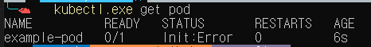
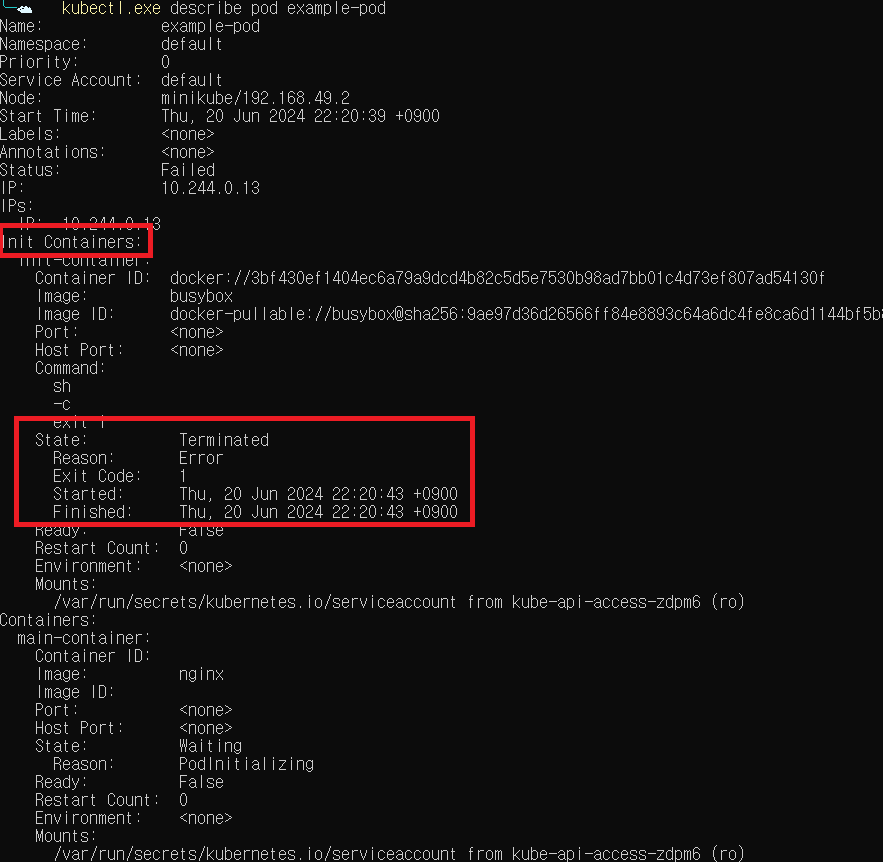

초기화 컨테이너가 실행되고 바로 종료(비정상 종료)됩니다. `Never` 옵션이므로, 의도치 않게 종료되어도 다시 실행되지 않습니다.
파드를 조회하면 당연히 초기화 컨테이너가 비정상 종료된걸 확인할 수 있습니다. `restartPolicy: Never`이므로 시간이 지나도 파드는 재할당 되지 않습니다.

`kubectl describe pod pod example-pod` 명령어로 상세조회 해보면 초기화 컨테이너에서 종료코드 1로 강제종료가 된걸 확인할 수 있습니다. 그리고 `Reason` 필드를 통해 어떤 이유로 종료 되었는지도 확인할 수 있었습니다.

2. restartPolicy: Onfailure(컨테이너가 오류로 종료되는 경우만 재실행)
```YAML
apiVersion: v1
kind: Pod
metadata:
  name: example-pod-onfailure
spec:
  restartPolicy: OnFailure
  initContainers:
  - name: init-container
    image: busybox
    command:
    - sh
    - -c
    - |
      if [ ! -f /tmp/success ]; then
        echo "First attempt, failing..."
        touch /tmp/success
        exit 1
      else
        echo "Second attempt, succeeding..."
        exit 0
      fi
    volumeMounts:
    - name: tmp-volume
      mountPath: /tmp
  containers:
  - name: main-container
    image: nginx
  volumes:
  - name: tmp-volume
    emptyDir: {}
```
이 매니페스트는 처음엔 실패, 그 이후 두 번째 요청은 성공하게 되어 있습니다. `restartPolicy: Onfailure` 옵션으로 설정되었기 때문에 오류로 종료된 경우 컨테이너가 재실행 되어야 합니다.
 
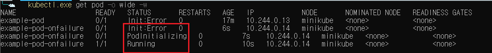
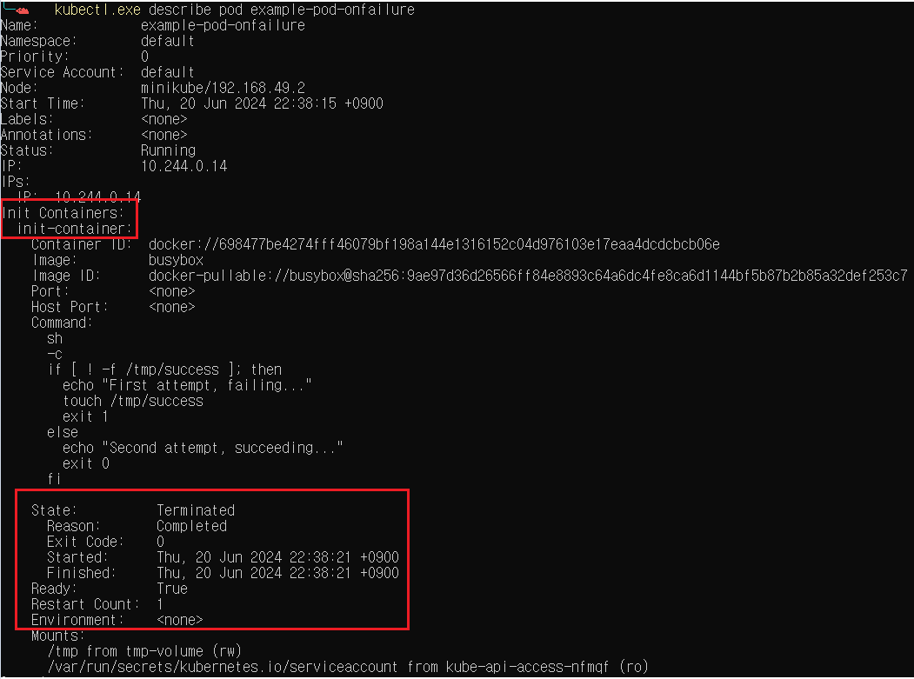
```
Events:
  Type    Reason     Age                    From               Message
  Normal  Scheduled  6m22s                  default-scheduler  Successfully assigned default/example-pod-onfailure to minikube
  Normal  Pulled     6m20s                  kubelet            Successfully pulled image "busybox" in 1.974s (1.974s including waiting). Image size: 4261574 bytes.
  Normal  Pulling    6m19s (x2 over 6m22s)  kubelet            Pulling image "busybox"
  Normal  Created    6m17s (x2 over 6m20s)  kubelet            Created container init-container
  Normal  Started    6m17s (x2 over 6m20s)  kubelet            Started container init-container
  Normal  Pulled     6m17s                  kubelet            Successfully pulled image "busybox" in 1.876s (1.876s including waiting). Image size: 4261574 bytes.
  Normal  Pulling    6m16s                  kubelet            Pulling image "nginx"
  Normal  Pulled     6m14s                  kubelet            Successfully pulled image "nginx" in 1.998s (1.998s including waiting). Image size: 187667856 bytes.
  Normal  Created    6m14s                  kubelet            Created container main-container
  Normal  Started    6m14s                  kubelet            Started container main-container
```
파드 조회를 보면 1번 에러가 발생한 후, 정상적으로 메인 컨테이너가 실행되었습니다. 좀 더 자세하게 해당 파드를 살펴보면 `Reason 필드에 완료가 된걸로 처리되어 있고 exit code도 정상적으로 종료`되었습니다. 추가적으로 알게된 사실은 `Restart Count`가 기록되고 있었고 이 값을 통해 몇번 실패했는지 유추할 수 있었습니다. 이벤트 로그를 실제 메인 컨테이너가 실행된것도 확인할 수 있었습니다.

3. restartPolicy: Always(종료된 경우 항상 컨테이너 재실행)
초기화 컨테이너의 경우 지정된 작업을 수행하고 종료되어야 합니다.. 하지만 `restartPolicy: Always` 옵션을 준 경우 어떻게 될까?

```YAML
apiVersion: v1
kind: Pod
metadata:
  name: example-pod-always
spec:
  restartPolicy: Always
  initContainers:
  - name: init-container
    image: busybox
    command: ["sh", "-c", "exit 1"]  # 항상 실패하도록 설정
  containers:
  - name: main-container
    image: nginx
```
초기화 컨테이너는 항상 실패하게 되어 있습니다.
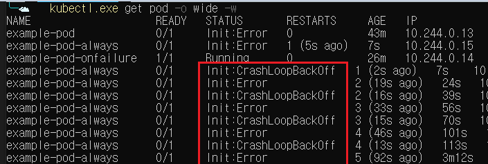
파드를 조회한 결과를 봤을 땐 굉장히 신기했습니다. 초기화 컨테이너는 계속 실패하고 다시 실행하고를 반복하고 상태가 `Error, CrashLoopBackOff`로 반복적으로 발생했습니다. 두 가지 상태가 번갈아가며 나타나는 이유는 다음 2가지가 반복적으로 동작하기 때문입니다.
- 초기화 컨테이너 실패: 초기화 컨테이너가 실패하여 파드의 상태가 `Init:Error`로 됩니다.
- 초기화 컨테이너가 실패하고 `재시작 정책`에 의해 지연 지연 시간이 발생하고, 이 지연 시간일 때 `CrashLoopBackOff` 상태로 보입니다.
- 재시작 정책은 10, 20, 40.... 2의 지수로 증가하며, 컨테이너가 10분 동안 문제없이 동작하면 재시작 타이머는 `kubelet`에 의해 초기화됩니다.

이런 이유 때문에 2가지 상태가 번갈아 가며 노출됩니다.
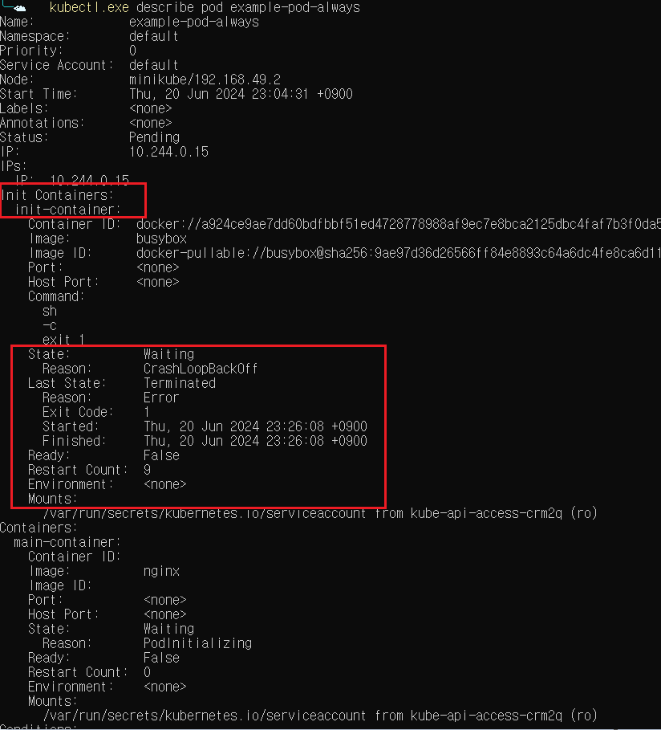
좀 더 상세하게 확인해보면 아직 초기화 컨테이너는 작업을 완료하지 않았으므로 `wating` 상태이며 반복된 실행으로 `Restart count:9`를 확인할 수 있습니다.


### 컨테이너 리소스 제한
파드를 생성할 때 각 컨테이너별 `필요한 리소스의 양을 요청하고 제한`할 수 있습니다.
컨테이너에서 리소스를 설정하면 `kubelet`은 컨테이너가 설정한 제한보다 많은 리소스를 사용할 수 없도록 제한을 적용합니다. 

- spec.containers[].resources
  - request
    - cpu
    - memory
    - hugepages-<size>
  - limit
    - cpu
    - memory
    - hugepages-<size>
  
매니페스트의 위와 같은 yaml파일로 리소스를 요청하고 제한할 수 있습니다.

```
apiVersion: v1
kind: Pod
metadata:
  name: frontend
spec:
  containers:
  - name: app
    image: images.my-company.example/app:v4
    resources:
      requests:
        memory: "64Mi"
        cpu: "250m"
      limits:
        memory: "128Mi"
        cpu: "500m"
```
해당 컨테이너는 
- memory: 64Mi
- cpu: 250m
  
만큼의 리소스를 요청하고
- memory: 128Mi
- cpu: 500m
  
만큼의 리소스를 초과하여 사용할 수 없습니다.

파드가 생성될 때, `스케줄러에 의해 파드를 배치할 노드를 필터링 할 때, reqeust의 리소스를 수용할 수 있으면 해당 노드는 선택`됩니다.

노드에 리소스가 충분하면 `request보다 많은 리소스를 사용할 수 있지만 limit 보다 더 많은 리소스를 사용할 수 없습니다.`

이렇게 리소스를 `요청과 제한`함으로 써 컨테이너가 동작하는 최소한의 사양을 맞출 수 있고, 제한(limit)함으로 써 노드의 리소스를 과도하게 사용하는 걸 방지합니다.

### 어노테이션
어노테이션은 `쿠버네티스 객체(리소스)`에 `추가적인 정보`를 저장하기 위한 (키, 값) 형태의 쌍입니다.

레이블과 형태가 똑같지만 사용하는 용도에 차이가 있습니다. 레이블은 셀렉터를 사용하여 파드를 선택하거나 그룹화할 수 있습니다.
하지만 어노테이션은 그런 기능을 제공하지 않습니다.

레이블과 다른점은 `용도`입니다. 어노테이션은 추가적인 정보를 저장하기 위한 값인 만큼 다음과 같은 용도로써 사용됩니다.
- 메타데이터 저장
  - 버전, 작성자, 릴리즈등 메타 정보를 어노테이션에 저장하여 사용
- 외부 도구 통합
  - CI/CD 파이프라인 정보, 모니터링 정보 등 외부 도구와의 통합 정보를 저장
- 정책
  - 리소스(객체)에 특정 정책을 적용하기 위한 설정 정보 저장

```
apiVersion: v1
kind: Pod
metadata:
  name: myapp-pod
  annotations:
    version: "4.0.6"
    author: "Jane Doe"
    release-date: "2024-06-17"
    debug: "true"
    debug-info: "Initial deployment failed due to misconfiguration"
    cicd-pipeline: "Jenkins"
    monitoring: "Prometheus"
    deployment-id: "cicd-2024-06-17-01"
    network-policy: "isolated"
    security: "restricted"
    compliance: "PCI-DSS"
spec:
  containers:
  - name: myapp-container
    image: myapp:4.0.6
```
이렇게 버전, 작성자, 릴리즈 부터 CI/CD, 외부도구 등 위에서 언급한 정보들을 실제로 어노테이션에 설정한 매니페스트 파일입니다.
물론 이렇게 한번에 다 어노테이션을 할당하진 않지만 이런식으로 필요한 정보를 저장할 수 있습니다.

레이블과 더 차이점이 뭐가 있을까요?

어노테이션은 정보를 저장, 레이블은 특정 레이블을 그룹하기 위함입니다. 그래서 어노테이션이 레이블보다 더 많은 양의 (키, 값)을 가질 수 있습니다.

레이블은 키, 값이 최대 63자, 어노테이션은 키 253자, 값은 제한없이 저장할 수 있습니다.


### Known Labels
Known Labels(노운 레이블)은 `쿠버네티스와 관련된 기능 및 메타데이터를 나타내기 위해 미리 정의된 표준 레이블`을 의미합니다.

[노운 레이블 공식문서](https://kubernetes.io/ko/docs/reference/labels-annotations-taints/)
문서를 통해 어떤 노운 레이블이 있고, 어떤 오브젝트에 적용되는지 그리고 사용/중지를 확인할 수 있습니다.

많이 사용하는 노운 레이블은 다음과 같습니다.

- 애플리케이션 관련 레이블
  - app.kubernetes.io/name: 애플리케이션의 이름
  - app.kubernetes.io/version: 애플리케이션 버전
  - app.kubernetes.io/component: 애플리케이션의 구성 요소
  - app.kubernetes.io/instance: 애플리케이션을 인스턴스를 식별하는 고유 이름
- 운영 관련 테이블
  - kubernetes.io/hostname: 노드의 호스트 이름
  - kubernetes.io/os: 노드의 운영체제

굉장히 다양한 레이블들이 있고 공식 문서를 통해 확인할 수 있습니다.

### ImagePullPolicy
이미지 풀 정책은 `kubelet`이 컨테이너가 이미지를 언제 가져올지 결정하는 정책을 의미합니다.
정책은 3개의 옵션을 가지고 있습니다.
- Always
  - kubelet이 컨테이너를 가동할 때마다, 이미지를 풀링 시도
  - 이미 로컬에 컨테이미지가 있는 경우 캐시된 이미지를 사용
- IfNotPresent
  - 이미지가 로컬에 없는 경우에만 이미지를 내려받음
- Never
  - 이미지를 풀링하지 않으며 로컬에 이미지가 있는 경우 컨테이너를 실행
  - 이미지가 로컬에 존재하지 않는 경우 실패함

Always옵션을 사용하여 항상 이미지를 풀링 하더라도 kubelet이 캐싱된 이미지가 있으면 사용하기 때문에 always를 사용해도 일반적인 상황에선 효율적입니다.

기본 이미지 정책에 대해서 알아봅니다.
- 기본값이 Always가 되는 경우
  - `imagePullPolicy를 명시하지 않고` 이미지의 태그가 `latest`인 경우
  - `imagePullPolicy를 명시하지 않고` 이미지 태그를 `명시하지 않은` 경우
- 기본값이 IfNotPresent가 되는 경우
  - `imagePullPolicy를 명시하지 않고` 이미지 태그가 `latest`가 아닌 경우

테스트에 사용한 매니페스트 파일입니다.
```YAML
# policy 명시하지 않고 태그가 latest인 경우
apiVersion: v1
kind: Pod
metadata:
  name: image-pull-policy-1
spec:
  containers:
  - name: container
    image: nginx:latest  # latest 태그를 사용

--
# policy 명시하지 않고 태그를 명시하지 않은 경우
apiVersion: v1
kind: Pod
metadata:
  name: image-pull-policy-no-tag
spec:
  containers:
  - name: container
    image: nginx

--
# policy 명시하지 않고 특정 버전의 태그를 사용한 경우
Version: v1
kind: Pod
metadata:
  name: image-pull-policy-tag
spec:
  containers:
  - name: container
    image: busybox:1.28
    command: ["sh", "-c", "policy test && sleep 360000"]
```

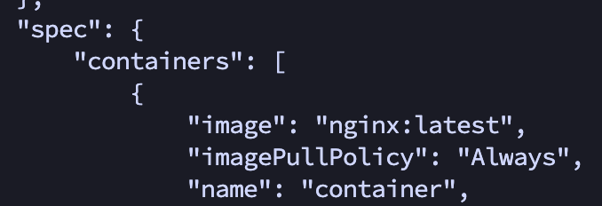
정책을 명시하지 않고 latest 태그인 경우, Always로 설정되었습니다.

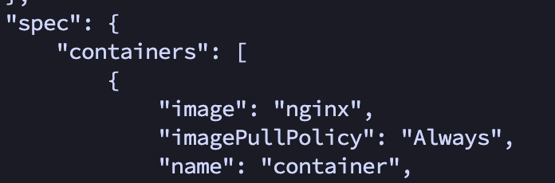
정책, 태그를 명시하지 않은 경우, Always로 설정되었습니다.

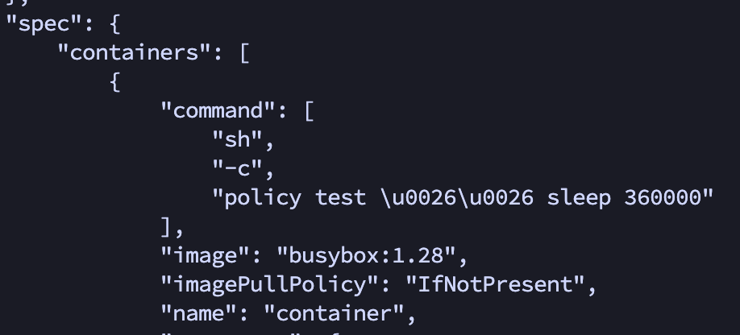
정책을 명시하지 않고, 특정 버전의 태그를 사용한 경우, IfNotPresent로 설정되었습니다.


기본 이미지 정책은 오브젝트가 처음 생성될 때 설정되고 그 이후 이미지의 태그가 바뀌더라도 업데이트 되지 않습니다. 이후 변경을 원하면 수동으로 변경해줘야 합니다.
### kubectl get
쿠버네티스는 `kubectl` CLI 도구를 통해 쿠버네티스 API와 소통합니다. 그 중 `kubectl get ...` 명령은 쿠버네티스의 오브젝트를 조회하는 명령어로 굉장히 많이 사용됩니다.

[kubectl get 문서](https://kubernetes.io/docs/reference/generated/kubectl/kubectl-commands#get)
실제 무수히 많은 옵션이 있지만 가장 많이 사용되는 옵션들만 미리 알아봅니다.

`kubectl get <resource-type> <option> <resource-name>` 형태로 사용되며, 리소스 타입은 pod, services, node등등 쿠버네티스의 오브젝트를 의미합니다.

- option
  - o(출력 형식 지정)
    - wide: 추가 정보를 출력
      - kubectl get pods -o wide
    - json: JSON 형식 출력
      - kubectl get pods -o json
    - yaml: YAML 형식 출력
      - kubectl get pods -o yaml
  - w(실시간으로 변경 사항 감지, 종료되지 않고 계속 감시)
    - kube get pods -w
  - l(레이블 셀렉터)
    - 특정 레이블을 가진 리소스만 조회
    - kubectl get pods -l key=value
  - --all-namespaces
    - 모든 네임스페이스의 리소스 조회
    - kubectl get pods --all-namespaces
  - n(네임 스페이스 명시)
    - 옵션을 사용하지 않을 경우 `default` 네임스페이스 사용
    - kubectl get pods -n my-namespace
    - kubectl get pods -n kube-system
  - 유용한 옵션
    - kubectl get pods --show-labels: 모든 파드의 레이블 조회
    - kubectl get events --sort-by=.metadata.creationTimestamp: 타임스탬프로 정렬된 이벤트 조회
    - kubectl events --types=Warning: 모든 Warning 타입 이벤트 조회
    - kubectl get pods --field-selector=status.phase=Running -n <namespace>: 네임스페이스의 모든 실핼중인 파드 조회

모든 옵션, 명령어를 이해하고 사용하기 힘드므로 필요할 때 공식문서를 참조하여 확인합니다.

### 라이브니스 프로브
컨테이너에 문제가 생겨 제대로 동작되지 않는 경우, `kubectl`이 해당 컨테이너를 재시작한다.
하지만 무한 루프나 데드락 같이 문제가 있지만 정상적으로 동작하는 것처럼 보이는 경우 어떻게 해야할까? 그래서 애플리케이션의 내부에서 문제를 파악하기 보단 외부에서 애플리케이션의 상태를 체크해야 한다.

쿠버네티스는 `라이브니스 프로브`를 통해 컨테이너가 살아 있는지 확인할 수 있다.
주기적으로 라이브니스 프로브를 실행하고 프로브가 실패할 경우, 해당 컨테이너를 다시 시작한다.

세 가지 메커니즘으로 컨테이너에 프로브를 실행한다.
1. GET 프로브
지정된 ip, port, path에  HTTP GET 메소드로 요청하고, status code(200, 300번대)로 문제를 판단한다.
잘못된 응답 코드나, 응답이 없는 경우, 해당 컨테이너를 다시 시작한다.
2. TCP 소켓 프로브
컨테이너 지정된 포트에 TCP연결을 시도하고 연결이 실패한 경우, 해당 컨테이너를 다시 시작한다.
3. Exec 프로브
컨테이너내의 임의의 명령을 실행하고 명령의 종료 상태코드를 확인한다. 0이면 성공, 0이외의 값이면 실패로 간주한다.

결과적으로 컨테이너에서 에러가 발생하거나, 라이브니스 프로브가 실패한 경우 노드의 `kubelet`은 해당 컨테이너를 재시작한다.

라이브니스 프로브는 다음과 같은 옵션을 가지고 있습니다.
- spec
  - containers
    - livenessProbe
      - initialDelaySeconds: 0(디폴트) <컨테이너가 시작된 후 N초 대기한 뒤 첫 번쨰 라이브니스 프로브 실행>
      - periodSeconds: 10(디폴트) <이후 매 N초마다 프로브를 실행>
      - timeoutSeconds: 1(디폴트) <프로브 요청이 2초 내에 완료되어야 합니다>
      - failureThreshold: 3(디폴트) <프로브가 3번 연속 실패하면 컨테이너를 재시작합니다>
```YAML
apiVersion: v1
kind: Pod
metadata:
  name: liveness-test
spec:
  containers:
  - name: nginx
    image: nginx
    ports:
    - containerPort: 80
    livenessProbe:
      httpGet:
        path: /ho/ho
        port: 80
      initialDelaySeconds: 10
      periodSeconds: 10
```
이 매니페스트를 실행한 후 파드의 정보를 조회해봅니다.

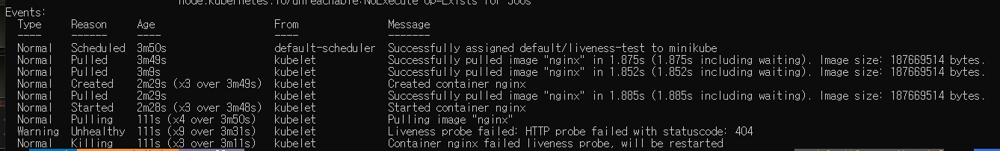
```YAML
Containers:
  nginx:
    State:          Waiting
      Reason:       CrashLoopBackOff
    Ready:          False
    Restart Count:  13
    Liveness:       http-get http://:80/ho/ho delay=10s timeout=1s period=10s #success=1 #failure=3
```
`/ho/ho`로 없는 존재하지 않는 URL로 요청하여 404에러가 발생한것을 확인할 수 있습니다.


### 레디니스 프로브
레디니스 프로브는 `주기적으로 호출되며 컨테이너가 클라이언트 요청을 처리할 준비가 되었는지 확인`한다. 레디니스 프로브가 실패하면 서비스 엔드포인트 목록에서 제거되어 트래픽이 전달되지 않습니다.

레디니스 프로브 유형
- Exec 프로브
  - 컨테이너 상태를 프로세스의 종료 상태 코드로 결정
- HTTP GET 프로브
  - HTTP GET 요청을 보내고 응답의 상태코드에 따라 준비 여부를 확인하는 프로브(Heartbeat)
- TCP 소켓 프로브
  - 컨테이너의 지정된 포트로 TCP 연결을 확인해 준비 여부를 확인하는 프로브

레디니스 프로브의 옵션은 다음과 같습니다.
- spec
  - containers
    - livenessProbe
      - initialDelaySeconds: 0(디폴트) <컨테이너가 시작된 후 N초 대기한 뒤 첫 번쨰 라이브니스 프로브 실행>
      - periodSeconds: 10(디폴트) <이후 매 N초마다 프로브를 실행>
      - timeoutSeconds: 1(디폴트) <프로브 요청이 2초 내에 완료되어야 합니다>
      - failureThreshold: 3(디폴트) <프로브가 3번 연속 실패하면 컨테이너를 재시작합니다>


그럼 라이브니스 프로브랑 어떤 다른점이 있을까?
라이브니스 프로브는 상태 점검에 실패하면 컨테이너를 제거하고 새로 만든다. 하지만 레디니스 프로브는 상태 점검에 실패하더라도 삭제되지 않고 상태 점검에 성공한 파드만 요청(서비스 엔드포인트가 유지됨)을 수신하도록 한다.

레디니스 프로브의 중요성
만약 파드 그룹이 다른 파드에서 제공하는 서비스에 의존하는 상황에서 문제가 발생한 경우, 레디니스 프로브를 통해 해당 파드가 요청을 처리할 준비가 되지 않음을 쿠버네티스에 알린다. 이를 통해 문제가 발생한 파드로 요청을 보내지 않고 정상 상태인 파드하고 통신하여 문제가 발생했음에도 사용자는 문제를 인식하지 못하고 안정적으로 서비스를 사용할 수 있다.

예를 들어 백엔드 애플레이케이션 서버가 데이터베이스 파드에 의존하는 상황에서 문제가 발생한 경우, 문제가 생긴 파드말고 정상적으로 동작하는 파드로 요청하여 안정적인 상태를 유지할 수 있다.

```
apiVersion: v1
kind: Pod
metadata:
  name: readiness-example
spec:
  containers:
  - name: web-server
    image: nginx:latest
    ports:
    - containerPort: 80
    readinessProbe:
      httpGet:
        path: /ready
        port: 80
      initialDelaySeconds: 5
      periodSeconds: 10
      timeoutSeconds: 1
      successThreshold: 1
      failureThreshold: 3

```
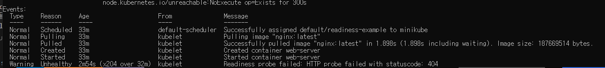
유효하지 않은 URL로 HTTP 요청을 했지만 레디니스 프로브가 실패한걸 이벤트를 통해 확인할 수 있습니다.

마지막으로 레디니스 프로브는 항상 정의되어야 한다. 그렇지 않으면 `파드가 생성되는 즉시 서비스 엔드포인트가 되므로 애플리케이션이 요청을 수행 받을 준비가 되어 있지 않더라도 요청을 받을 수 있다.` 그래서 항상 레디니스 프로브를 정의헤야 한다.

### Kubeconfig
기본적으로 kubectl은 `$HOME/.kube` 디렉토리에 config 파일을 찾습니다.
kubeconfig는 다음과 같은 정보를 가지고 있습니다.(아래에 값들은 내부 클러스터에 있는 kubeconfig파일이며 보안를 위해 일부 값들을 축소해서 표현했습니다.)
1. clusters
클러스터에 대한 정보를 정의합니다.

```YAML
clusters:
- cluster:
    certificate-authority-data: LS0tLS1CRUdJTiBDRVJUSUZJQ0FURS0tLS==...
    server: https://10.60.160.171:6443
  name: kubernetes
```
- name: 클러스터 이름을 명시합니다.
- cluster
  - server: 클러스터 내부 API 서버의 주소입니다.
  - certificate-authority-data: 클러스터가 생성되면 CA인증서가 만들어지고 base64로 인코딩되어 저장됩니다.

```
certificate-authority-data(CA)값에 있는 인증서 파일을 통해 쿠버네티스 API 서버를 신뢰할 수 있는지 검증합니다.

클라이언트는 API 서버의 인증서를 CA 인증서로 서명이 되어 있는지 확인하여 신뢰할 수 있는지 확인합니다.
```

2. users
클라이언트의 인증 정보를 정의합니다.

```YAML
users:
- name: kubernetes-admin
  user:
    client-certificate-data: LS0tLS1CRUdJTiBDRVJUSUZJ==
    client-key-data: LS0tLS1CRUdJTiBQUklWQVRFIE=
```

`clinert-certificate-data`는 클라이언트 인증서 데이터를 base64로 인코딩한 값입니다. 클라이언트가 API서버에 접근 할 때 . 이인증서를 사용하여 자신을 인증합니다. 이 인증서는 클러스터의 CA 인증서로 서명되어 있어야 합니다.
`client-key-data`는 클라이언트의 개인 키를 base64로 인코딩한 값입니다.
클라이언트 인증서와 함께 사용되어 클라이언트의 신원을 증명하는데 필요한 암호화 작업을 수행합니다.


3. context
쿠버네티스 클러스터와 상호 작용할 때, 사용할 클러스터, 사용자, 네임스페이스를 가지고 있습니다. kubectl은 현재 컨텍스트의 매개 변수를 사용하여 클러스터와 통신합니다.
네임스페이스가 없는 경우 `default` 네임스페이스를 사용합니다.

```YAML
contexts:
- context:
    cluster: kubernetes
    user: kubernetes-admin
  name: kubernetes-admin@kubernetes
current-context: kubernetes-admin@kubernetes
```
클러스터, user, name을 확인할 수 있고 현재 어떤 클러스트를 사용 중인지 알 수 있습니다.

### 컨테이너 상태
컨테이너의 상태는 크게 3가지가 있습니다.
1. Waiting

Waiting 상태의 컨테이너는 시작을 완료하는데 필요한 작업(컨테이너 이미지를 가져오기)을 계속 실행하는 중인 상태입니다.
kubectl을 사용하여 파드를 조회하면 컨테이너가 해당 상태에 있는 이유를 `Reason` 필드에 표시됩니다.
Reason 필드는 [초기화 컨테이너 리스타트 정책별 정리](#초기화-컨테이너-다양한-케이스)에서 확인할 수 있습니다.

2. Running

Running 상태는 컨테이너가 문제없이 실행되고 있음을 의미합니다. 
`postStart 라이프사이클 훅`이 설정되어 있었다면 이미 실행이 완료되었습니다.
kubectl을 사용하여 Running 상태로 진입한 시기랑 정보를 확인할 수 있습니다.
아래는 `kubectl describe pod <podname>`으로 실제 파드를 상세 조회한 정보입니다.

```
Containers:
  main-container:
    Container ID:   docker://5fe144a83de53f54738555abc973e1d73b1277d8d14c06bcacb59e7f1d6eb67c
    Image:          nginx
    Image ID:       docker-pullable://nginx@sha256:56b388b0d79c738f4cf51bbaf184a14fab19337f4819ceb2cae7d94100262de8
    Port:           <none>
    Host Port:      <none>
    State:          Running
      Started:      Thu, 20 Jun 2024 23:35:42 +0900
    Ready:          True
    Restart Count:  0
    Environment:    <none>
    Mounts:
      /var/run/secrets/kubernetes.io/serviceaccount from kube-api-access-lzjd5 (ro)
```
`State: Running`, `Started: <시간>` 을 통해 현재 컨테이너의 상태, 그리고 언제 Running으로 바뀌었는지 시간에 대한 정보를 알 수 있습니다.

3. Terminated

Terminated 상태는 작업을 완료하고 종료 하거나, 에러가 발생하여 종료된 상태를 의미합니다.
컨테이너에 구성된 `preStop 라이프사이클 훅`이 설정되어 있는 경우 이 훅은 컨테이너가 Terminated 들어가기 전에 실행됩니다.
[초기화 컨테이너 리스타트 정책별 정리](#초기화-컨테이너-다양한-케이스) 여기 예시에서
```
State: Terminated
  Reason: `Completed` or `Error`
  Exit Code: `종료 코드`
  Started: `시간`
  Finished: `시간`
```
형식을 확인할 수 있습니다.

### 컨테이너 라이프사이클 훅
```
앞서 컨테이너의 상태에서 Running, Terminated 상태에서 라이프사이클 각각 PostStart, PreStop에 대해 언급했습니다. 여기서 좀 더 자세하게 어떤 동작인지 살펴봅니다.
```
컨테이너에서 사용되는 라이프사이클 훅은 2개가 있습니다.
1. PostStart
이 훅은 컨테이너 생성 직후에 실행됩니다. 하지만 컨테이너 엔트리포인트에 앞서서 실행된다는 보장은 없습니다.

```
컨테이너가 생성이 된 후 바로 실행되는데, 컨테이너 엔트리포인트에 앞서서 실행된다는 보장이 없다는게 무슨말일까요?

먼저 컨테이너 생성과 실행을 구분해야합니다.
- 컨테이너 생성:` 컨테이너가 생성되고 실행할 준비가 되었고, 아직 엔트리포인트나 CMD 명령어가 실행되기되기 전 상태`
- 컨테이너 실행: `컨테이너가 생성된 후, 엔트리포인트나 CMD가 실행되어 컨테이너가 동작한 상태`
```
즉 `PostStart`는 `컨테이너 생성 직후` 실행되며 `컨테이너 생성 후 - 컨테이너 실행 전`, `컨테이너 생성 후 - 컨테이너 실행 후 즉시` 실행될 수 있습니다. 하지만 둘 중 어느 단계에서 실행되는지 알 수 없습니다.

실제 동작을 테스트 해봅니다.
```YAML
apiVersion: v1
kind: Pod
metadata:
  name: poststart-test
spec:
  containers:
  - name: poststart-test
    image: nginx
    lifecycle:
      postStart:
        exec:
          command: ["/bin/sh", "-c", "echo Hello from the postStart handler > /usr/share/message"]

--
apiVersion: v1
kind: Pod
metadata:
  name: poststart-test
spec:
  containers:
  - name: poststart-test
    image: nginx
    lifecycle:
      postStart:
        httpGet:
          path: /
          port: 80
          host: localhost
          scheme: HTTP
          #httpHeaders
          #  - name: Key
          #    value: value

```
- spec
  - containers
    - lifecycle
      - postStart(둘 중 하나만 사용 가능)
        - exec: 스크립트, 특정 커맨드 실행 가능
        - HTTP: http 요청 실행 가능

```SHELL
kubectl exec -it <pod-name> -- /bin/sh
cat /usr/share/message # 파일이 생성된 걸 확인

kubectl logs <pod-name> # 요청이 로그 확인
```
컨테이너에 직접 들어가 파일이 생성된 걸 확인하거나 컨테이너의 로그를 조회하여 요청이 성공적으로 이루어진 걸 확인하면 됩니다. 
하지만 실패한 경우 상황에 따라 `postStart가 종료될 수 있고, 성공적으로 실행된 걸로 간주될 수 있습니다.`

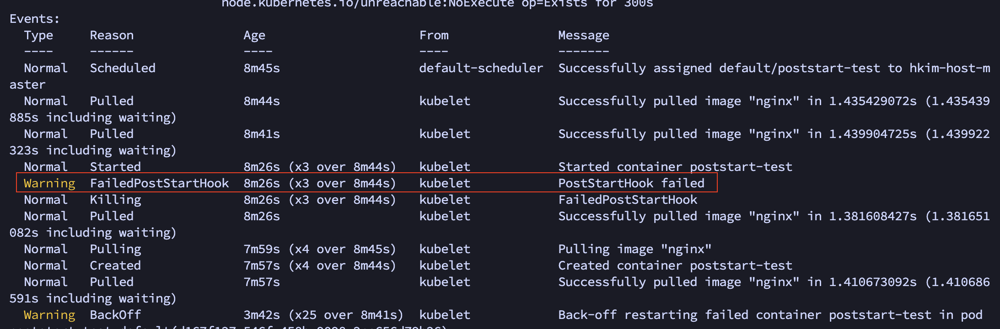
```
lifecycle:
      postStart:
        exec:
          command: ["/bin/sh", "-c", "echo Hello from the postStart handler > /ho/ho"]
```
위 사진은 일부러 실패하는 커맨드가 실행된 모습입니다.
커맨드 명령이 실패하여 컨테이너가 종료되고 재실행됩니다. 그리고 `postStart 실패 기록은 event에 기록되며 위 사진처럼 확인할 수 있습니다.` 하지만 http 요청의 경우 400, 500번대 에러가 발생해도 실패로 간주가 안됩니다. 이유는 `응답 코드와는 별개로 HTTP 요청이 성공적으로 완료되었다고 처리되기 때문입니다(400, 500에러를 받은 것도 요청이 성공적으로 되었기 때문에 받을 수 있음)`. 400, 500번대를 에러로 처리하려면 별도의 커맨드로 응답 상태코드값을 받아와 검증하여 exit 시스템 콜을 사용해 컨테이너를 종료 처리해야 합니다.

2. PreStop
PreStop은 컨테이너가 종료되기 직전에 호출됩니다. 컨테이너가 이미 `Terminated`, `Completed` 상태인 경우 preStop 요청은 실패합니다. 컨테이너가 중지하기 위한 TERM 신호가 보내지기 전에 완료되어야 합니다. 그레이스 종료 기간(컨테이너가 종료되기 전 기다리는 최대 시간)은 preStop이 실행되기 전에 시작되어, 그레이스 종료 기간이 끝나면 preStop 결과에 상관없이 컨테이너는 강제로 종료됩니다.


preStop가 실행되는 상황은 다음과 같습니다.
- API 요청: 관리자가 직접 pod를 삭제하거나 컨테이너를 종료 하는 경우
- 활성 프로브(라이브니스 프로브): 헬스 체크가 실패하여 컨테이너를 다시 시작하는 경우
- 선점: 더 높은 우선순위의 파드를 실행하기 위해 현재 파드를 축출 하는 경우
- 자원: 노드의 자원이 부족하여 일부 컨테이너를 종료할 때

추가적으로 궁금할 수 있는 내용들입니다.
```
1. 컨테이너에게 TERM 신호가 보내지기 전에 preStop이 완료 되어야 하는데 그러면 preStop가 실핼중일 때 TERM 신호는 어떻게 처리되는가?
`kubelet`에 의해 관리가되며, TERM 시그널은 preStop가 동작이 완료될 때까지 대기합니다. preStop가 완료되면 바로 TERM을 보내 컨테이너를 종료합니다.

2. 그레이스 종료 기간 
그레이스 종료 기간은 파드 단위로 설정된 컨테이너가 정상적으로 종료할 수 있도록 할당된 시간입니다. 이 값은 기본 30초를 가지며
spce
  - terminationGracePeriodSeconds: 60
  container:
  ...
같은 형식으로 수정할 수 있습니다. 이 시간이 지나면 SIGKILL 신호를 보내 컨테이너를 강제로 종료합니다.
```

실제 preStop이 잘 동작되는지 확인해봅니다.
```YAML
# 성공 케이스
apiVersion: v1
kind: Pod
metadata:
  name: pre-stop
spec:
  containers:
  - name: pre-stop
    image: nginx
    lifecycle:
      preStop:
        exec:
          command: ["/bin/sh", "-c", "echo 'PreStop for container1' >> /prestop.log; sleep 10"]
```
이 파드를 생성 후 삭제 하면서 preStop가 정상적으로 실행되었는지 확인합니다.
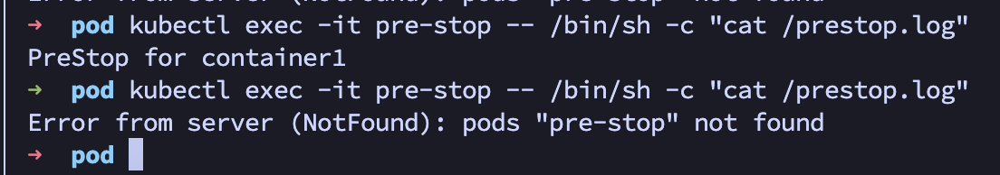
파드 삭제 API를 실행했습니다. 이후 preStop이 실행되고 10초만 sleep할 때 커맨드가 제대로 실행되었는지 확인한 결과입니다. preStop가 실행되어 로그파일을 생성했고 이후 다시 조회했을 땐 해당 파드가 삭제되었습니다.

```YAML
# 실패 케이스(일반적인 실패)
apiVersion: v1
kind: Pod
metadata:
  name: pre-stop
spec:
  containers:
  - name: pre-stop
    image: nginx
    lifecycle:
      preStop:
        exec:
          command: ["exit", "1"]

--
# 실패 케이스(그레이스 종료 시간)
apiVersion: v1
kind: Pod
metadata:
  name: pre-stop
spec:
  containers:
  - name: pre-stop
    image: nginx
    lifecycle:
      preStop:
        exec:
          command: ["/bin/sh", "-c", "echo 'PreStop for container1'; sleep 2000000"]
```
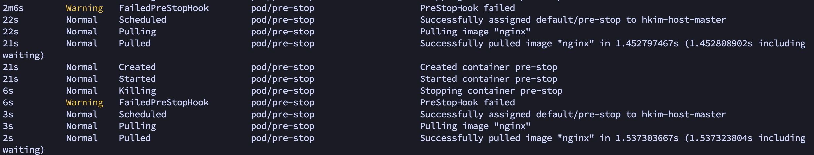
그림을 보면 2개의 preStop 에러 이벤트가 있습니다.
위가 그레이스종료시간(타임아웃)으로 실패한 경우도 아래가 일반적인 에러가 난 경우 실패를 의미합니다.

PostStart의 용도
- 초기화 작업: 메인 컨테이너가 생성된 후, 필요한 설정이나 초기화 작업 수행
- 의존성 확인: 컨테이너가 의존하는 서비스나 리소스 확인
- 로그 초기화: 컨테이너가 시작될 때 로그 파일을 초기화

PreStop의 용도
- 세션 종료: 컨테이너가 종료되기 전 연결된 클라이언트들에게 종료 전달
- 데이터 저장: 종료되기 직전 로그파일이나 메모리의 중요한 데이터 저장
- 자원 해제: 데이터베이스 close등 애플리케이션과 연결된 자원들을 정리

```
PostStart의 경우 초기화 컨테이너와 굉장히 유사합니다. 그럼 둘의 다른점은 무엇일까요?
먼저 초기화 컨테이너는 별도의 컨테이너를 가지며, 메인 컨테이너가 실행되기 전에 실행됩니다. 하지만 postStart는 메인 컨테이너가 생성된 직후 실행되므로 초기화 컨테이너와 실행되는 위치에 차이가 있습니다.

실행 순서는
1. 초기화 컨테이너 실행
2. 메인 컨테이너 생성
3. PostStart 실행
순서로 동작합니다.
```

### 쿠버네티스에서 리소스를 관리하는 방법
`kubelet`이 파드의 컨테이너를 시작할 때, 각 컨테이너별 `정의된 cpu/메모리의 요청과 제한을 컨테이너 런타임에게 전달`합니다.
`컨테이너 런타임은 적용될 커널의 cgroup 기능을 사용하여 리소스에 대한 제한`을 겁니다.

CPU
- cpu 요청은 가중치에 의해 결정됩니다. `파드내에 여러 컨테이너가 실행되는 경우, cpu 요청값이 더 큰 컨테이너가 더 많은 CPU 시간을 할당`받습니다.
- cpu 제한은 해당 컨테이너가. 사용할 수 있는 상한으로 정의됩니다. `일정 간격 마다 리눅스 커널이 이 제한을 초과되었는지 확인하고, 초과된 경우 cgroup에 의해 cpu자원을 사용하지 못하고, 제한이 제한보다 작아진 경우 다시 cpu 자원을 사용`합니다.

메모리
- 메모리 요청은 파드 스케줄링 과정(메모리를 수용할 수 있는 파드에 할당)에서 사용됩니다. 컨테이너 런타임은 메모리 요청 값을 참고하여 cgroup v2인 경우, `memory.min` 설정을 구성합니다.
- 메모리 제한은 해당 cgroup의 메모리 사용량 상한을 정의합니다. 컨테이너가 제한된 용량보다 더 많은 메모리를 할당받으려고 시도하면, `리눅스 커널의 메모리 부족 시스템이 활성화되고, 메모리를 할당 받으려고 했던 컨테이너의 프로세스 중 하나를 종료`합니다. 만약 종료한 프로세스의 PID가 1(메인 프로세스)라면 컨테이너는 종료되고, 재시작 정책이 `Always, OnFailure`이면 `kubelet`에 의해 컨테이너는 재실행됩니다.
- 메모리 제한의 경우 메모리 기반 볼륨(emptyDir)에서 medium 속성을 memory로 적용하면 위의 제한을 똑같이 적용할 수 있습니다.

### cgroup v2
cgroup2은 cgroup의 성능을 개선한 새로운 버전입니다.

cgroup2에서 메모리는 `memory.max`, `memory.current`, `memory.high`, `memory.low`, `memory.min` 설정파일을 제공합니다.
min, max에 대해서만 내용을 작성합니다.

이 파일은 cgroup에서 메모리 사용 보장을 위해 사용되는 설정 파일입니다. 각 파일은 바이트를 값으로 가지고 있습니다. ex) 268435456(256Mib을 가짐)
- memory.min: 절대적으로 보장되는 최소 메모리의 양입니다. 시스템 메모리가 부족한 상황에서도 이 설정값은 보장됩니다. 부족하면 다른 컨테이너(cgroup)에서 메모리를 회수해서라도 이 메모리 사용을 유지합니다.
- memory.max: 사용할 수 있는 최대 메모리 양입니다. 이 값을 초과하려고 시도하면 메모리 할당이 실패하고 OOM(Out Of Memory)가 발생하여 컨테이너의 프로세스 중 하나를 종료합니다.

예시를 들어 설명하겠습니다.
```YAML
apiVersion: v1
kind: Pod
metadata:
  name: memory-limits-example
spec:
  containers:
  - name: container
    image: nginx
    resources:
      requests:
        memory: "512Mi"
      limits:
        memory: "1024Mi"
```
이 매니페스트 파일은 메모리에 512MiB를 요청하고, 1024MiB로 제한을 걸었습니다.
이 설정이 적용되면 해당 파드에 있는 cgroup v2의 메모리 파일들은 다음과 같이 설정됩니다.
- memory.min: 메모리 요청값(512MiB) 절대적으로 보장받는 최소 메모리
- memory.max: 메모리 제한값(1024MiB) 최대 사용 가능 메모리
이 컨테이너는 512MiB 메모리를 최소로 보장하며 1024MiB 사용량을 넘는 시도가 있으면 OOM이 발생하여 해당 컨테이너의 프로세스 중 하나를 종료합니다.

### LimitRange
파드를 정의할 때 각 컨테이너의 리소스를 요청, 제한할 수 있습니다. 하지만 이 리소스 값을 정의하지 않으면 2가지 중 1개의 동작이 일어납니다.
- 아무 노드에 배치될 수 있으며, 제한이 없어 자원을 무제한으로 사용할 수 있는 컨테이너
- LimitRange 객체에 의해 디폴트 값이 설정됨

확인을 위해 요청과 제한이 있는 파드와 리로스 제한이 없는 파드를 생성하겠습니다.
```YAML
# 리소스 요청과 제한
apiVersion: v1
kind: Pod
metadata:
  name: resource-limit
spec:
  containers:
  - name: container
    image: nginx
    resources:
      requests:
        memory: "512Mi"
      limits:
        memory: "1024Mi"
--
# 리소스 무제한
apiVersion: v1
kind: Pod
metadata:
  name: no-resource-limits
spec:
  containers:
  - name: container
    image: busybox
    command: ["sh", "-c", "sleep 3600"]
```

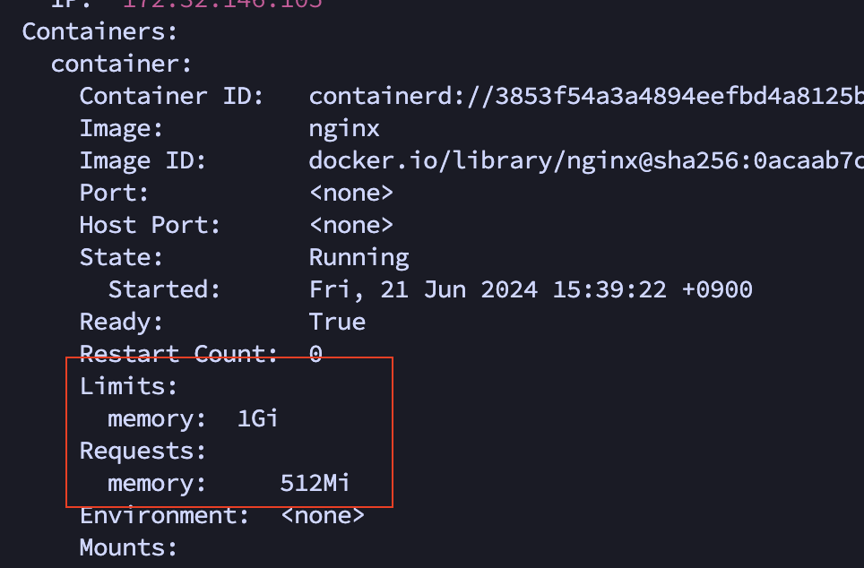
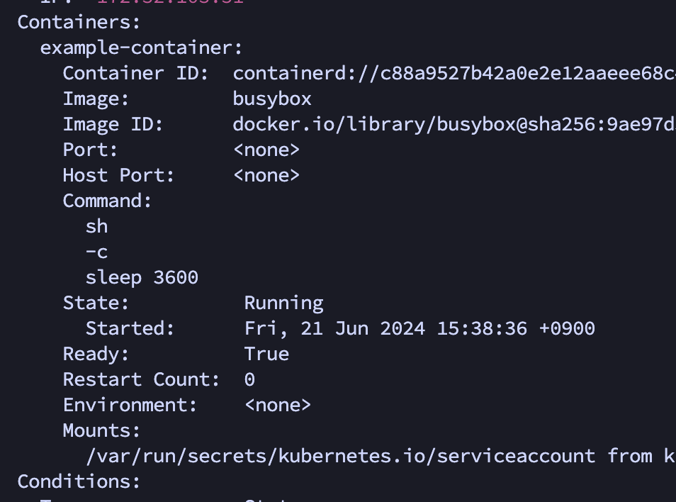
각각 생성된 파드를 보면 리소스에 제한이 걸린게 있고 리로스 필드 자체가 없는걸 볼 수 있습니다.

리소스에 제한이 없는 컨테이너는 파드내의 모든 자원을 혼자 사용할 수 있으므로 반드시 생성되지 않게 해야합니다.
쿠버네티스에선 이를위해 LimitRange를 지원하여 네임스페이스 단위로 디폴트 값을 설정할 수 있습니다.

```YAML
apiVersion: v1
kind: LimitRange
metadata:
  name: limit-range
  namespace: default
spec:
  limits:
  - max:
      cpu: "2"
      memory: "2Gi"
    min:
      cpu: "200m"
      memory: "512Mi"
    default:
      cpu: "500m"
      memory: "1Gi"
    defaultRequest:
      cpu: "200m"
      memory: "512Mi"
    type: Container
```
- max
  - 컨테이너가 요청할 수 있는 최대 리소스
- min
  - 컨테이너가 요청할 수 있는 최소 리소스
- default
  - 컨테이너에 리소스 `제한`이 설정되어 있지 않으면 설정되는 값
- defaultRequest
  - 컨테이너에 리소스 `요청`이 설정되어 있지 않으면 설정되는 값

만약 min ~ max의 범위를 벗어나는 값을 할당하면
```
Error from server (Forbidden): error when creating "rs.yaml": pods "resource-limit" is forbidden: maximum memory usage per Container is 2Gi, but limit is 6000Mi
```
파드를 생성할 때 에러가 발생하여 생성할 수 없습니다.
그리고 이제 리소스 요청, 제한 없이 `default namespace`에서 파드를 생성하면

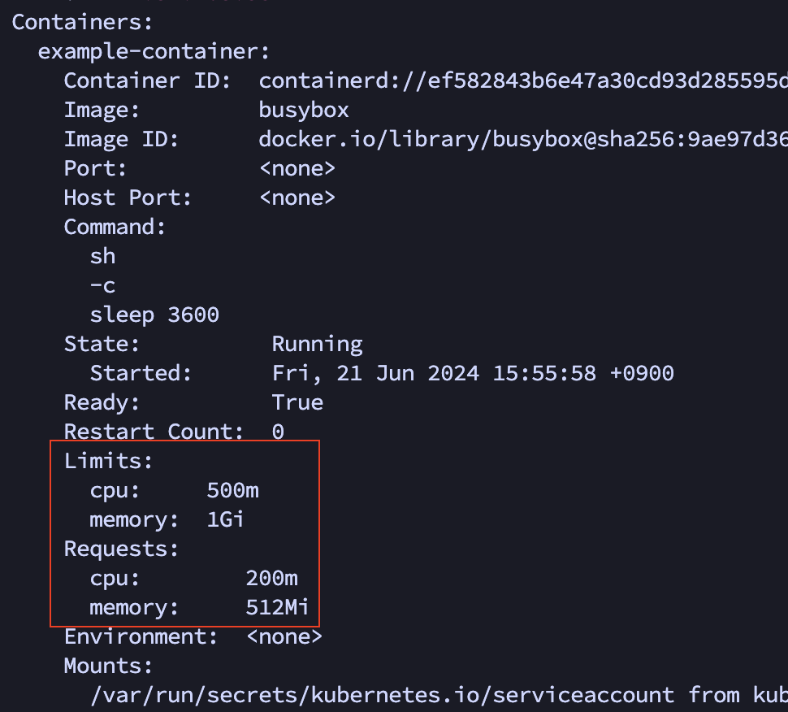
리소스가 자동으로 할당된 걸 확인할 수 있었습니다.

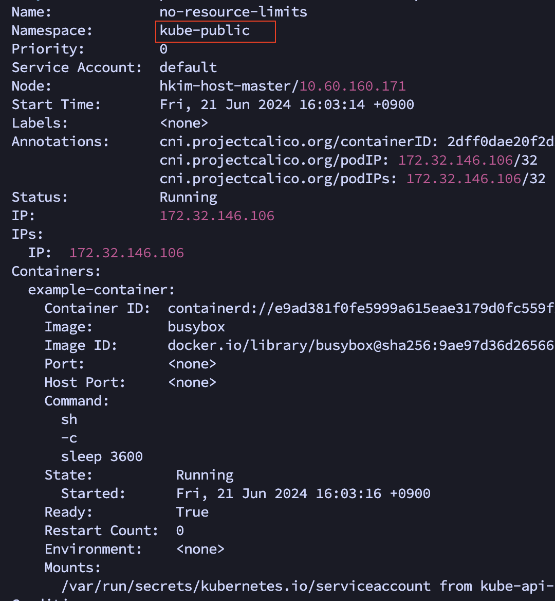
다른 네임스페이스(kube-public)에서 파드를 생성했지만 리소스에 대한 디폴트 값이 적용되지 않은 것도 확인할 수 있었습니다.

### 파드 상태
파드는 정의된 라이프사이클을 따릅니다. `Pending`단계부터 시작해서 `Running`, `Succeeded`, `Failed` 단계로 이동합니다.

파드가 실행되는 동안, `kubelet`은 오류나 문제를 해결하기위해 컨테이너는 다시 시작될 수 있습니다. 그리고 파드 오브젝트의 상태는 `파드 컨디션`으로 구성됩니다. 

파드의 정의된 상태는 다음과 같습니다.

1. Pending

파드가 생성되었지만 컨테이너가 실행되지 않은 상태입니다. 파드는 `스케줄러에 의해 노드에 배치` 전 상태이거나 배치된 직후의 상태입니다. `초기화 컨테이너는 실행 중/실행 완료된 상황이어도 메인 컨테이너가 실행`되지 않은 상태입니다.
이 과정에서 컨테이너 이미지 풀링 또한 같이 이루어집니다.

2. Running 

파드내에 모든 컨테이너가 생성되었고, 하나 이상의 컨테이너가 정상적으로 실행 중이거나 시작/재시작 중에 있습니다.

3. Succeeded

파드가 특정 작업을 성공적으로 완료 했음을 나타내는 상태입니다. 일반적으로 `잡`과 같은 일회성 작업에 사용됩니다.

파드내에 모든 컨테이너가 정상적으로 종료되었고, 다시 시작하지 않을 때 적용됩니다. 하나라도 컨테이너가 작업에 실패하면 `Failed` 상태가 됩니다.

데이터 가공(변환), 백업 등 일회성 작업에 사용됩니다.

4. Failed

파드내에 모든 컨테이너가 종료되었고, 하나 이상의 컨테이너가 실패로 종료된 상태입니다. 만약 3개의 컨테이너 중 2개가 실행 중이고, 1개가 실패로 종료되어도 파드는 모든 컨테이너가 종료되지 않았기 때문에 Running 상태를 유지합니다.

5. Unknown
어떤 이유에 의해서 파드의 상태를 얻을 수 없습니다. 이 단계는 일반적으로 파드가 실행되어야 하는 노드와 통신 오류로 인해 발생합니다.

1개의 파드 안에 여러 개의 컨테이너를 실행하고 상태를 확인하겠습니다.
```YAML
apiVersion: v1
kind: Pod
metadata:
  name: pod-status
spec:
  restartPolicy: OnFailure
  containers:
  - name: running-container
    image: busybox
    command: ["sh", "-c", "while true; do echo Running...; sleep 10000; done"]
  - name: failed-container
    image: busybox
    command: ["sh", "-c", "exit 1"]
  - name: completed-container
    image: busybox
    command: ["sh", "-c", "echo Hello, World!; sleep 5"]
    
```
3개의 컨테이너가 시작됩니다. 1개는 정상, 1개는 실패, 1개는 정상적으로 작업을 완료하는 3개의 컨테이너 입니다.
```YAML
Name:             pod-status
Namespace:        default
Status:           Running
Containers:
  running-container:
    Command:
      sh
      -c
      while true; do echo Running...; sleep 10000; done
    State:          Running
      Started:      Sat, 22 Jun 2024 22:24:14 +0900
  failed-container:
    Command:
      sh
      -c
      exit 1
    State:          Waiting
      Reason:       CrashLoopBackOff
    Last State:     Terminated
      Reason:       Error
      Exit Code:    1
      Started:      Sat, 22 Jun 2024 22:27:10 +0900
      Finished:     Sat, 22 Jun 2024 22:27:10 +0900
    Ready:          False
    Restart Count:  5
  completed-container:
    Command:
      sh
      -c
      echo Hello, World!; sleep 5
    State:          Terminated
      Reason:       Completed
      Exit Code:    0
      Started:      Sat, 22 Jun 2024 22:33:46 +0900
      Finished:     Sat, 22 Jun 2024 22:33:51 +0900
    Restart Count:  0
```
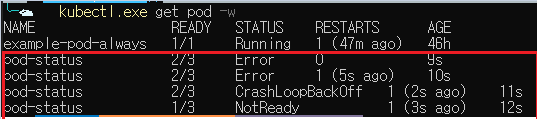

파드 목록을 조회하면 2개 컨테이너가 READY 상태이고 그 이후 1개의 컨테이너는 작업 완료 후 종료된 상태라 1개가 READY로 된걸 확인할 수 있습니다.

실행한 결과에서 필요한 부분만 복사했습니다. 재시작 정책이 `OnFailure`라서 에러가 발생한 경우만 재실행됩니다.

이 결과로 봤을 때 이 파드는 1개 이상의 컨테이너가 실행 중이므로 `Running` 상태이며 각 컨테이너는 다음과 같은 상태입니다.
- Running
- Waiting/Terminated: 계속 재실행
- Terminated(Complted): 작업 완료 후 종료


Pending, Failed 상태를 가지는 파드를 만들고 결과를 확인합니다.
```YAML
# Pending Status
apiVersion: v1
kind: Pod
metadata:
  name: pending-pod
spec:
  containers:
  - name: large-resource-container
    image: busybox
    command: ["sh", "-c", "echo Pending...; sleep 3600"]
    resources:
      requests:
        memory: "100Ti"
        cpu: "1000"

--

# Failed Status
apiVersion: v1
kind: Pod
metadata:
  name: failed-pod
spec:
  restartPolicy: Never
  containers:
  - name: failing-container
    image: busybox
    command: ["sh", "-c", "exit 1"]
```

```YAML
# describe pending-pod 
Name:             pending-pod
Namespace:        default
Annotations:      <none>
Status:           Pending
Containers:
  large-resource-container:
    Command:
      sh
      -c
      echo Pending...; sleep 3600
    Requests:
      cpu:        1k
      memory:     100Ti

# describe failed-pod
Name:             failed-pod
Namespace:        default
Status:           Failed
Containers:
  failing-container:
    Command:
      sh
      -c
      exit 1
    State:          Terminated
      Reason:       Error
      Exit Code:    1
      Started:      Sat, 22 Jun 2024 22:42:49 +0900
      Finished:     Sat, 22 Jun 2024 22:42:49 +0900
    Restart Count:  0
```
의도한 대로 파드의 상태를 확인할 수 있습니다.

### 파드 컨디션
파드 컨디션은 `파드의 현재 상태를 상세하게 설명하는 정보`입니다. 파드가 특정 조건을 만족하는지를 나타내는 데이터입니다.

파드 컨디션의 값은 세 가지 중 하나입니다.
- True: 해당 컨디션을 만족
- False: 해당 컨디션 만족되지 않음
- Unknown: 해당 컨디션의 상태를 알 수 없음

주요한 파드 컨디션들은 다음과 같습니다.

1. PodScheduled

파드가 특정 노드에 스케줄 되었음을 나타냅니다. 

2. PodHanNetwork(알파기능, 사용시 명시적으로 활성화 필요)

샌드박스가 성공적으로 생성되고 네트워킹이 구성됨을 의미합니다.

3. ContainersReady

파드의 모든 컨테이너가 준비되었음을 나타냅니다. 모든 컨테이너가 `레디니스 프로브`를 통과했음을 의미합니다.

4. Initialized

모든 초기화 컨테이너가 성공적으로 완료되었음을 나타냅니다.

5. Ready

파드가 요청을 처리할 준비가 되었고, 일치하는 모든 서비스의 로드 밸런싱 풀에 추가되어야 합니다.

각 파드 컨디션의 필드는 다음과 같이 구성됩니다.
- type
  - 컨디션의 이름입니다. ex) `Ready`, `PodScheduled`
- status
  - 해당 컨디션이 적용 가능한지 여부를 나타냅니다. ex) `True`, `False`
- lastProbeTime
  - 컨디션이 마지막으로 프로브된 시간의 타임스탬프를 의미합니다. ex) `null`, `timestamp`
- lastTransitionTime
  - 파드가 다른 상태로 전환된 마지막 시간의 타임스탬프를 의미합니다.
- reason
  - 컨디션의 마지막 전환에 대한 이유(UpperCacmeCase)를 나타냅니다.
- message
  - 마지막 상태 전환에 대한 세부 정보를 나타내는 메시지입니다.

 
위에서 이미 작성한 파드를 통해 결과를 확인해봅니다.
```YAML
apiVersion: v1
kind: Pod
metadata:
  name: pod-status
spec:
  restartPolicy: OnFailure
  containers:
  - name: running-container
    image: busybox
    command: ["sh", "-c", "while true; do echo Running...; sleep 10000; done"]
  - name: failed-container
    image: busybox
    command: ["sh", "-c", "exit 1"]
  - name: completed-container
    image: busybox
    command: ["sh", "-c", "echo Hello, World!; sleep 5"]
```
이 파드는 각각 `실행 중, 작업완료 후 종료, 실패 후 재실행` 컨테이너로 구성되어 있습니다.
```YAML
Containers:
  running-container:
    Command:
      sh
      -c
      while true; do echo Running...; sleep 10000; done
    State:          Running
      Started:      Sat, 22 Jun 2024 22:33:42 +0900
    Ready:          True
    Restart Count:  0
  failed-container:
    Command:
      sh
      -c
      exit 1
    State:          Waiting
      Reason:       CrashLoopBackOff
    Last State:     Terminated
      Reason:       Error
      Exit Code:    1
      Started:      Sat, 22 Jun 2024 23:31:08 +0900
      Finished:     Sat, 22 Jun 2024 23:31:08 +0900
    Ready:          False
    Restart Count:  16
  completed-container:
    Command:
      sh
      -c
      echo Hello, World!; sleep 5
    State:          Terminated
      Reason:       Completed
      Exit Code:    0
      Started:      Sat, 22 Jun 2024 22:33:46 +0900
      Finished:     Sat, 22 Jun 2024 22:33:51 +0900
    Ready:          False

Conditions:
  Type                        Status
  Initialized                 True
  Ready                       False
  ContainersReady             False
  PodScheduled                True


# 별도로 조회한 파드 컨디션 필드
status:
  conditions:
  - lastProbeTime: null
    lastTransitionTime: "2024-06-22T13:33:39Z"
    status: "True"
    type: Initialized
  - lastProbeTime: null
    lastTransitionTime: "2024-06-22T13:33:39Z"
    message: 'containers with unready status: [failed-container completed-container]'
    reason: ContainersNotReady
    status: "False"
    type: Ready
  - lastProbeTime: null
    lastTransitionTime: "2024-06-22T13:33:39Z"
    message: 'containers with unready status: [failed-container completed-container]'
    reason: ContainersNotReady
    status: "False"
    type: ContainersReady
  - lastProbeTime: null
    lastTransitionTime: "2024-06-22T13:33:39Z"
    status: "True"
    type: PodScheduled
```
- Initialized
  - 모든 초기화 컨테이너가 성공적으로 완료되었습니다.(초기화 컨테이너가 없으면 True로 됩니다)
- Ready
  - 하나 이상의 컨테이너가 준비되지 않았기 때문에 파드가 요청을 처리할 준비가 되지 않았으므로 False로 표시됩니다.
- ContainersReady
  - 파드 내 하나 이상의 컨테이너가 준비되지 않았으므로 False로 표시됩니다.
- PodScheduled
  - 파드가 노드에 성공적으로 배치되었으므로 True로 표시됩니다.
