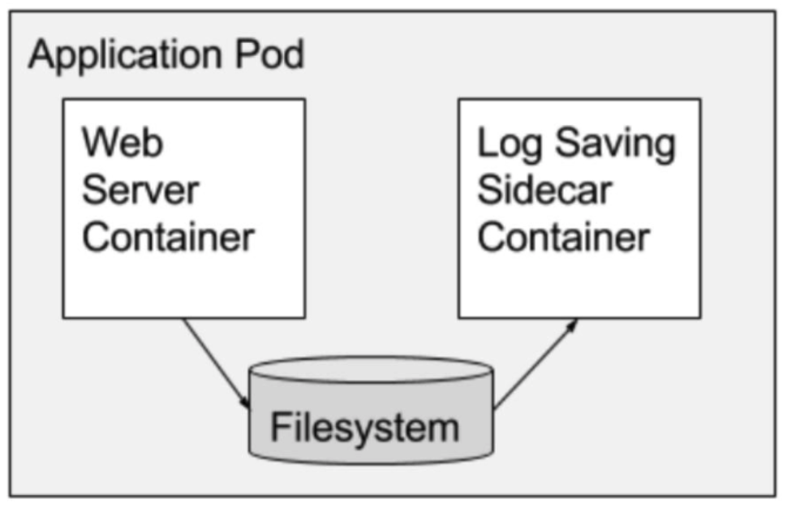

### 파드 기본 개념
파드는 쿠버네티스에서 생성하고 관리할 수 있는 배포 가능한 가장 작은 단위로 표현한다.
파드는 하나 이상의 컨테이너의 그룹이다. 파드 안에 여러 개의 컨테이너가 있으면 이 컨테이너는 네트워크, 스토리지 같이 같은 환경에서 사용되는 자원은 공유한다.(가능하면 1개의 컨테이너만 실행 권장)
또한 모든 파드는 하나의 워커 노드에서 실행되며, 여러 워커 노드에 의해 실행되지 않는다(즉 2개의 노드에서 1개의 파드에 대해 공유할 수 없다)


### 파드가 필요한 이유
굳이 파드를 사용하지 않고 워커 노드에서 직접 컨테이너를 사용할 수 있다.
하지만 이런 경우 많은 문제가 생긴다.
1. 네트워크 및 스토리지 설정
하나의 노드에서 많은 컨테이너를 사용할 경우 네트워크 및 스토리지 설정을 다 구성해야 하므로 복잡성이 증가한다.
2. 일관된 배포 단위
파드는 여러 컨테이너를 그룹화하여 관리할 수 있다. 예를 들면 주 애플리케이션 컨테이너와 이를 보조하는 `사이드카 컨테이너`를 함께 배치할 수 있다.
3. 확장성
파드는 디플로이먼트, 레플리카셋 기능을 이용해 쉽게 확장할 수 있다. 파드를 직접 확장/축소 하는 작업이 직접 컨테이너를 사용하여 확장/축소를 하는 것보다 더 효율성이 뛰어나다.

결과적으로 컨테이너를 그룹화하여 관리할 수 있는 구조가 필요하며 그게 바로 `파드`이다.

### 파드 내부
파드 내부의 모든 컨테이너는 LAN환경과 같이 접근할 수 있다. localhost를 사용하여 컨테이너간 통신을 할 수 있고, 공유 스토리지 볼륨을 설정하여 데이터를 공유할 수 있다. 단 같은 네트워크를 사용하기에 포트번호가 중복되면 안된다.


### 멀티 컨테이너
쿠버네티스는 파드안에 한 개의 컨테이너 사용을 권장한다. 하지만 상황에 따라 한 파드안에 여러 개의 컨테이너가 사용될 수 있다. 여러 개의 컨테이너를 사용하는 경우 장점과 단점을 알아보자.

### 멀티 컨테이너 장점
1. 통신이 유용함
같은 파드내에 컨테이너들은 별도의 과정없이 로컬 환경에 접근하듯 다른 컨테이너에 접근할 수 있어 속도가 빠르고 네트워크 지연, 트래픽에 대한 비용을 줄여준다.
2. 데이터 공유
공유 볼륨을 사용하여 설정 파일, 로그, 캐시등 공유가 필요한 데이터에 쉽게 접근할 수 있다.
3. 애플리케이션 디자인 유용성
보조 작업을 수행하는 사이드카 컨테이너같은 특정 패턴을 사용하여 컨테이너간 기능을 분리할 수 있다.
4. 개발 및 테스트 용이성
개발 구성 요소를 하나의 파드이 배치하여, 통합된 환경에서 개발 및 테스트를 진행할 수 있다.

### 멀티컨테이너 단점
1. 복잡성 증가
한 파드내에 여러 컨테이너를 관리할 때, 컨테이너간 의존성이 발생하여 복잡해질 수 있다. 그리고 컨테이너가 자원 공유 하므로 파드에서 자원 할당, 모니터링등이 복잡해진다.

2. 오류 격리
한 컨테이너에서 발생한 오류(리소스 포함)가 같은 파드내의 컨테이너에 영향을 미칠 수 있다.

3. 스케일링 제약
같은 그룹으로 스케일링을 편하게 할 수 있는 장점이 있지만 항상 동일한 파드가 스케일링 되므로, 의도치 않는 컨테이너 또한 늘어날 수 있다.

### 사이드카 컨테이너
파드안에 한 개의 컨테이너를 권장하지만 보조 기능을 제공하는 컨테이너를 사용할 수 있다 이를 `사이드카 컨테이너`라고 하고 멀티 컨테이너 파드의 디자인 패턴중 하나이다.


그림을 보면 Application Pod는 web server container와 log saving container를 가지고 있다.

웹 서버 컨테이너에서 발생한 표준 출력, 표준 에러에 대한 로그를 파일 시스템에 저장하면 log saving 컨테이너가 파일 시스템의 로그에 접근한다. 이런 방식으로 메인 컨테이너와 보조 컨테이너를 사용하는 패턴을 사이드카 패턴, 사이드카 컨테이너 라고 한다.

### yaml 매니페스트 구조
파드를 포함한 쿠버네티스의 자원들은 REST API 엔드포인트에 JSON, YAML 매니페스트를 전송해 생성한다.
yaml은 버전 정의, 리소스를 명시 한다음 크게 3가지 부분으로 구분된다.
- metadata : 이름, 네임스페이스, 레이블, 파트 정보를 갖는다.
- spec : 파드 컨테이너, 볼륨, 파드에 대한 실제 명세를 가진다.
- Status : 파드 상태, 컨테이너 설명과 상태, 파드 내부 IP등 실행 중인 파드에 관한 정보를 갖는다.

```
apiVersion : v1
kind : Pod
metadata:
  name: nginx-pod # 파드 이름
spec:
  containers:
  - image: nginx
    name: nginx-container # 컨테이너 이름
    ports:
    - containerPort: 8080
      protocol: TCP
```

작성한 YAML을 통해 파드를 생성하려면 아래와 같이 명령어를 작성한다


```
# kubectl create -f {YAML파일이름}
kubectl create -f 

# 파드 리스트 확인
kubectl get pods -o wide

# 생성된 파드 정보 상세 조회
kubectl describe pod nginx-pod
```


파드 리스트 조회를 통해 생성된 걸 확인하고, 파드를 상세 조회를 통해 YAML파일을 통해 생성된 걸 확인할 수 있다.

### 파드 로그


파드의 로그는 각 컨테이너에 출력되는 `표준 출력`, `표준 에러` 로그들을 기록한다.

로그를 저장하는 위치는 컨테이너 런타임에 따라 다르지만 containerd를 사용하는 경우 `/var/log/pods/{pod-uid}/{container-name}/` 경로에 생성된다(버전에 따라 다를 수 있음)

파드의 로그를 조회하는 방법은 아래와 같다.
```
kubectl logs {pod 이름}

kubectl logs {pod 이름} -c {컨테이너 이름}

# 리눅스의 tail 명령 처럼 마지막 N줄의 로그 조회
kubectl logs --tail=N {pod 이름}

# 실시간으로 출력되는 로그 조회
kubectl logs -f {pod 이름}
```

해당 예제는 `nginx-pod` 라는 파드이름을 갖고 파드 안에서 `nginx-container`라는 이름의 컨테이너로 실행된다. 그래서 결과적으로 같은 로그가 출력된다.


### 파드 요청(port-forward)
파드에 디버깅 목적으로 직접 접속할 경우 포트 포워딩을 이용해 접근할 수 있다. 포트 포워딩을 이용하여 서비스를 만들지 않고 직접 파드에 접속한다.

```
# kubectl port-forward {pod 이름} {port:port}
kubectl port-forward nginx-pod 8888:80
```


포트 포워드 명령을 통해 `nginx-pod`는 localhost:8888로 접근할 수 있게 되었다.


직접 `localhost:88888`로 접근했을 때 요청이 성공한걸 볼 수 있다.

이렇게 서비스를 사용하지 않고 개발 및 디버깅 용도로 사용할 수 있다.

### 레이블
레이블은 쿠버네티스 오브젝트(pod, deployment)에 첨부된 (키, 값) 형태의 값이다.
어떻게 보면 각 오브젝트에 할당된 태그와 같다.
이 값들은 레이블 셀렉터를 사용해 리소스를 선택할 때 활용된다.


그림을 보면
- app={ui, as, pc, sc, os}
- rel={beta, stable, canary}
형태로 레이블을 갖고 오브젝트들은 1개 이상의 레이블을 가질 수 있다.
레이블은 파드를 생성할 때 할당할 수 있고 도중에 수정할 수 있다.

```
apiVersion: v1
kind: Pod
metadata:
  name: kubia-manual-v2
  labels:
    creation_method: manual
    env: prod
spec:
  containers:
  - image: luksa/kubia
    name: kubia
    ports:
    - containerPort: 8080
      protocol: TCP
```
이 YAML을 보면 metadata에 레이블을 2개 추가 했다.

```
# 레이블 조회
kubectl get pod --show-labels

# created_method, env 레이블을 포함하는 파드 조회
kubectl get pod -L created_method,env

# 파드내 라벨 수정
kubectl label pod nginx-pod created_method=manual --overwrite
```


2개의 pod의 레이블을 포함하는 파드를 조회하고, 수정하는 명령어다.

### 레이블 셀렉터
레이블 셀렉터를 이용하면 조건에 맞는 리소스를 가져올 수 있다.
```
# creation_method, manual의 (키, 값)을 가지는 파드 필터링
kubectl get pod -l creation_method=manual

# env 레이블을 가지는 파드 조회
kubectl get pod -l env
```

- key!=value : 키 레이블을 가지는 파드중 값이 value가 아닌 파드 조회
- key in (v1, v2) : 키 레이블을 가지는 파드중 v1 또는 v2값을 가지는 파드 조회

이런식으로 원하는 레이블을 가진 파드를 조회할 수 있다.

### 네임스페이스
쿠버네티스의 네임스페이스는 오브젝트를 그룹화한 것이다.
리눅스의 격리 수준의 네임스페이스가 아닌 오브젝트 이름 범위를 제공한다.

그럼 왜 네임스페이스를 사용하여 오브젝트를 그룹화 하는 것인가??
복잡한 구성 요소를 관리하기 용이하게 작은 개별 그룹으로 분할할 수 있다. 이는 개발, 운영, QA등 다양한 기준으로 나뉜다.

모든 오브젝트가 네임스페이스에 속한 것은 아니다 `노드 리소스`의 경우 네임스페이스에 얽매이지 않고 전역적인 속성을 가진다.


```
kubectl get namespace
```
명령을 통해 네임스페이스를 조회할 수 있다.


`kube-system` 네임스페이스를 조회하면 이미 배웠던 컨트롤러, 매니저, etcd등 실제로 노드에서 동작하는 리소스들이 조회된다.

이렇게 서로 관계없는 리소스를 그룹으로 분리하여 여러 사용자 또는 그룹이 고유한 네임스페이스를 사용하여, 다른 사람의 리소스에 접근 범위를 제한해야 한다.

### 네임스페이스 생성
네임스페이스 생성은 YAML 파일 또는 kubectl 명령을 통해 CLI로 만들 수 있다.

```
# namespace.yaml
apiVersion: v1
kind: Namespace
metadata:
  name: test-namespace
```

```
# YAML로 네임스페이스 생성
kubectl create -f {yaml 파일}

# CLI로 네임스페이스 생성
kubectl create namespace test-namespace
```

YAML 매니페스트를 서버에 전송해서 네임스페이스를 생성/읽기/갱신/삭제 등 API 서버에 직접 전송해 실행할 수 있다.
