## 목차
- [목차](#목차)
  - [Downward API](#downward-api)
  - [Downward API 환경변수 사용](#downward-api-환경변수-사용)
  - [Downward API 볼륨 사용](#downward-api-볼륨-사용)
  - [쿠버네티스 API](#쿠버네티스-api)
  - [파드 내에서 API 통신](#파드-내에서-api-통신)
  - [앰버서더 패턴을 이용한 프록시](#앰버서더-패턴을-이용한-프록시)
### Downward API
컨피그맵, 시크릿은 컨테이너가 생성되기 전 데이터를 다루는 리소스입니다. 파드의 IP, 호스트 노드, 파드 이름 등 이런 정보들은 실행이 되어야 알 수 있는 데이터들입니다.

파드의 레이블이나 어노테이션 같이 사전에 정의된 정보, 파드의 IP, 호스트 네임 같은 실행되어야 할당되는 정보들은 `etcd` 저장이 되어 있습니다. 하지만 계속 이런 정보를 가져올 때 마다 API를 호출하는건 추가적인 비용이 생깁니다. 이를 위해 쿠버네티스는 `Downward API`를 통해 `메타데이터를 환경변수 또는 파일로 제공`합니다.

`fieldRef`를 통해 얻을 수 있는 정보
- metadata.name: 파드의 이름
- metadata.namespace: 파드가 속한 네임스페이스
- metadata.uid: 파드의 고유 ID
- metadata.annotations[<KEY>]: 파드의 어노테이션에서 <KEY>에 해당하는 값
- metadata.labels[<KEY>] 파드의 레이블에서 <KEY>에 해당하는 문자열
- spec.serviceAccountName: 파드의 서비스 어카운트
- spec.nodeName: 파드가 실행중인 노드명
- status.hostIP: 파드가 할당된 노드의 기본 IP 주소
- status.podIP: 파드의 기본 IP 주소 (일반적으로 IPv4 주소)
- Downward API 볼륨을 통해서한 접근 가능
  - metadata.labels: 파드의 모든 레이블로, 한 줄마다 하나의 레이블을 갖는(label-key="escaped-label-value") 형식을 
  - metadata.annotations: 파드의 모든 어노테이션으로, 한 줄마다 하나의 어노테이션을 갖는 (annotation-key="escaped-annotation-value") 형식
  
`resourceFieldRef`를 통해 얻을 수 있는 정보
- resource: limits.cpu: 컨테이너의 CPU 제한
- resource: requests.cpu: 컨테이너의 CPU 요청
- resource: limits.memory: 컨테이너의 메모리 제한
- resource: requests.memory: 컨테이너의 메모리 요청
- resource: limits.hugepages-*: 컨테이너의 hugepage 제한 (DownwardAPIHugePages 기능 게이트가 활성화 된 경우)
- resource: requests.hugepages-*: 컨테이너의 hugepage 요청 (DownwardAPIHugePages 기능 게이트가 활성화 된 경우)
- resource: limits.ephemeral-storage: 컨테이너의 임시 스토리지 제한
- resource: requests.ephemeral-storage: 컨테이너의 임시 스토리지 요청


### Downward API 환경변수 사용
```YAML
apiVersion: v1
kind: Pod
metadata:
  name: downward
spec:
  containers:
  - name: main
    image: busybox
    command: ["sleep", "9999999"]
    resources:
      requests:
        cpu: 15m
        memory: 100Ki
      limits:
        cpu: 100m
        memory: 4Mi
    env:
    - name: POD_NAME
      valueFrom:
        fieldRef:
          fieldPath: metadata.name
    - name: POD_NAMESPACE
      valueFrom:
        fieldRef:
          fieldPath: metadata.namespace
    - name: POD_IP
      valueFrom:
        fieldRef:
          fieldPath: status.podIP
    - name: NODE_NAME
      valueFrom:
        fieldRef:
          fieldPath: spec.nodeName
    - name: SERVICE_ACCOUNT
      valueFrom:
        fieldRef:
          fieldPath: spec.serviceAccountName
    - name: CONTAINER_CPU_REQUEST_MILLICORES
      valueFrom:
        resourceFieldRef:
          resource: requests.cpu
          divisor: 1m
    - name: CONTAINER_MEMORY_LIMIT_KIBIBYTES
      valueFrom:
        resourceFieldRef:
          resource: limits.memory
          divisor: 1Ki
```
매니페스트 파일을 보면 `POD_NAME`,`POD_NAMESPACE`, `POD_IP`, `NODE_NAME` 이름으로 환경변수를 설정하는데 `fileRef`, `resourceFiledRef`를 통해 얻어온걸 확인할 수 있다. 실제 컨테이너 내의 환경 변수를 조회해보면 확인할 수 있습니다.

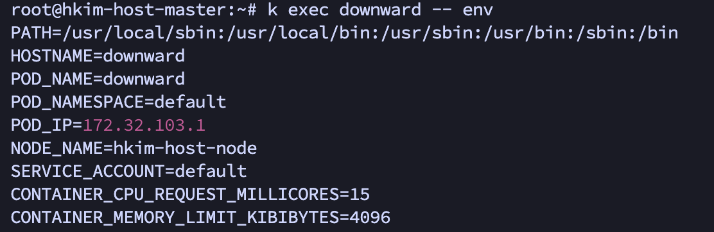
CONTAINER_MEMORY_LIMIT_KIBIBYTES의 경우, 메모리 제한은 4Mi되어 있고 제수(나누는 수)를 1Ki로 설정했기 때문에 4096으로 표시되었습니다.


### Downward API 볼륨 사용
```YAML
apiVersion: v1
kind: Pod
metadata:
  name: downward
  labels:
    foo: bar
  annotations:
    key1: value1
    key2: |
      multi
      line
      value
spec:
  containers:
  - name: main
    image: busybox
    command: ["sleep", "9999999"]
    resources:
      requests:
        cpu: 15m
        memory: 100Ki
      limits:
        cpu: 100m
        memory: 4Mi
    volumeMounts:
    - name: downward
      mountPath: /etc/downward
  volumes:
  - name: downward
    downwardAPI:
      items:
      - path: "podName"
        fieldRef:
          fieldPath: metadata.name
      - path: "podNamespace"
        fieldRef:
          fieldPath: metadata.namespace
      - path: "labels"
        fieldRef:
          fieldPath: metadata.labels
      - path: "annotations"
        fieldRef:
          fieldPath: metadata.annotations
      - path: "containerCpuRequestMilliCores"
        resourceFieldRef:
          containerName: main
          resource: requests.cpu
          divisor: 1m
      - path: "containerMemoryLimitBytes"
        resourceFieldRef:
          containerName: main
          resource: limits.memory
          divisor: 1
```

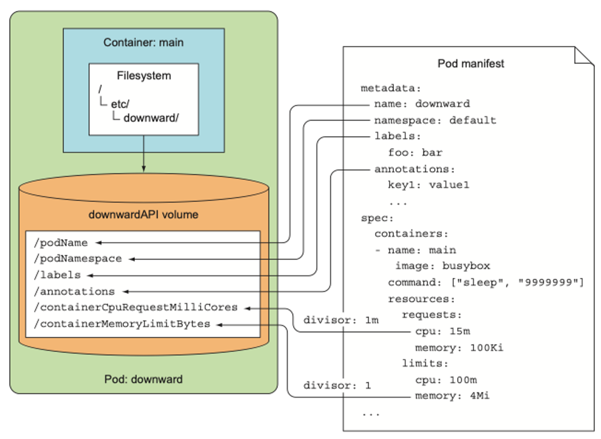
컨테이너는 downward라는 볼륨을 /etc/downward에 마운트합니다.
downward 볼륨에 포함된 파일들은 `downwardAPI.items` 속성 아래에 설정됩니다. 

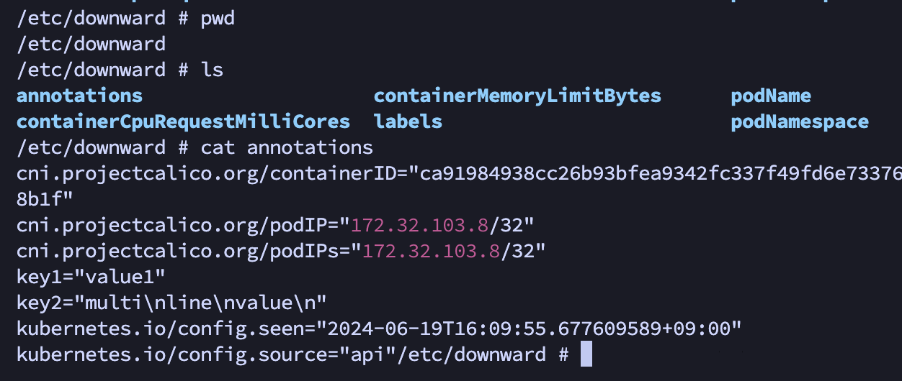

결과를 확인하면 /etc/downward 폴더에 각각 items에 있는 속성들이 파일로 생성된걸 확인하고 값이 들어있는걸 확인할 수 있습니다.

파드가 실행되는 동안 레이블과 어노테이션은 수정될 수 있습니다. 그리고 이 값들이 업데이트되면 쿠버네티스는 파드에서 최신의 값을 가질 수 있게 업데이트 합니다. 이전에 downwardAPI에서 레이블과 어노테이션은 볼륨으로 밖에 값을 할당하지 못했습니다. 그 이유는 파드가 실행 중 레이블과 어노테이션이 변경되면 환경변수는 업데이트할 방법이 없기 때문에 레이블과 어노테이션은 볼륨으로밖에 값을 할당할 수 없습니다.

그리고 컨테이너의 리소스(resourceFiledRef) 제한 또는 요청을 하는 메타데이터를 노출하는 경우 리소스 필드에 컨테이너 이름을 명시해야 합니다.
볼륨이 컨테이너가 아닌 파드 수준에서 정의되었기 때문에 어느 컨테이너에 지정할 지 알 수 없음으로 어느 컨테이너에서 볼륨을 사용할지 지정해야 합니다.

### 쿠버네티스 API
Downward API는 자기 자신의 파드의 메타데이터만 노출하고 이 값들은 제한적입니다. 다른 파드나, 서비스등 쿠버네티스 리스소에 정보가 더 필요한 경우 쿠버네티스 API에 직접 호출해야합니다.

쿠버네티스의 API 서버에 직접 요청할 수 있습니다. 하지만 서버는 https를 사용하고 인증이 필요하기 때문에 직접 통신하기는 힘듭니다.
`curl https://<클러스터IP> -k(인증서 검사 X옵션)`

로 직접 요청하면 `Unauthorized`와 같이 통신하는 과정에 문제가 생깁니다.

다행이 인증을 직접 처리하지 않고 `kubectl proxy` 명령을 실행해 프록시로 서버와 통신할 수 있습니다.

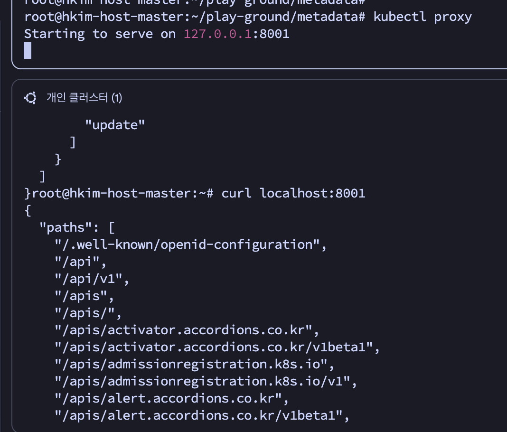
 사진을 보면 프록시 서버를 실행하고, 프록시 서버로 요청을 보낸경우 api 경로들을 확인할 수 있습니다.

그럼 어떻게 proxy 서버는 어떻게 인증을 한 것일까요??
`kubectl proxy --v=9` 명령을 통해 프록시 서버가 어떻게 실행되는지 살펴봅니다.
`--v 옵션은 명령어가 실행되는 과정을 로깅`하는 옵션이며 숫자(1-9)가 클수록 자세히 로깅합니다.

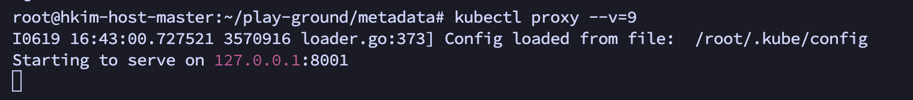
명령어가 실행되는 과정을 보면 프록시 서버 실행전 쿠버네티스 인정 정보를 담고 있는 config파일을 로딩한걸 확인할 수 있습니다. proxy는 이런 인증 정보를 가져왔기 때문에 쿠버네티스 API서버에 인증을 확인할 수 있습니다.

`curl localhost:8001/apis/batch/v1` : batch v1 API그룹에서 리소스 유형 및 REST 엔드포인트 목록 반환
`curl localhost:8001/apis/batch/v1/jobs` : 클러스터에 있는 잡 조회

이렇게 kubectl 명령을 통하지 않고 직접 REST API 통신을 할 수 있습니다.

### 파드 내에서 API 통신
kubectl proxy로 로컬에서 쿠버네티스 API에 호출할 수 있습니다. 하지만 kubectl이 없는 파드에선 어떻게 API를 호출할까요?
API 서버로 요청하려면 3가지의 단계를 거쳐야합니다.
1. API 서버 위치(주소) 확인
2. API 서버와 통신하고 있는지 확인
3. API 서버로 인증

각 컨테이너는 `/var/run/secrets/kubernetes.io/serviceaccount/`에 디폴트 토큰 시크릿이 마운트됩니다.

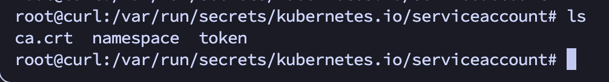
실제 경로를 확인해보면 존재합니다.

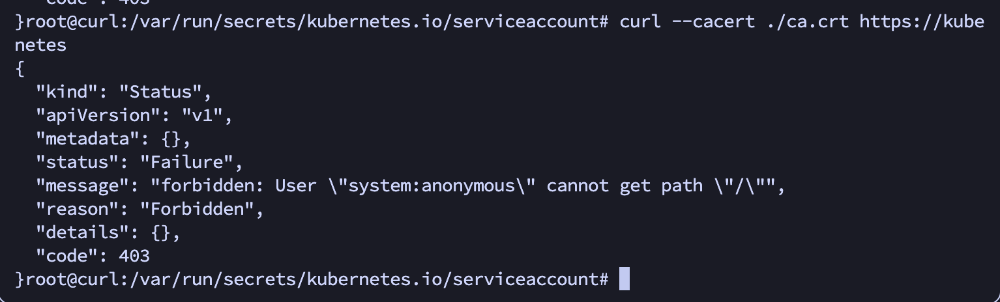
요청은 성공적으로 완료되었지만 권한(403)이 없어서 거부당했습니다

서버에서 발행한 인증토큰이 필요합니다. 토큰은 ca파일과 마찬가지로 동일한 디렉토리에 위치해 있습니다.

`curl --cacert ./ca.crt -H "Authorization: Bearer <Token>" https://kubernetes/api` 에 요청하면
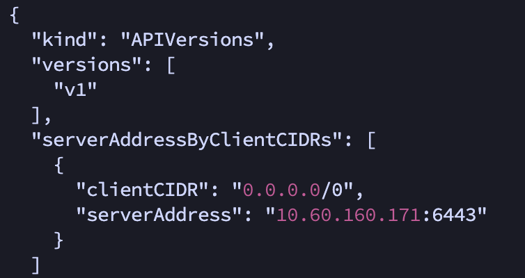
성공적으로 요청이 갔고 인증이 된걸 확인할 수 있습니다.

`파드가 쿠버네티스와 통신하는 방법`을 정리하면
1. 애플리케이션은 API 서버의 인증서가 인증 기관으로 부터 서명됐는지 검증해야합니다. 그리고 인증 파일은 `ca.cert`파일에 있습니다.
2. 서명이 확인됐으면 인증 token을 HTTP 헤더에 Bearer 토큰으로 넣어 자신을 인증해야합니다.
3. 컨테이너가 소속된 네임스페이스 이름은 인증서 파일과 같은 위치에 있고 API를 요청할 때 네임스페이스 값이 필요한 경우 이 값을 참조합니다.

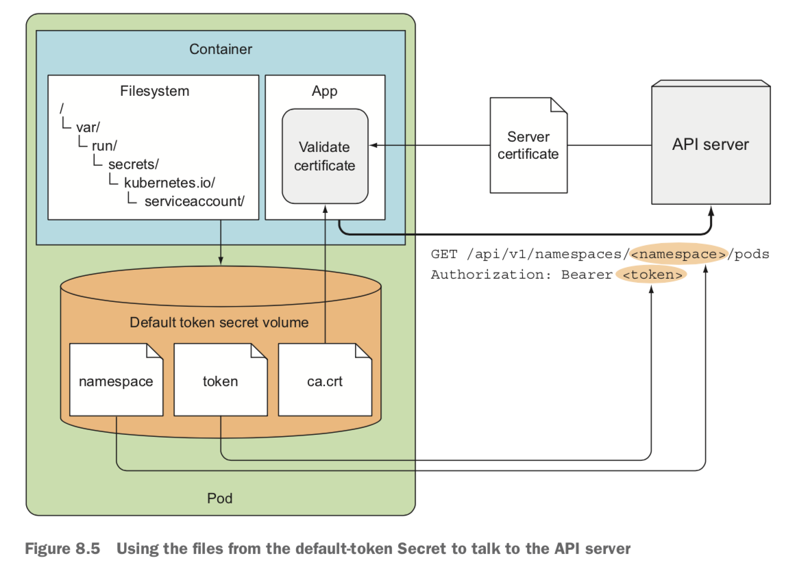

그림을 보면 이해가 더 수월합니다. 
즉 파드 내부(컨테이너)에선 `쿠버네티스 인증 관련 파일이 마운트`되고 이 정보를 바탕으로 쿠버네티스 API 서버와 통신할 수 있습니다.

### 앰버서더 패턴을 이용한 프록시
`앰버서더 패턴은 파드 외부 요청을 내부 서비스로 전달하는 프록시 역할을 수행하는 패턴`입니다. 방금과 같이 쿠버네티스 API 서버랑 통신 하는 컨테이너는 프록시 앰버서더 컨테이너가 역할을 처리하여 메인 컨테이너와 역할을 분리합니다.

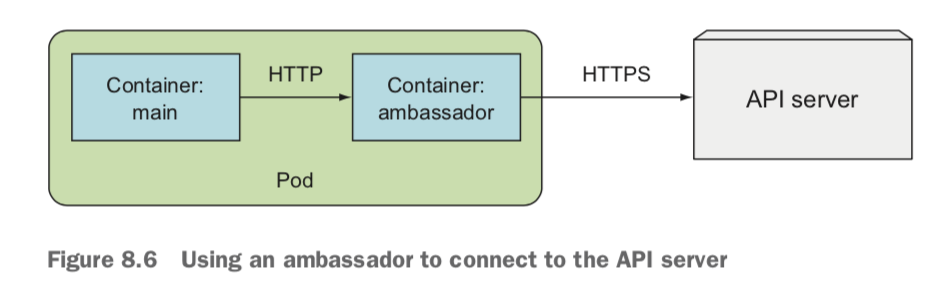

그림과 같이 메인 컨테이너는 앰버서더 컨테이너와 http로 통신하고, `앰버서더 컨테이너가 쿠버네티스 API 서버와의 인증`을 담당합니다. `같은 파드내의 네트워크는 공유`하므로 메인 컨테이너는 앰버서더 컨테이너에 직접적으로 요청(localhost)할 수 있습니다.

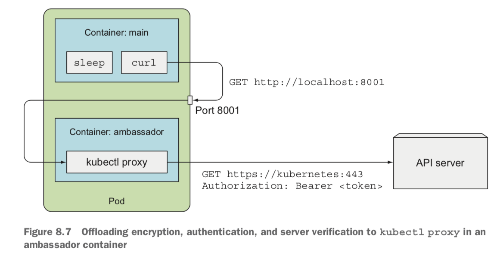

실제 요청을 처리하는 예시입니다. 메인 컨테이너는 앰버서커 컨테이너에 요청하면, 엠버서더 컨테이너가 대신 인증을을 처리하여 쿠버네티스 API 서버에 요청합니다.

이렇게 함으로써 외부 서비스에 연결하는 복잡성을 숨기고 메인 컨테이너는 단순하게 자기 역할만 수행할 수 있습니다.

