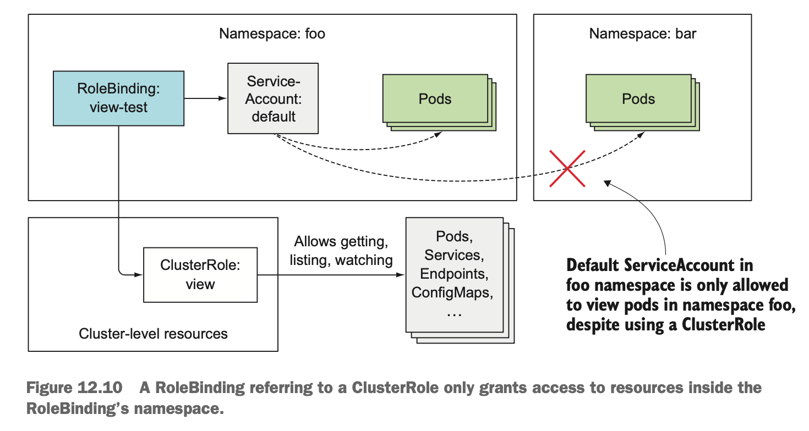

### RBAC인가 플러그인
RBAC는 사용자가 클러스터 내의 자원에 대해 접근하고 사용할 수 있는지 점검하고 설정할 수 있습니다. 

`쿠버네티스 API와 통신하는 애플리케이션을 작성`하려면 RBAC 관련 리소스로 권한을 관리하는 방법을 알아야합니다.

쿠버네티스 API서버는 인가 플러그인(RBAC)을 사용해 `액션`을 요청하는 사용자가 액션을 수행할 수 있는지 확인합니다.

액션을 요청할 때, 사용자는 자격증명(토큰, 인증서)을 포함시켜 자신을 인증해야합니다.

### 액션
액션은 REST 클라이언트를 통해 특정 리소스를 나타내는 URL 경로를 보냅니다.

액션에 관한 예시들입니다.
- 파드 요청
- 서비스 생성
- 서비스 업데이트

이런 액션들은 REST API 형식에 맞게 `HTTP 메소드`, `리소스에 대한 행동(동사)`, `컬렉션에 대한 행동(동사)` 로 이루어집니다. 아래 테이블이 액션에 과 HTTP 메서드가 매핑된 예시입니다.

| HTTP 메소드 | 단일 리소스에 관한 동사      | 컬렉션에 관한 동사      |
|-------------|------------------------------|-------------------------|
| GET, HEAD   | get (and watch for watching) | list (and watch)        |
| POST        | create                       | n/a                     |
| PUT         | update                       | n/a                     |
| PATCH       | patch                        | n/a                     |
| DELETE      | delete                       | delete collection       |

API 서버의 모든 경로가 리소스를 매핑한 것은 아니기 때문에, 리소스가 아닌 URL에도 권한을 적용할 수 있습니다. ex) /heartbeat 등등

### RBAC 리소스
RBAC는 `롤이라는 리소스로 사용자가 액션을 수행할 수 있는지` 확인합니다. 주체(사용자, 서비스어카운트, 그룹(사용자, 서비스어카운트))는 한 개 이상의 롤과 연계돼 있으며, 롤바인딩을 통해 사용자는 특정 리소스에 대한 권한을 가지고 있습니다.

파드 조회에만 하는 롤을 가진 사용자는 파드에 대해 POST(생성), DELETE(삭제)할 수 없습니다.

RBAC 인가 클러스터는 4개의 리소스로 구성됩니다.
- 롤, 클러스터롤: 리소스에 수행할 수 있는 동사 지정
- 롤바인딩, 클러스터롤바인딩: 위의 롤을 특정 사용자, 서비스어카운트, 그룹에 바인딩합니다.

롤은 작업에 대해 명시가 되어 있고 바인딩은 누가 어떤 롤을 사용하는지 정의합니다.


롤과 롤바인딩은 `네임스페이스가 지정된 리소스`이고 `클러스터롤과 클러스터롤바인딩`은 네임스페이스를 지정하지 않는 클러스터 수준의 리소스입니다.


그림을 보면 네임스페이스가 1개 이상의 롤 바인딩을 가질 수 있고, 네임스페이스가 지정되지 않은 클러스터롤도 참조할 수 있습니다. 

아래는 네임스페이스 범위와 클러스터 범위의 리소스들입니다.

네임스페이스 범위의 리소스
- Pods
- Services
- Deployments
- ReplicaSets
- StatefulSets
- PersistentVolumeClaims
- ConfigMaps
- Secrets
- Jobs
- CronJobs


클러스터 범위의 리소스
- Nodes
- Namespaces
- PersistentVolumes
- StorageClasses

만약 클러스터 범위의 리소스(node)에 대한 클러스터롤이 바인딩이 되어 있는 사용자는 그 노드에 있는 `네임스페이스 범위의` 리소스에 대한 정보를 가져올 수 있습니다.

```
롤: 특정 네임스페이스 내에서만 권한을 정의합니다. 해당 네임스페이스 내의 리소스에만 접근 권한을 설정합니다.

클러스터롤: 클러스터 전체에서 권한을 정의합니다. 모든 네임스페이스와 클러스터 범위의 리소스에 대한 접근 권한을 설정합니다.
```

롤과 클러스터롤을 분리하여 접근을 제어하는 이유는 다음과 같습니다.
- 보안
  - 특정 네임스페이스 내에서만 최소한 권한을 부여합니다.
  - 네임스페이스별로 세밀한 권한 관리를 할 수 있습니다.
- 관리
  - 네임스페이스 별로 권한을 설정함으로써, 특정 네임스페이스만 작업하는 팀이나 애플리케이션에 대해 독립적으로 권한을 줄 수 있습니다.

사용 사례
- 롤
  - 개발팀이 특정(개발) 네임스페이스에서만 작업해야 하는 경우, 해당 네임스페이스에 대한 리소스 권한 부여
- 클러스터롤
  - 관리자가 클러스터 전체에 대한 리소스가 필요한 경우
  - 모니터링 같은 모든 리소스를 필요로 하는 리소스를 사용할 때

### 롤 실습
2개의 네임스페이스(test-a, test-b)를 만들고 test-b안에 있는 파드에서 test-a에 대한 리소스를 조회해보겠습니다.

```
# default 서비스어카운트 사용

# 네임스페이스 생성
kubectl create ns test-a
kubectl create ns test-a

# 각각 네임스페이스 내에 kube-proxy 서버가 동작되는 파드 실행
kubectl run test-a-pod --image=luksa/kubectl-proxy -n test-a

kubectl run test-b-pod --image=luksa/kubectl-proxy -n test-b
```

파드에 접속하게 쿠버네티스 API를 요청해보겠습니다.

`curl localhost:8001/api/v1/namespaces/test-a/services`

test-a 네임스페이스에 있는 서비스를 조회하는 요청입니다.
```JSON

{
  "kind": "Status",
  "apiVersion": "v1",
  "metadata": {},
  "status": "Failure",
  "message": "services is forbidden: User \"system:serviceaccount:test-a:default\" cannot list resource \"services\" in API group \"\" in the namespace \"test-a\"",
  "reason": "Forbidden",
  "details": {
    "kind": "services"
  },
  "code": 403
}
```

파드가 동일한 네임스페이스에서 실행되지만 API 서버는 권한 문제로 거절당했습니다. 이는 rbac가 동작하기 때문에 그렇습니다.

이제 서비스를 조회할 수 있게 롤을 만들고 바인딩을 해보겠습니다.

```YAML
# 서비스에 대한 정보를 조회할 수 있는 . 로
apiVersion: rbac.authorization.k8s.io/v1
kind: Role
metadata:
  namespace: test-a
  name: service-reader
rules:
- apiGroups: [""]
  verbs: ["get", "list"]
  resources: ["services"]

--
# 위의 롤과 test-a(네임스페이스):default(서비스어카운트) 바인딩
apiVersion: rbac.authorization.k8s.io/v1
kind: RoleBinding
metadata:
  name: test-ns-service
  namespace: test-a
subjects:
- kind: ServiceAccount
  name: default
  namespace: test-a
roleRef:
  kind: Role
  name: service-reader
  apiGroup: rbac.authorization.k8s.io
```
위의 롤과 롤바인딩을 만들고 난후 상세 조회해보면 아래와 같이 나옵니다.
``` YAML
# 롤 상세 정보
apiVersion: rbac.authorization.k8s.io/v1
kind: Role
metadata:
  name: service-reader
  namespace: test-a
rules:
- apiGroups:
  - ""
  resources:
  - services
  verbs:
  - get
  - list

# 롤바인딩 상세 정보
apiVersion: rbac.authorization.k8s.io/v1
kind: RoleBinding
metadata:
  name: test-ns-service
  namespace: test-a
roleRef:
  apiGroup: rbac.authorization.k8s.io
  kind: Role
  name: service-reader
subjects:
- kind: ServiceAccount
  name: default
  namespace: test-a
```
- `test-a` 네임스페이스에 있는 `service` 리소스에 대해 조회 권한이 있는 `service-reader` 이름을 가진 롤
- `test-a` 네임스페이스의 `default` 서비스어카운트가 `service-read`롤과 바인딩 

그러면 한번 test-a 네임스페이스에서 default 서비스어카운트를 가지는 파드에서 쿠버네티스 API에 요청 해보겠습니다.

`curl localhost:8001/api/v1/namespaces/test-a/services`

```JSON
{
  "kind": "ServiceList",
  "apiVersion": "v1",
  "metadata": {
    "resourceVersion": "11202479"
  },
  "items": []
}
```
이번엔 조회가 성공하였고 실제 생성된 서비스가 없어서 빈값으로 온걸 확인할 수 있습니다.

롤 바인딩은 하나의 롤만 참조하지만, 여러 주체는 롤에 바인딩 될 수 있습니다.

test-b 네임스페이스의 default 서비스어카운트에 `service-read`롤을 바인딩 해보겠습니다.

롤 바인딩에 아래 내용을 추가합니다.
```YAML
subjects:
- kind: ServiceAccount
  name: default
  namespace: test-a
- kind: ServiceAccount # 추가된 서비스어카운트
  name: default
  namespace: test-b
```

```YAML
apiVersion: rbac.authorization.k8s.io/v1
kind: RoleBinding
metadata:
  name: test-ns-service
  namespace: test-a
roleRef:
  apiGroup: rbac.authorization.k8s.io
  kind: Role
  name: service-reader
subjects:
- kind: ServiceAccount
  name: default
  namespace: test-a
- kind: ServiceAccount
  name: default
  namespace: test-b
```
해당 롤에 대해 주체를 추가 했습니다.

이제 `test-b` 네임스페이스에 속하고 `default` 서비스어카운트를 가지는 파드내에서 `test-a` 네임스페이스의 서비스 리소스를 조회해보겠습니다.

`curl localhost:8001/api/v1/namespaces/test-a/services`

```JSON
{
  "kind": "ServiceList",
  "apiVersion": "v1",
  "metadata": {
    "resourceVersion": "11248842"
  },
  "items": []
}
```

test-b 네임스페이스에서 test-a 네임스페이스의 서비스 리소스를 가져온 걸 확인할 수 있었습니다.

### 클러스터 롤 실습(클러스터 리소스)
클러스터롤은 네임스페이스를 지정하지 않는 리소스에 대한 롤을 만들 수 있습니다.

```YAML
apiVersion: rbac.authorization.k8s.io/v1
kind: ClusterRole
metadata:
  name: pv-reader
rules:
- apiGroups: [""]
  resources: ["persistentvolumes"]
  verbs: ["get", "list"]
```
PV에 대해 `get`, `list` 권한을 설정했습니다.

먼저 바인딩을 하기 전 PV를 조회해보겠습니다.

`curl localhost:8001/api/v1/persistentvolumes`

```JSON
{
  "kind": "Status",
  "apiVersion": "v1",
  "metadata": {},
  "status": "Failure",
  "message": "persistentvolumes is forbidden: User \"system:serviceaccount:test-a:default\" cannot list resource \"persistentvolumes\" in API group \"\" at the cluster scope",
  "reason": "Forbidden",
  "details": {
    "kind": "persistentvolumes"
  },
  "code": 403
}
```
PV는 네임스페이스에 연관되지 않기 때문에 URL에 namespaces가 없습니다.

```YAML
apiVersion: rbac.authorization.k8s.io/v1
kind: RoleBinding
metadata:
  name: pv-test
  namespace: test-a
subjects:
- kind: ServiceAccount
  name: default
  namespace: test-a
roleRef:
  apiGroup: rbac.authorization.k8s.io
  kind: ClusterRole
  name: pv-reader
```

클러스터롤은 일반 롤바인딩을 사용해서도 주체에 바인딩할 수 있습니다.

클러스터롤, 롤바인딩을 만들었음에도 정상적으로 PV요청을 수행할 수 없습니다. 이전과 똑같은 403에러가 발생합니다.

클러스터롤에 롤바인딩을 사용할 수 있지만, 클러스터 리소스에 액세스 권한을 부여하려면 클러스터롤바인딩을 사용해야합니다.

```YAML
# 클러스터롤바인딩
apiVersion: rbac.authorization.k8s.io/v1
kind: ClusterRoleBinding
metadata:
  name: pv-test
subjects:
- kind: ServiceAccount
  name: default
  namespace: test-a
roleRef:
  apiGroup: rbac.authorization.k8s.io
  kind: ClusterRole
  name: pv-reader
```

`curl localhost:8001/api/v1/persistentvolumes`

```JSON
{
  "kind": "PersistentVolumeList",
  "apiVersion": "v1",
  "metadata": {
    "resourceVersion": "11261561"
  },
  "items": [
    ...
  ]
}
```

클러스터롤 바인딩을 만든 후 PV를 요청하면 정상적으로 실행되는걸 확인할 수 있습니다.


이 그림처럼 `test-a` 네임스페이스에 default 서비스어카운트는 클러스터바인딩을 통해 pv에 대한 접근를 가지는 클러스터롤과 바인딩 되어 있습니다. 그래서 클러스터 수준의 리소스인 PV에 대해 요청(조회) 할 수 있습니다.

### 클러스터롤 실습(URL)
쿠버네티스 API 서버는 URL에 관한 액세스 권한도 명시적으로 부여해야합니다. 명시하지 않으면 API 서버는 요청을 거부합니다. 

쿠버네티스의 `system:discovery` 클러스터롤은 클러스터에 어떤 리소스가 있는지 탐색할 수 있도록 최소한의 권한을 부여합니다. 여기에 URL 목록을 확인하여 API 서버에 대한 정보(리소스, 엔드포인트)를 탐색하는데 사용됩니다. 

system:discovery 클러스터롤과 클러스터롤바인딩을 확인해보겠습니다.
```YAML
# 클러스터롤
apiVersion: rbac.authorization.k8s.io/v1
kind: ClusterRole
metadata:
  name: system:discovery
rules:
- nonResourceURLs:
  - /api
  - /api/*
  - /apis
  - /apis/*
  - /healthz
  - /livez
  - /openapi
  - /openapi/*
  - /readyz
  - /version
  - /version/
  verbs:
  - get
```

`nonResourceURLs` 옵션을 통해 URL 규칙을 정의할 수 있습니다. 위의 나열된 URL에 한해서 get 요청에 대한 권한을 가지고 있습니다.

```YAML
# 클러스터롤바인딩
apiVersion: rbac.authorization.k8s.io/v1
kind: ClusterRoleBinding
metadata:
  name: system:discovery
roleRef:
  apiGroup: rbac.authorization.k8s.io
  kind: ClusterRole
  name: system:discovery
subjects:
- apiGroup: rbac.authorization.k8s.io
  kind: Group
  name: system:authenticated
```
주체를 보면 system:authenticated 그룹으로 되어 있습니다. 이 그룹은 클러스터에 대해 성공적으로 인증된 모든 사용자에게 할당됩니다.

저희가 만든 파드는 생성될 때, 서비스어카운트(default)의 인증파일이 `/var/run/secrets/kubernetes.io/serviceaccount` 경로에 생성됩니다. 그리고 이 안에 있는 인증서와 토큰으로 API 서버에 인증합니다.

그러면 저희가 만든 파드는 위 주체의 조건을 만족으로 클러스터롤에 명시된 URL에 접근할 수 있습니다. 한번 확인해보겠습니다.


그렇다면 저 주체를 바꾸면 URL 요청을 거부당한다는 뜻입니다.
```YAML
subjects:
- apiGroup: rbac.authorization.k8s.io
  kind: Group
  name: Test
```

클러스터롤바인딩에서 system:authenticated 그룹을 임의의 문자로 바꾸고 다시 api를 호출해보겠습니다.

`curl localhost:8001/api`
```JSON
{
  "kind": "Status",
  "apiVersion": "v1",
  "metadata": {},
  "status": "Failure",
  "message": "forbidden: User \"system:serviceaccount:test-a:default\" cannot get path \"/api\"",
  "reason": "Forbidden",
  "details": {},
  "code": 403
}
```

의도한대로 해당 url에 대해 요청을 수행할 수 없었습니다.

### 클러스터롤 실습(특정 네임스페이스 리소스에 액세스 권한 부여)
클러스터롤이 네임스페이스를 갖는 일반적인 롤바인딩과 바인딩될 수 있습니다.

먼저 사전에 정의된 `view` 클러스터롤을 살펴보겠습니다.

```YAML
apiVersion: rbac.authorization.k8s.io/v1
kind: ClusterRole
metadata:
  name: view
rules:
- apiGroups:
  - ""
  resources:
  - configmaps
  - endpoints
  - persistentvolumeclaims
  - persistentvolumeclaims/status
  - pods
  - replicationcontrollers
  - replicationcontrollers/scale
  - serviceaccounts
  - services
  verbs:
  - get
  - list
  - watch
```
이 클러스터롤은 규칙이 많지만 네임스페이스에 지정된 리소스가 정의되어 있습니다.

클러스터롤은 클러스터롤바인딩, 롤바인딩 중 어디에 바인드 되느냐에 따라 다릅니다.

`클러스터롤바인딩을 생성하고 클러스터롤을 참조하면 바인딩에 나열된 주체는 모든 네임스페이스에 있는 지정된 리소스를 볼 수 있습니다.`

`롤바인딩을 생성하고 클러스터롤을 참조하면 나열된 주체가 네임스페이스에 있는 리소스만 볼 수 있습니다.`

```
# 디폴트 서비스어카운트에 view 클러스터롤이랑 클러스터바인딩
kubectl  create clusterrolebinding view-test --clusterrole=view --serviceaccount=test-a:default
```
이렇게 클러스터바인딩을 생성하면, `test-a` 네임스페이스의 default 서비스어카운트를 가지는 파드에서 모든 네임스페이스에 대해 요청(클러스터롤에 허용된 리소스) 할 수 있습니다.

```
# test-a 에 존재하는 파드 조회
curl localhost:8001/api/v1/namespaces/test-a/pods

# test-b 에 존재하는 파드 조회
curl localhost:8001/api/v1/namespaces/test-b/pods

# 모든 네임스페이스에 있는 파드 조회
curl localhost:8001/api/v1/pods
```

다른 네임스페이스 요청, 모든 네임스페이스에 대한 요청이 모두 정상적으로 동작됩니다.



그림과 같이 네임스페이스가 지정된 리소스를 참조하는 클러스터롤을 클러스터롤과 바인딩하면 모든 네임스페이스에 대해 지정된 리소스를 액세스할 수 있습니다.

```
# view 클러스터롤, 롤바인딩
kubectl create rolebinding view-test-role --clusterrole=view --serviceaccount=test-a:default -n test-a
```

위에서 실습한 요청을 다시 해보겠습니다.
- 자기 네임스페이스 파드 조회(성공)
- 다른 네임스페이스 파드 조회(실패)
- 모든 네임스페이스 파드 조회(실패)

클러스터롤이랑 일반적인 롤 바인딩을 했을 때 다른 특정 네임스페이스나 모든 네임스페이스에 나열할 수 없습니다.

### 롤, 클러스터롤, 롤바인딩, 클러스터롤바인딩 조합 요약
| 접근 유형                                | 롤 타입       | 사용할 바인딩 타입         |
|------------------------------------------|---------------|---------------------------|
| 클러스터 수준 리소스(노드, 퍼시스턴트 볼륨) | 클러스터롤     | 클러스터롤바인딩           |
| 리소스가 아닌 URL(/api, /healthz)        | 클러스터롤     | 클러스터롤바인딩           |
| 모든 네임스페이스의 네임스페이스로 지정된 리소스 | 클러스터롤     | 클러스터롤바인딩           |
| 특정 네임스페이스의 네임스페이스로 지정된 리소스 (여러 네임스페이스에 동일한 클러스터롤 재사용) | 클러스터롤     | 롤바인딩                   |
| 특정 네임스페이스의 네임스페이스로 지정된 리소스 (각 네임스페이스에 롤을 정의) | 롤             | 롤바인딩                   |

위의 예시에서 3개(클러스터롤, 클러스터롤바인딩)을 사용하는 예시는 당연히 클러스터 수준의 리소스를 사용하므로 클러스터롤, 클러스터롤바인딩을 사용하는게 맞습니다.

하지만 4번째, 5번째에는 `특정 네임스페이스의 네임스페이스로 지정된 리소스`를 사용하는데 롤과 클러스터롤을 사용합니다. 둘의 차이를 확인해보겠습니다.

특정 네임스페이스의 네임스페이스로 지정된 리소스 (여러 네임스페이스에 동일한 클러스터롤 재사용)
- 이 방식은 클러스터롤을 재사용 하는 방식입니다.
- 1개의 클러스터롤 정의
- 각각의 네임스페이스에서 롤바인딩일 통해 클러스터롤을 참조합니다.
- 1개의 클러스터롤을 정의하여 각각 네임스페이서 에서 동일한 권한을 `재사용`합니다.

특정 네임스페이스의 네임스페이스로 지정된 리소스 (각 네임스페이스에 롤을 정의)
- 이 방식은 롤, 롤바인딩을 각각 생성하는 방식입니다.
- 각각의 네임스페이스에서 롤(A, B) 정의
- 각각의 네임스페이스에서 롤바인딩(A, B)
- 각각 롤, 롤바인딩을 바인딩하여 `권한을 세밀하게` 설정할 수 있습니다.
