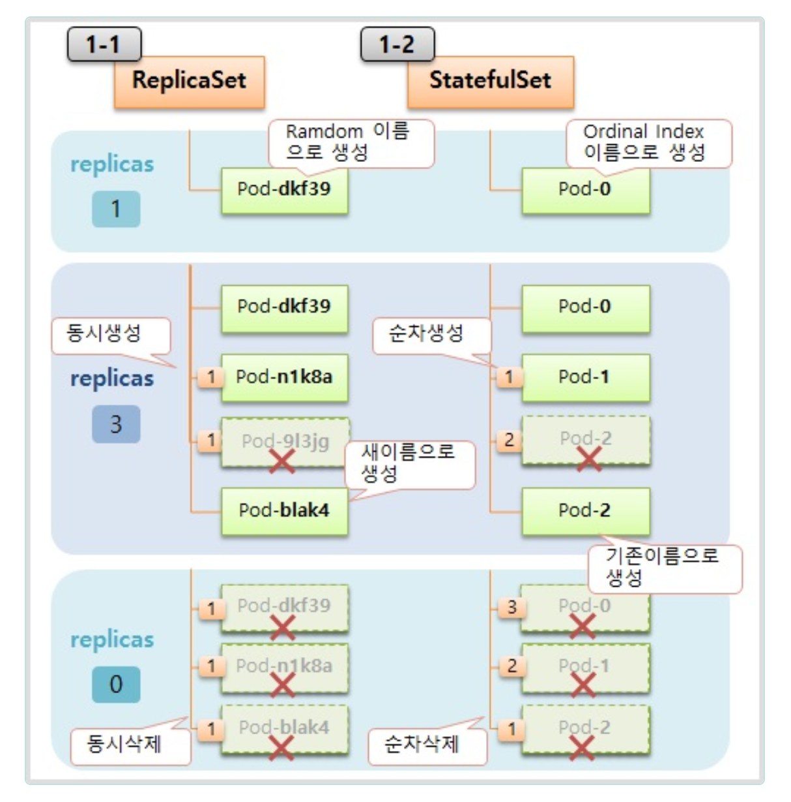
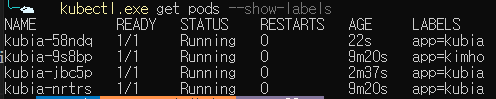
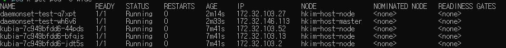

## 목차
[1. 레플리카셋](#레플리카셋)  
[2. 레플리카셋으로 생성된 파드의 레이블이 수정된다면?](#레플리카셋으로-생성된-파드의-레이블이-수정된다면)    
[3. 오너 레퍼런스](#오너-레퍼런스) 
[4. 데몬셋](#데몬셋)      
[5. Tolerations 및 Taints](#tolerations-및-taints)    
[6. 잡](#잡)  
[7. 크론 잡](#크론-잡)  
[8. 크론잡 히스토리](#크론잡-히스토리)


### 레플리카셋
레플리카셋은 레플리카 파드 집합의 실행을 안정적으로 유지하는 것으로, 파드를 지속적으로 모니터링하여 파드 수가 의도하는 수와 일치하는치 확인하고 실행하는걸 보장합니다.
특정 레이블의 키를 갖는 파드를 매칭시킬 수 있습니다. 결과적으로 레플리카의 목적은 `지정된 수의 파드가 항상 실행되도록 보장`하는 것입니다.

레플리카셋은 다음과 같은 필드를 가지고 있습니다.
1. 셀렉터

`레플리카셋이 괸리할 파드를 식별`하는 방법을 정의합니다. 셀렉터를 사용하여 파드를 선택하고 관리합니다.

2. 레플리카 수
   
유지(보장)해야할 파드의 개수를 정의합니다.

3. 파드 템플릿

레플리카셋이 생성할 파드의 템플릿을 정의합니다.

YAML파일을 보면서 필드를 확인하고 어떻게 생성되는지 확인해봅니다.

```
apiVersion: apps/v1
kind: ReplicaSet
metadata:
  name: kubia
spec:
  replicas: 3
  selector:
    matchLabels:
      app: kubia
  template:
    metadata:
      labels:
        app: kubia
    spec:
      containers:
      - name: kubia
        image: luksa/kubia
```
`kind : ReplicaSet` 이제 Pod가 아닌 레플리카셋으로 명시합니다.
`spec.replicas : 3` 몇 개의 파드가 실행될 지 설정합니다.
- spec
  - selector
    - matchLabels
      - app:kubia 레이블을 가진 파드에 대해서만 관리합니다.
`spec.template` : 실제 파드에서 실행될 컨테이너이며, 추가/삭제될 파드에 대한 템플릿이다.

실제 이 YAML 파일로 레플리카 셋을 만들면 다음과 같이 파드가 만들어집니다.


`kubectl get rs` 명령을 통해 현재 레플리카셋의 파드가 몇 개 생성되어야 하고 몇 개 생성 되어있는지 확인할 수 있습니다.
```
NAME    DESIRED   CURRENT   READY   AGE
kubia   3         3         3       80s
```



`kubectl describe rs <rs-name>` 명령을 통해 레플리카셋에 대한 자세한 정보와 어떤 파드가 만들어졌는지 등 이벤트를 확인할 수 있습니다.

```
spec:
  replicas: 3
  selector:
    matchExpressions:
      - key: app
        operator: In
        values:
         - kubia
```
레플리카셋에서 레이블 셀렉터를 이용하여 좀더 파드와의 매칭을 확장할 수 있습니다.
- `In` : 레이블이 지정된 값 중 하나와 일치
- `NotIn` : 레이블 값이 지정된 값과 일치하지 않아야 함
- `Exists` : 파드는 지정된 값을 키로 가진 레이블을 포함해야 함(이 연산자를 사용할 땐, 값 필드를 지정하지 않아야 함)
- `DoesNotExist` : 파드에 지정된 값을 키로 가진 레이블이 포함되어 있지 않아야함(똑같이 값 필드를 지정하지 않아야 함)
위의 연산자를 활용하여 YAML 매니페스트 파일에서 파드를 매칭할 수 있다.

### 레플리카셋으로 생성된 파드의 레이블이 수정된다면?
위의 예제는 `app: kubia` 레이블을 가지 파드가 3개 실핼중입니다. 하지만 이 파드중 레이블이 변경되면 레플리카셋은 어떻게 동작될까요?

```
NAME          READY   STATUS    RESTARTS   AGE     LABELS
kubia-9s8bp   1/1     Running   0          8m24s   app=kubia
kubia-jbc5p   1/1     Running   0          101s    app=kubia
kubia-nrtrs   1/1     Running   0          8m24s   app=kubia
```
현재 레플리카셋에 의해 3개의 파드가 실핼중입니다. 이들 중 한 개의 레이블을 수정하겠습니다.

```
kubectl label pod kubia-9s8bp app=kimho --overwrite
```


파드를 조회하면 `app=kubia` 레이블을 가지는 파드가 생성되었습니다. `레플리카셋은 셀렉터에 의해 매칭되는 레이블만 관리하기 때문에 레이블이 변경된 파드는 레플리카셋에 의해 관리가 되지 않습니다.` 그래서 이 파드는 더 이상 레플리카셋에 의해 관리되지 않으며 삭제되어도 다시 생성되지 않습니다.

한번 다시 이 파드의 레이블을 `app=kubia`로 변경해보겠습니다.
```
NAME          READY   STATUS        RESTARTS   AGE     LABELS
kubia-58ndq   1/1     Terminating   0          2m47s   app=kubia
kubia-9s8bp   1/1     Running       0          11m     app=kubia
kubia-jbc5p   1/1     Running       0          5m2s    app=kubia
kubia-nrtrs   1/1     Running       0          11m     app=kubia
```
다시 파드를 조회해보면 해당 파드는 다시 레플리카셋에 의해 관리가되고 3개의 수를 보장하기 때문에 1개의 파드가 삭제되는걸 확인할 수 있습니다.

```
주의할 점은 레플리카셋에 정의되지 않은 템플릿을 가지는 파드가 labels 변경으로 레플리카셋에 관리가되면 이미지가 달라도 레플리카셋은 해당 파드를 관리합니다. 하지만 해당 파드가 삭제되면 재 생성 시, 레플리카셋에 정의된 템플릿에 의해 파드가 재 생성됩니다.
```

### 오너 레퍼런스
레플리카셋에 의해 생성된 파드는 `오너 레퍼런스`라는 메타데이터를 가지게 됩니다. 이 메타데이터를 사용하여 레플리카셋 컨트롤러가 파드의 수를 감지하여 생성/삭제할 수 있습니다.

메타데이터를 확인해보겠습니다. 먼저 레플리카셋 매니페스트 파일은 다음과 같습니다.
```
apiVersion: apps/v1
kind: ReplicaSet
metadata:
  name: kubia
spec:
  replicas: 3
  selector:
    matchLabels:
      app: kubia
  template:
    metadata:
      labels:
        app: kubia
    spec:
      containers:
      - name: kubia
        image: luksa/kubia
```

```YAML
# 파드 조회 데이터
apiVersion: v1
kind: Pod
metadata:
  labels:
    app: kubia
  name: kubia-9s8bp
  namespace: default
  ownerReferences:
  - apiVersion: apps/v1
    blockOwnerDeletion: true
    controller: true
    kind: ReplicaSet
    name: kubia
    uid: 813040e0-f453-4d68-ab74-c41f883f86ec
```
메타데이터에 `ownerReferences`가 생성된 걸 확인할 수 있으며, 생성된 레플리카셋, 이름, 레플리카셋UID 등을 확인할 수 있습니다.

그외에 다른 2개의 필드는 다음과 같습니다.
- blockOwnerDeletion(True/False)
  - 상위 리소스를 삭제할 때 자식 리소스가 존재하면 상위 리소스를 삭제할 수 없습니다.
  - 레플리카셋에 의해 생성된 파드가 실행중이면, 레플리카셋을 삭제할 수 없습니다.
- controller(True/False)
  - 상위 리소스(소유자)가 자식 리소스를 컨트롤합니다.
  - True로 설정되면 레플리카셋이 자식 파드를 관리(감시/생성/삭제)합니다.


그리고 테스트 결과 `label이 변경되어 레플리카셋에 의해 관리가 되지 않는 파드는 메타데이터에서 오너 레퍼런스가 삭제되고, label이 변경되어 레플리카셋에 의해 관리가 되면 메타데이터에 오너 레퍼런스가 생성`됩니다.

실제 쿠버네티스 시스템에서 사용중인 레플리카셋을 조회해보겠습니다.
```
# 조회 명령어
kubectl get replicasets -n kube-system
kubectl describe replicaset <rsplicaset-Name> -n kube-system
```
```YAML
# kubectl get
apiVersion: apps/v1
kind: ReplicaSet
metadata:
  labels:
    k8s-app: kube-dns
  name: coredns-75ddfb5f98
  namespace: kube-system
  ownerReferences:
  - apiVersion: apps/v1
    blockOwnerDeletion: true
    controller: true
    kind: Deployment
    name: coredns
    uid: 67f4e8f5-0931-497a-89ab-9a8a1dc11fad
```
deployment를 상위 리소스를 가지며, 레플리카셋으로 실행되는걸 오너레퍼런스를 통해 확인할 수 있습니다.

### 데몬셋
레플리카셋은 노드의 몇 개의 파드가 배치될지 정할 수 없습니다. 이는 스케줄러에의해 할당됩니다. 하지만 각각의 노드에서 1개씩 지정된 파드를 실행하려면 어떻게 해야 할까요?

노드에서 1개씩 파드를 실행하려면 데몬셋 오브젝트를 생성해야 합니다.
데몬셋은 레플리카셋과 다르게 `원하는 파드의 수` 개념이 없습니다. 파드 셀렉터와 일치하는 파드가 노드에서 실행 중인지 확인하는 것이기 때문에, 2개 이상 파드를 실행하지 않습니다. 데몬셋은 새 노드가 추가된 경우 생성된 노드에 파드를 할당합니다.

데몬셋을 활용한 용도는 다음과 같습니다.
- 스토리지 데몬 실행
- 로그 수집 데몬 실행
- 노드 모니터링 데몬 실행


```
apiVersion: apps/v1
kind: DaemonSet
metadata:
  name: ssd-monitor
spec:
  selector:
    matchLabels:
      app: ssd-monitor
  template:
    metadata:
      labels:
        app: ssd-monitor
    spec:
      nodeSelector:
        disk: ssd
      containers:
      - name: main
        image: luksa/ssd-monitor
```
이 매니페스트는 데몬셋을 생성한다
- spec
  - template
    - spec
      - nodeSelector
        - disk: ssd
노드 셀렉터는 위와 같이 되어 있다. 이 뜻은 `disk:ssd` 레이블을 갖는 노드에만 해당 파드를 할당한다는 의미이다.

`disk:ssd` 레이블을 가진 노드가 없기 때문에 생성되어 있는 노드에 레이블을 추가한다.

```
# kubectl label node {노드이름} disk=ssd
kubectl label node hkim-host-node disk=ssd
```


노드에 레이블을 추가 하기 전 파드 조회


노드에 `disk:ssd` 레이블 추가


데몬셋을 생성하고 데몬셋의 노드 셀렉터에 만족하는 레이블을 노드에 추가하니 데몬셋에 의해 파드가 생성되었다.

데몬셋은 노드에서 1개만 실행되는 걸 보장합니다. 그럼 실제 쿠버네티스에서 데몬셋은 어떻게 사용중인지 확인해봅니다.

```YAML
# kube-proxy
apiVersion: apps/v1
kind: DaemonSet
metadata:
  annotations:
  creationTimestamp: "2024-06-10T11:12:55Z"
  labels:
    k8s-app: kube-proxy
  name: kube-proxy
  namespace: kube-system
```
kube-proxy를 조회해보면 데몬셋으로 되어있는걸 확인할 수 있습니다.

### Tolerations 및 Taints
테인트는 특정 조건이 있는 노드에 파드가 스케줄링되지 않도록 하는 기능입니다.

톨러레이션은 파드가 특정 테인트를 무시하고 노드에 스케줄링될 수 있도록 허용하는 기능입니다.

톨러레이션은 테인트(taint)와 함께 작동하여 파드가 적절한 노드에 스케줄링 되도록 보장합니다.

테인트는 특정 조건이 있는 노드에 파드가 스케줄링되지 않도록 설정하는 기능이라고 했습니다. 노드에 테인트를 추가하면 톨러레이션이 없는 파드는 그 노드에 스케줄링되지 않습니다.

테인트는 다음과 같이 구성됩니다.
- key
  - taint 이름입니다.
- value
  - taint 값입니다.
- effect
  - 테인트가 적용되는 방식입니다. 세 가지 유형이 있습니다.
    - NoSchedule: 해당 테인트가 있는 노드에 파드를 스케줄링하지 않습니다.
    - PreferNoSchedule: 가능하면 해당 테인트가 있는 노드에 파드를 스케줄링하지 않습니다.
    - NoExecute: 기존에 실행 중인 파드도 퇴출시키며, 새로운 파드를 스케줄링하지 않습니다.

톨러레이션은 다음과 같이 구성됩니다.
- key
  - 톨러레이션 이름입니다.
- operator
  - Exists, Equal 값이 있습니다.
  - Exists: 키가 존재하기만 하면 톨러레이션을 적용합니다.
  - Equal: 키와 값이 정확하게 일치해야 톨러레이션을 적용합니다.
- value
  - 톨러레이션 값입니다.
- effect
  - 적용될 테인트와 일치해야 합니다. 값이 다르면 적용되지 않습니다.
- tolerationSeconds(option)
  - 테인트의 `effect:NoExecute`인 경우 적용되며, 파드가 노드에서 얼마나 생존할 시간을 나타냅니다.
  - 3600 값으로 설정된 경우, 해당 파드는 1시간 후 노드에서 축출됩니다.

마스터노드에 테인트를 추가하여 파드를 배치할 수 없게 만들고 마스터노드에 데몬셋을 통해 파드를 배치해보겠습니다.

```
kubectl taint nodes hkim-host-master node-role.kubernetes.io/master:NoSchedule
```

```YAML
apiVersion: apps/v1
kind: DaemonSet
metadata:
  name: daemonset-test
spec:
  selector:
    matchLabels:
      name: kimho
  template:
    metadata:
      labels:
        name: kimho
    spec:
      tolerations:
      - key: "node-role.kubernetes.io/master"
        operator: "Exists"
        effect: "NoSchedule"
      containers:
      - name: nginx
        image: nginx
```
- spec
  - key: node-role.kubernetes.io/master 이 키를 가진 테인트에 대해 적용합니다.
  - operator: Exists 해당 키가 존재하면 톨러레이션이 적용됩니다.
  - effect: NoSchedule가 적용된 테인트(파드가 스케줄링되지 않는 노드)를 무시하고 노드에 파드가 스케줄링 될 수 있습니다.

실행된 결과를 보면

다른 노드들은 워커노드에 파드가 배치되었지만, 방금 생성한 데몬셋으로 생성된 파드는 마스터 노드에 배치된 걸 알 수 있습니다.


### 잡
이전에 작성했던 레플리카셋, 데몬셋은 완료됐다는 속성없이 지속적인 태스크를 실행합니다.
하지만 완료 가능한 태스크가 필요하며, 이런 태스크는 작업이 완료되면 소멸된다. 쿠버네티스는 이런 리소스를 잡을 통해 제공한다.

잡은 파드의 `컨테이너 내부에서 실행 중인 프로세스가 완료되면 컨테이너를 다시 시작하지 않는 파드`를 실행할 수 있다. 프로세스가 완료되면 파드는 완료된 것으로 간주한다.
노드에 장애가 발생한 경우 잡은 레플리카셋과 동일하게 파드에 다시 스케줄링된다. 하지만 프로세스 자체에 장애가 발생한 경우, 잡에서 컨테이너를 다시 시작할 것인지 설정할 수 있다.

그럼 잡은 어떤 상황에 유용할까?
잡은 작업이 완료되는 것이 중요한 임시 작업에 유용하다. `관리되지 않은 임시 작업이 장애가 발생하여 중단된 경우, 수동으로 다시 생성해주어야 하며 장애 발생에 대한 감시가 이루어져야 하기에 관리자가 직접 하는건 굉장히 힘든일이다.`
그래서 잡을 통해 임시 작업을 관리하여 노드에 장애가 발생한 경우 잡 파드를 다시 생성하여 실행이 완료할 수 있게 보장해주어야 한다.
예를 들어 데이터를 저장하고, 저장된 데이터를 변환해서 어딘가로 전송해야 하는 일정 시간 이상이 걸리는 작업인 경우 잡을 통해 관리하면 매우 유용하다.

```
apiVersion: batch/v1
kind: Job
metadata:
  name: batch-job
spec:
  template:
    metadata:
      labels:
        app: batch-job
    spec:
      restartPolicy: OnFailure
      containers:
      - name: main
        image: luksa/batch-job
```
이 매니페스트 파일을 통해 잡을 생성할 수 있다.
- spec
  - template
    - spec
      - restartPolicy
        - OnFailure값은 비정상적으로 종료되면 다시 시작하는 옵션이다
        - Never(Deault) 성공/실패 유무에 관계없이 재시작 하지 않는 정책이다.
        - Always(허용되지 않음)

잡에서 사용되는 필드 들을 알아보겠습니다.
- complections
  - 잡이 완료되기 위해 성공적으로 종료(작업 완료)되어야 하는 파드의 개수입니다.
  - 기본값 1
- parallelism
  - 동시에 실행될 수 있는 파드의 수를 정의합니다.
  - 기본값 1
- activeDeadlineSeconds
  - 잡이 생성된 후, 최대 실행 시간을 초 단위로 정의합니다. 이 시간이 지나면 모든 활성화된 파드는 종료되고 잡은 실패로 간주됩니다.
  - 동시에 3개가 실행중일 때 1개라도 시간을 초과하면 모든 잡은 실패로 간주됩니다. 잡이 실패로 간주되면 다시 잡은 재시도 되지 않습니다.
  - 설정하지 않으면 무제한
- backoffLimit
  - 파드가 실패한 후 다시 시도하는 횟수입니다.
  - 파드가 실패할 때마다 새로운 파드를 생성하여 다시 시도합니다. 횟수를 초과하면 잡은 실패로 처리되어 잡은 재실행되지 않습니다.
  - 파드는 10, 20, 40... 형식으로 지수적으로 증가하는 백오프 지연 시간이 적용되어 잡 컨트롤러에 의해 재성성됩니다.
  - 기본값은 6입니다.
- ttlSecondsAfterFinished
  - 잡이 완료된 후, 삭제되기 전까지 유지되는 시간입니다.


잡은 일시 중지할 수 있습니다.
잡 중지는 `spec.suspend` 필드를 True/False 값으로 업데이트하여 중지(True)할 수 있습니다.
잡이 일시 중지하면, `completed` 상태가 아닌 실행중인 파드에 종료 시그널을 보내 종료하게됩니다. 
```YAML
apiVersion: batch/v1
kind: Job
metadata:
  name: sus-job
spec:
  template:
    spec:
      containers:
      - name: example
        image: busybox
        command: ["sh", "-c", "echo Hello; sleep 60"]
      restartPolicy: OnFailure
```
실제 잡을 실행하고 일시 중지 해보겠습니다.
```
# 잡 실행 직 후
NAME      STATUS    COMPLETIONS   DURATION   AGE
sus-job   Running   0/1           6s         6s

# 잡 중지 직 후
kubectl patch job sus-job -p '{"spec":{"suspend":true}}'
NAME      STATUS      COMPLETIONS   DURATION   AGE
sus-job   Suspended   0/1           20s        20s

# 잡 재개 후 파드 조회
NAME                   READY   STATUS        RESTARTS   AGE
daemonset-test-6zzh7   1/1     Running       0          75m
sus-job-9gs5s          1/1     Running       0          6s
sus-job-zlx2w          0/1     Terminating   0          47s
```

처음에 잡에서 생성된 파드는 일시 중지일 때 종료되었고, 잡이 다시 재개되면서 파드를 생성한 걸 확인할 수 있습니다.

```
잡 관련된 상세 내용
1. 잡은 완료되어도 파드가 삭제되지 않습니다. ttlSecondsAfterFinished 옵션을 적용하여 일정 시간이 지난 파드는 삭제로 처리할 수 있습니다.

2. 잡으로 생성된 파드가 완료되지 않은 상태로 남아 있는 경우, 별다른 옵션을 할당하지 않는 한 파드는 무한히 생성되어 있습니다. activeDeadlineSeconds 옵션을 할당하여 일정 시간안에 완료되지 못한 파드가 있으면 강제로 잡을 실패로 만들어야 합니다. 이 경우 남아 있는 파드를 통해 원인을 분석할 수 있습니다.
```

### 크론 잡
주기적으로(지정된 간격) 반복 실행되는 작업을 리눅스에서 `크론(cron)` 이라고 한다. 크론 잡은 일정한 간격으로 잡을 실행한다.
크론의 주기는 5개의 시간으로 이루어진다
*(분) *(시간) *(일) *(월) *(요일)
ex)
- 0,20,40 * * * * : 매일 매시간 0, 20, 40분에 실행
- 45 5 * * 5 : 매 주 금요일 오전 5시 45분에 실행

```
apiVersion: batch/v1
kind: CronJob
metadata:
  name: test-cronjob
spec:
  schedule: "*/5 * * * *"
  successfulJobsHistoryLimit: 3  # 성공한 잡 히스토리 제한
  failedJobsHistoryLimit: 1      # 실패한 잡 히스토리 제한
  jobTemplate:
    spec:
      template:
        spec:
          containers:
          - name: example
            image: busybox
            command: ["sh", "-c", "echo Hello World! && sleep 30"]
          restartPolicy: OnFailure
```
크론잡을 실행하면
```
Events:
  Type    Reason            Age    From                Message
  ----    ------            ----   ----                -------
  Normal  SuccessfulCreate  7m19s  cronjob-controller  Created job test-cronjob-28652314
  Normal  SawCompletedJob   6m44s  cronjob-controller  Saw completed job: test-cronjob-28652314, status: Complete
  Normal  SuccessfulCreate  6m19s  cronjob-controller  Created job test-cronjob-28652315
  Normal  SawCompletedJob   5m45s  cronjob-controller  Saw completed job: test-cronjob-28652315, status: Complete
  Normal  SuccessfulCreate  5m19s  cronjob-controller  Created job test-cronjob-28652316
  Normal  SawCompletedJob   4m44s  cronjob-controller  Saw completed job: test-cronjob-28652316, status: Complete
  Normal  SuccessfulCreate  4m19s  cronjob-controller  Created job test-cronjob-28652317
  Normal  SuccessfulDelete  3m44s  cronjob-controller  Deleted job test-cronjob-28652314
  Normal  SawCompletedJob   3m44s  cronjob-controller  Saw completed job: test-cronjob-28652317, status: Complete
  Normal  SuccessfulCreate  3m19s  cronjob-controller  Created job test-cronjob-28652318
  Normal  SuccessfulDelete  2m44s  cronjob-controller  Deleted job test-cronjob-28652315
  Normal  SawCompletedJob   2m44s  cronjob-controller  Saw completed job: test-cronjob-28652318, status: Complete
  Normal  SuccessfulCreate  2m19s  cronjob-controller  Created job test-cronjob-28652319
  Normal  SuccessfulDelete  104s   cronjob-controller  Deleted job test-cronjob-28652316
  Normal  SawCompletedJob   104s   cronjob-controller  Saw completed job: test-cronjob-28652319, status: Complete
  Normal  SuccessfulCreate  79s    cronjob-controller  Created job test-cronjob-28652320
  Normal  SuccessfulDelete  45s    cronjob-controller  Deleted job test-cronjob-28652317
  Normal  SawCompletedJob   45s    cronjob-controller  Saw completed job: test-cronjob-28652320, status: Complete
  Normal  SuccessfulCreate  19s    cronjob-controller  Created job test-cronjob-28652321
```

이 크론잡은 5분 간격으로 잡 리소스를 생성합니다.
이벤트에 크론잡에 대한 기록이 계속 기록되어 확인할 수 있습니다.

추가적으로 `startingDeadlineSeconds` 옵션을 할당할 수 있다. 이 옵션은 지정된 초 이내로 파드가 시작해야하는 옵션이다.

주의할 점은 이 옵션이 굉장히 작은 시간(10초 미만)으로 설정되어 있으면 크론잡이 스케줄 되지 않을 수 있다.
크론잡 컨트롤러는 10초마다 마지막 부터 현재까지 얼마나 많은 크론잡이 누락되었는지 확인한다. 만약 일정 수 이상(100개)의 일정이 누락되면 잡을 실행하지 않고 로그를 남긴다. 크론잡은 실패합니다.

### 크론잡 히스토리
일반적으로 잡의 경우 작업이 완료되면 만들어진 파드가 삭제되지 않습니다. 크론잡의 경우 굉장히 많은 수의 작업이 이루지면 파드수가 굉장히 많아 질 수 있습니다. 이 문제는 잡 히스토리 옵션을 사용하여 문제를 해결할 수 있습니다.

위의 매니페스트 파일에 다음과 같은 옵션이 있습니다.
- spec
  - successfulJobsHistoryLimit: 디폴트(3)
    - 성공한 잡의 개수를 3개로 제한합니다. 만약 4번 째 잡이 완료되면 가장 오래된 잡을 삭제하여 최근 3개의 잡에 대한 기록을 유지합니다.
  - failedJobsHistoryLimit: 디폴트(1)
    - 실패한 잡의 개수를 1개로 제한합니다. 만약 2번 째 잡이 완료되면 가장 오래된 잡을 삭제하여 최근 1개의 잡에 대한 기록을 유지합니다.

이렇게 무수히 많은 잡에 대한 기록이 생길 수 있지란 이런 옵션을 사용하여 문제를 방지하고 문제가 발생한 경우 추적할 수 있는 기록을 남겨놓습니다.