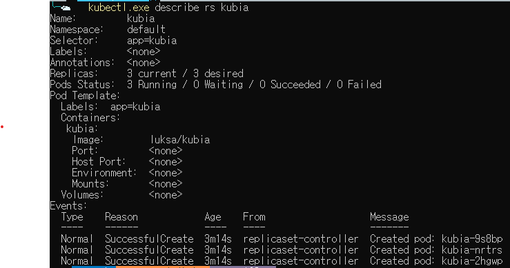

### 레플리카셋
레플리카셋은 레플리카 파드 집합의 실행을 안정적으로 유지하는 것으로, 파드를 지속적으로 모니터링하여 파드 수가 의도하는 수와 일치하는치 확인하고 실행하는걸 보장합니다.
특정 레이블의 키를 갖는 파드를 매칭시킬 수 있습니다. 결과적으로 레플리카의 목적은 `지정된 수의 파드가 항상 실행되도록 보장`하는 것입니다.

레플리카셋은 다음과 같은 필드를 가지고 있습니다.
1. 셀렉터

`레플리카셋이 괸리할 파드를 식별`하는 방법을 정의합니다. 셀렉터를 사용하여 파드를 선택하고 관리합니다.

2. 레플리카 수
   
유지(보장)해야할 파드의 개수를 정의합니다.

3. 파드 템플릿

레플리카셋이 생성할 파드의 템플릿을 정의합니다.

YAML파일을 보면서 필드를 확인하고 어떻게 생성되는지 확인해봅니다.

```
apiVersion: apps/v1
kind: ReplicaSet
metadata:
  name: kubia
spec:
  replicas: 3
  selector:
    matchLabels:
      app: kubia
  template:
    metadata:
      labels:
        app: kubia
    spec:
      containers:
      - name: kubia
        image: luksa/kubia
```
`kind : ReplicaSet` 이제 Pod가 아닌 레플리카셋으로 명시합니다.
`spec.replicas : 3` 몇 개의 파드가 실행될 지 설정합니다.
- spec
  - selector
    - matchLabels
      - app:kubia 레이블을 가진 파드에 대해서만 관리합니다.
`spec.template` : 실제 파드에서 실행될 컨테이너이며, 추가/삭제될 파드에 대한 템플릿이다.

실제 이 YAML 파일로 레플리카 셋을 만들면 다음과 같이 파드가 만들어집니다.


`kubectl get rs` 명령을 통해 현재 레플리카셋의 파드가 몇 개 생성되어야 하고 몇 개 생성 되어있는지 확인할 수 있습니다.
```
NAME    DESIRED   CURRENT   READY   AGE
kubia   3         3         3       80s
```



`kubectl describe rs <rs-name>` 명령을 통해 레플리카셋에 대한 자세한 정보와 어떤 파드가 만들어졌는지 등 이벤트를 확인할 수 있습니다.

```
spec:
  replicas: 3
  selector:
    matchExpressions:
      - key: app
        operator: In
        values:
         - kubia
```
레플리카셋에서 레이블 셀렉터를 이용하여 좀더 파드와의 매칭을 확장할 수 있습니다.
- `In` : 레이블이 지정된 값 중 하나와 일치
- `NotIn` : 레이블 값이 지정된 값과 일치하지 않아야 함
- `Exists` : 파드는 지정된 값을 키로 가진 레이블을 포함해야 함(이 연산자를 사용할 땐, 값 필드를 지정하지 않아야 함)
- `DoesNotExist` : 파드에 지정된 값을 키로 가진 레이블이 포함되어 있지 않아야함(똑같이 값 필드를 지정하지 않아야 함)
위의 연산자를 활용하여 YAML 매니페스트 파일에서 파드를 매칭할 수 있다.

### 레플리카셋으로 생성된 파드의 레이블이 수정된다면?
위의 예제는 `app: kubia` 레이블을 가지 파드가 3개 실핼중입니다. 하지만 이 파드중 레이블이 변경되면 레플리카셋은 어떻게 동작될까요?

```
NAME          READY   STATUS    RESTARTS   AGE     LABELS
kubia-9s8bp   1/1     Running   0          8m24s   app=kubia
kubia-jbc5p   1/1     Running   0          101s    app=kubia
kubia-nrtrs   1/1     Running   0          8m24s   app=kubia
```
현재 레플리카셋에 의해 3개의 파드가 실핼중입니다. 이들 중 한 개의 레이블을 수정하겠습니다.

```
kubectl label pod kubia-9s8bp app=kimho --overwrite
```


파드를 조회하면 `app=kubia` 레이블을 가지는 파드가 생성되었습니다. `레플리카셋은 셀렉터에 의해 매칭되는 레이블만 관리하기 때문에 레이블이 변경된 파드는 레플리카셋에 의해 관리가 되지 않습니다.` 그래서 이 파드는 더 이상 레플리카셋에 의해 관리되지 않으며 삭제되어도 다시 생성되지 않습니다.

한번 다시 이 파드의 레이블을 `app=kubia`로 변경해보겠습니다.
```
NAME          READY   STATUS        RESTARTS   AGE     LABELS
kubia-58ndq   1/1     Terminating   0          2m47s   app=kubia
kubia-9s8bp   1/1     Running       0          11m     app=kubia
kubia-jbc5p   1/1     Running       0          5m2s    app=kubia
kubia-nrtrs   1/1     Running       0          11m     app=kubia
```
다시 파드를 조회해보면 해당 파드는 다시 레플리카셋에 의해 관리가되고 3개의 수를 보장하기 때문에 1개의 파드가 삭제되는걸 확인할 수 있습니다.

```
주의할 점은 레플리카셋에 정의되지 않은 템플릿을 가지는 파드가 labels 변경으로 레플리카셋에 관리가되면 이미지가 달라도 레플리카셋은 해당 파드를 관리합니다. 하지만 해당 파드가 삭제되면 재 생성 시, 레플리카셋에 정의된 템플릿에 의해 파드가 재 생성됩니다.
```

### 오너 레퍼런스
레플리카셋에 의해 생성된 파드는 `오너 레퍼런스`라는 메타데이터를 가지게 됩니다. 이 메타데이터를 사용하여 레플리카셋 컨트롤러가 파드의 수를 감지하여 생성/삭제할 수 있습니다.

메타데이터를 확인해보겠습니다. 먼저 레플리카셋 매니페스트 파일은 다음과 같습니다.
```
apiVersion: apps/v1
kind: ReplicaSet
metadata:
  name: kubia
spec:
  replicas: 3
  selector:
    matchLabels:
      app: kubia
  template:
    metadata:
      labels:
        app: kubia
    spec:
      containers:
      - name: kubia
        image: luksa/kubia
```

```YAML
# 파드 조회 데이터
apiVersion: v1
kind: Pod
metadata:
  labels:
    app: kubia
  name: kubia-9s8bp
  namespace: default
  ownerReferences:
  - apiVersion: apps/v1
    blockOwnerDeletion: true
    controller: true
    kind: ReplicaSet
    name: kubia
    uid: 813040e0-f453-4d68-ab74-c41f883f86ec
```
메타데이터에 `ownerReferences`가 생성된 걸 확인할 수 있으며, 생성된 레플리카셋, 이름, 레플리카셋UID 등을 확인할 수 있습니다.

그외에 다른 2개의 필드는 다음과 같습니다.
- blockOwnerDeletion(True/False)
  - 상위 리소스를 삭제할 때 자식 리소스가 존재하면 상위 리소스를 삭제할 수 없습니다.
  - 레플리카셋에 의해 생성된 파드가 실행중이면, 레플리카셋을 삭제할 수 없습니다.
- controller(True/False)
  - 상위 리소스(소유자)가 자식 리소스를 컨트롤합니다.
  - True로 설정되면 레플리카셋이 자식 파드를 관리(감시/생성/삭제)합니다.


그리고 테스트 결과 `label이 변경되어 레플리카셋에 의해 관리가 되지 않는 파드는 메타데이터에서 오너 레퍼런스가 삭제되고, label이 변경되어 레플리카셋에 의해 관리가 되면 메타데이터에 오너 레퍼런스가 생성`됩니다.

### 데몬셋
레플리카셋은 노드의 몇 개의 파드가 배치될지 정할 수 없다. 이는 스케줄러에의해 할당된다. 하지만 각각의 노드에서 1개씩 지정된 파드를 실행하려면 어떻게 해야할가?(kube-proxy 모든 노드에 1개씩 있는 느낌)
각각의 노드에서 1개씩 파드를 실행하려면 데몬셋 오브젝트를 생성해야 한다.
생성된 파드는 타겟 노드가 지정되어 있고 스케줄링 기능을 사용하지 않으면 이런 요구 사항을 만족할 수 있다.
데몬셋은 레플리카셋과 다르게 `원하는 파드의 수` 개념이 없다. 파드 셀렉터와 일치하는 파드가 노드에서 실행 중인지 확인하는 것이기 때문에, 복제본 개념이 필요 없다. 그리고 노드가 다운됐다고 해서 다른 노드에 파드를 생성하지 않는다. 대신 새 노드가 추가된 경우 생성된 노드에 파드를 할당한다.

```
apiVersion: apps/v1
kind: DaemonSet
metadata:
  name: ssd-monitor
spec:
  selector:
    matchLabels:
      app: ssd-monitor
  template:
    metadata:
      labels:
        app: ssd-monitor
    spec:
      nodeSelector:
        disk: ssd
      containers:
      - name: main
        image: luksa/ssd-monitor
```
이 매니페스트는 데몬셋을 생성한다
- spec
  - template
    - spec
      - nodeSelector
        - disk: ssd
노드 셀렉터는 위와 같이 되어 있다. 이 뜻은 `disk:ssd` 레이블을 갖는 노드에만 해당 파드를 할당한다는 의미이다.

`disk:ssd` 레이블을 가진 노드가 없기 때문에 생성되어 있는 노드에 레이블을 추가한다.

```
# kubectl label node {노드이름} disk=ssd
kubectl label node hkim-host-node disk=ssd
```


노드에 레이블을 추가 하기 전 파드 조회


노드에 `disk:ssd` 레이블 추가


데몬셋을 생성하고 데몬셋의 노드 셀렉터에 만족하는 레이블을 노드에 추가하니 데몬셋에 의해 파드가 생성되었다.

### 잡
이전에 작성했던 레플리카셋, 데몬셋은 완료됐다는 속성없이 지속적인 태스크를 실행한다. 예를 들어 API서버의 경우 작업이 종료되는게 아닌 무한히 요청을 대기 한다.
하지만 완료 가능한 태스크가 필요하며, 이런 태스크는 작업이 완료되면 소멸된다. 쿠버네티스는 이런 리소스를 잡을 통해 제공한다.

잡은 파드의 `컨테이너 내부에서 실행 중인 프로세스가 완료되면 컨테이너를 다시 시작하지 않는 파드`를 실행할 수 있다. 프로세스가 완료되면 파드는 완료된 것으로 간주한다.
노드에 장애가 발생한 경우 잡은 레플리카셋과 동일하게 파드에 다시 스케줄링된다. 하지만 프로세스 자체에 장애가 발생한 경우, 잡에서 컨테이너를 다시 시작할 것인지 설정할 수 있다.

그럼 잡은 어떤 상황에 유용할까?
잡은 작업이 완료되는 것이 중요한 임시 작업에 유용하다. `관리되지 않은 임시 작업이 장애가 발생하여 중단된 경우, 수동으로 다시 생성해주어야 하며 장애 발생에 대한 감시가 이루어져야 하기에 관리자가 직접 하는건 굉장히 힘든일이다.`
그래서 잡을 통해 임시 작업을 관리하여 노드에 장애가 발생한 경우 잡 파드를 다시 생성하여 실행이 완료할 수 있게 보장해주어야 한다.
예를 들어 데이터를 저장하고, 저장된 데이터를 변환해서 어딘가로 전송해야 하는 일정 시간 이상이 걸리는 작업인 경우 잡을 통해 관리하면 매우 유용하다.

```
apiVersion: batch/v1
kind: Job
metadata:
  name: batch-job
spec:
  template:
    metadata:
      labels:
        app: batch-job
    spec:
      restartPolicy: OnFailure
      containers:
      - name: main
        image: luksa/batch-job
```
이 매니페스트 파일을 통해 잡을 생성할 수 있다.
- spec
  - template
    - spec
      - restartPolicy
        - OnFailure값은 비정상적으로 종료되면 다시 시작하는 옵션이다
        - Always(Deault) 정상적으로 종료 되었다고 해도 다시 시작하는 정책이다.
        - Never 성공/실패 유무에 관계없이 재시작 하지 않는 정책이다.


잡은 여러 번 동작하게 설정할 수 있고 병렬로도 실행이 가능하다.
```
apiVersion: batch/v1
kind: Job
metadata:
  name: multi-completion-batch-job
spec:
  completions: 5
  parallelism: 2
  template:
    metadata:
      labels:
        app: batch-job
    spec:
      restartPolicy: OnFailure
      containers:
      - name: main
        image: luksa/batch-job
```

- spec
  - completions
    - 이 속성은 총 5번의 작업이 완료되어야 하고, `parallelism` 속성이 없으면 한 작업씩 순차적으로 이루어진다. 만약 중간에 실패하면 새 파드를 생성하여 작업을 계속한다. 즉 최소 5번 이상의 파드가 만들어진다.
  - parallelism
    - 이 속성은 병렬로 최대 n개의 파드가 생성되어 작업을 병렬로 처리한다는 의미이다. 이 옵션은 잡이 실행되는 동안 변경할 수 있으며 증가한 경우 바로 파드를 만들어 실해한다.

### 크론 잡
주기적으로(지정된 간격) 반복 실행되는 작업을 리눅스에서 `크론(cron)` 이라고 한다. 크론 잡은 일정한 간격으로 잡을 실행한다.
크론의 주기는 5개의 시간으로 이루어진다
*(분) *(시간) *(일) *(월) *(요일)
ex)
- 0,20,40 * * * * : 매일 매시간 0, 20, 40분에 실행
- 45 5 * * 5 : 매 주 금요일 오전 5시 45분에 실행


```
apiVersion: batch/v1
kind: CronJob
metadata:
  name: batch-job-every-fifteen-minutes
spec:
  schedule: "0,15,30,45 * * * *"
  jobTemplate:
    spec:
      template:
        metadata:
          labels:
            app: periodic-batch-job
        spec:
          restartPolicy: OnFailure
          containers:
          - name: main
            image: luksa/batch-job
```
- spec
  - schedule
    - 0, 15, 30, 45 * * * * 설정은 매일 매시간 0, 15, 30, 45분에 실행한다는 의미이다.

이 크론잡은 15분 간격으로 잡 리소스르를 생성합니다.

추가적으로 `startingDeadlineSeconds` 옵션을 할당할 수 있다. 이 옵션은 지정된 초 이내로 파드가 시작해야하는 옵션이다.

주의할 점은 이 옵션이 굉장히 작은 시간(10초 미만)으로 설정되어 있으면 크론잡이 스케줄 되지 않을 수 있다.
크론잡 컨트롤러는 10초마다 마지막 부터 현재까지 얼마나 많은 크론잡이 누락되었는지 확인한다. 만약 일정 수 이상의 일정이 누락되면 잡을 실행하지 않고 에어 로그를 남긴다. 