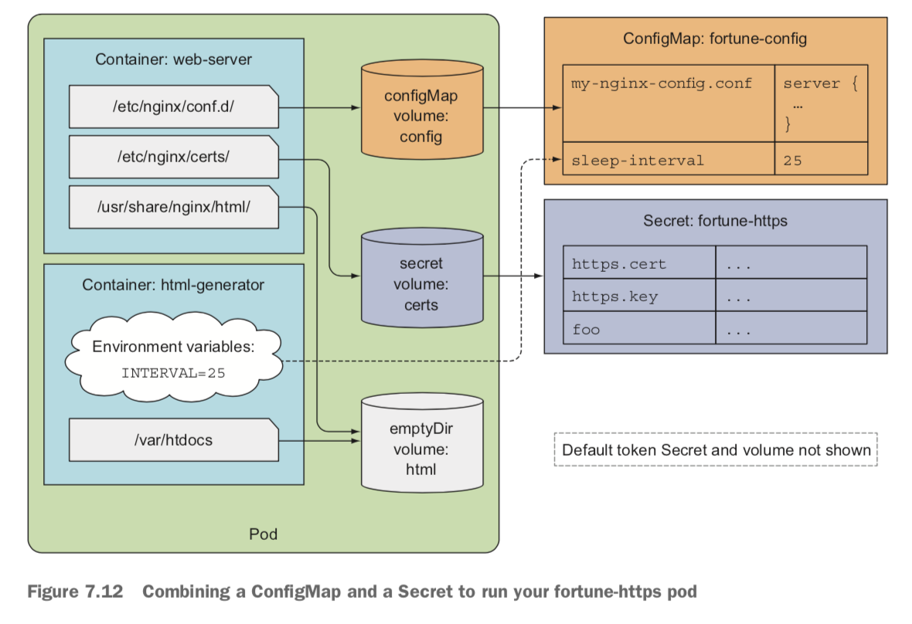

## 목차
- [목차](#목차)
  - [시크릿](#시크릿)
  - [시크릿 생성](#시크릿-생성)
  - [파드에서 시크릿 사용](#파드에서-시크릿-사용)

### 시크릿
컨피그맵은 애플리케이션에 대한 설정 데이터를 저장하는데 사용합니다. 지금부터 설명할 시크릿은 `보안이 유지되어야 하는 민감한 데이터`를 안전하게 유지합니다.

컨피그맵과 동일하게 환경변수, 볼륨의 형태로 파드에 전달할 수 있습니다.

쿠버네티스는 `시크릿에 접근해야 하는 파드가 실행되는 노드`에만 시크릿을 개별로 배포해 안전하게 유지합니다. 그리고 시크릿은 물리적 디스크가 아닌 메모리에만 저장되게(하드는 디스크를 완전히 삭제하는 작업이 필요) 합니다.

시크릿은 etcd에 암호화된 형태(1.7버전 이후)로 안전하게 저장합니다.

### 시크릿 생성

```
# RSA 개인 키 생성
openssl genrsa -out https.key 2048

# 인증서 생성
openssl req -new -x509 -key https.key -out https.cert -days 3650 -subj /CN=www.kubia-example.com

# 시크릿 생성
kubectl create secret generic fortune-https --from-file=https.key --from-file=https.cert --from-file=foo
```

생성된 시크릿과 컨피그맵을 비교해봅시다.

```JSON
{
    "apiVersion": "v1",
    "data": {
        "INTERVAL": "5",
        "ho-key": "ho-value"
    },
    "kind": "ConfigMap",
    "metadata": {
        "creationTimestamp": "2024-06-18T11:46:32Z",
        "name": "kimho-config",
        "namespace": "default",
        "resourceVersion": "5053281",
        "uid": "2233287c-a57b-45a0-97c9-c2fc66561b3d"
    }
}
```

```JSON
{
    "apiVersion": "v1",
    "data": {
        "foo": "YmFyCg==",
        "https.cert": "LS0tLS1CRUdJTiBDRVJUSU.........",
        "https.key": "LS0tLS1CRUdJTiBQUklWQVR........."
    },
    "kind": "Secret",
    "metadata": {
        "creationTimestamp": "2024-06-18T13:40:57Z",
        "name": "fortune-https",
        "namespace": "default",
        "resourceVersion": "5104343",
        "uid": "831c95d1-268c-4040-a780-1dd16f020e49"
    },
    "type": "Opaque"
}
```

두 개를 비교해보면 가장 큰 차이는 값입니다. 컨피그맵은 값이 평문으로 그대로 보이는 반면, 시크릿은 base64로 인코딩 되어 있습니다.

그럼 왜 굳이 base64로 인코딩할까요? base64를 사용할 경우 바이너리값도 담을 수 있기 때문에 시크릿은 base64로 인코딩됩니다.

쿠버네티스는 `민감한 정보와 민감하지 않은 정보가 포함될 경우 시크릿 사용`을 권장하기 때문에 민감하지 않은 정보는 `string Data` 필드로 설정할 수 있습니다. 이 필드는 쓰기 전용으로 값을 설정할 때만 사용할 수 있습니다.

시크릿 조회 시
```
stringData:
 <key>: <value(plain text)>
data:
 <key>: <base encoding>
```
형태로 string Data 필드는 바로 확인할 수 있습니다.

### 파드에서 시크릿 사용
시크릿 볼륨을 통해 시크릿을 컨테이너에 참조하면, 시크릿 항목의 값이 실제 형식으로 디코딩되어 파일에 저장됩니다. 이는 환경변수로 시크릿을 할당할 때도 동일합니다.

컨피그맵과, 시크릿을 활용한 예제입니다. 그림과 매니페스트를 아래에 제공합니다.




```YAML
apiVersion: v1
kind: Pod
metadata:
  name: fortune-https
spec:
  containers:
  - image: luksa/fortune:env
    name: html-generator
    env:
    - name: INTERVAL
      valueFrom: 
        configMapKeyRef:
          name: fortune-config
          key: sleep-interval
    volumeMounts:
    - name: html
      mountPath: /var/htdocs
  - image: nginx:alpine
    name: web-server
    volumeMounts:
    - name: html
      mountPath: /usr/share/nginx/html
      readOnly: true
    - name: config
      mountPath: /etc/nginx/conf.d
      readOnly: true
    - name: certs
      mountPath: /etc/nginx/certs/
      readOnly: true
    ports:
    - containerPort: 80
    - containerPort: 443
  volumes:
  - name: html
    emptyDir: {}
  - name: config
    configMap:
      name: fortune-config
      items:
      - key: my-nginx-config.conf
        path: https.conf
  - name: certs
    secret:
      secretName: fortune-https
```

컨피그맵과 시크릿 볼륨을 하나씩 확인합니다.
- configMap
  - name: fortune-config
  - imtes:
    - key: my-nginx-config.conf
    - path: https.conf

`fortune-config` 컨피그맵에 있는 `my-nginx-config.conf` 키의 값이 `https.conf` 파일로 마운트됩니다.
```YAML
spec:
  containers:
  - image: nginx:alpine
    name: web-server
    volumeMounts:
    - name: config
      mountPath: /etc/nginx/conf.d
      readOnly: true
```
web-server에서 `/etc/nginx/conf.d` 경로에 `config` 컨피그맵을 마운트합니다. 해당 경로에 `https.conf` 파일로 key파일의 값이 들어 있습니다.


- secret
  - name: certs
    - fortune-https
`fortune-https` 시크릿 안에 있는 아래의 값들이 디코딩되어 경로에 마운트됩니다.
```JSON
 "data": {
        "foo": "YmFyCg==",
        "https.cert": "LS0tLS1CRUdJTiBDRVJUSU.........",
        "https.key": "LS0tLS1CRUdJTiBQUklWQVR........."
    }
```

```YAML
spec:
  containers:
    name: web-server
    volumeMounts:
    - name: certs
      mountPath: /etc/nginx/certs/
      readOnly: true
```
`/etc/nginx/certs` 경로에 certs 시크릿을 마운트합니다.

- /etc/nginx/certs/https.key
- /etc/nginx/certs/https.cert
- /etc/nginx/certs/foo

시크릿 값을 가진 파일들이 생성됩니다.
