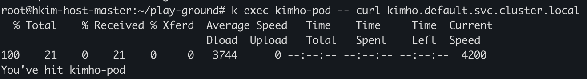
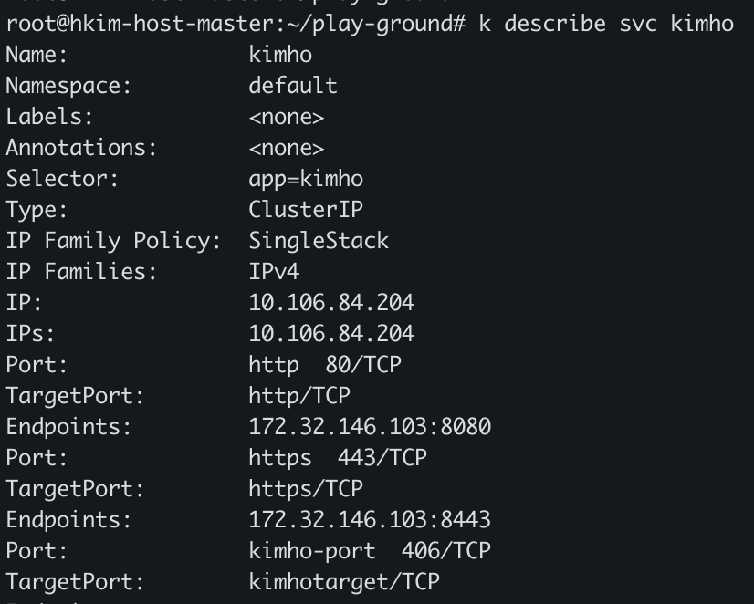

### 서비스
파드는 외부의 요청없이 독립적으로 실행할 수 있지만 대부분의 애플리케이션들은 외부 요청에 응답하기 위한 것이다.
물론 파드도 내부적으로 IP를 가지고 있지만 쿠버네티스의 파드는 굉장히 삭제되고 변경되기 쉽다. 외부에서 특정 파드의 IP를 알고 접속을 한다고 해도 IP가 변경될 수 있어 원하는 파드에 접근한건지 보장할 수 없다. 
그리고 파드가 할당될 때 IP가 부여되므로 미리 파드의 IP를 알 수 없다.
이런 문제를 해결하기 위해 파드 집합에서 실행중인 애플리케이션을 네트워크 서비스로 추상화한 방법이 `서비스`이다.


사용자들이 접근하는 프론트 엔드기능은 3개의 파드(2.1.1.0/24)로 구성되어 있고, 프론트엔드가 접근하는 백엔드 기능은 1개의 파드(2.1.1.4)로 되어 있다.
프론트엔드 서비스, 백엔드 서비스 같이 각각의 파드 집합에 대한 접점을 만든다.
그러면 사용자는 프론트엔드 서비스에 요청 시, 프론트엔드 서비스가 3개의 파드 중 1개로 요청을 하고 백엔드 또한 백엔드 서비스가 백엔드 파드로 요청을 전달한다.
이렇게 되면 사용자는 프론트엔드 서비스의 ip/port만 알면되고 프론트엔드 또한 백엔드 서비스의 ip/port만 알면된다.
그래서 서비스의 ip/port는 파드에 영향을 받아선 안되고 변경되서도 안된다.

### 서비스 생성
서비스를 지원하는 pod를 어떻게 관리할 수 있을까? 이 경우 레이블 셀렉터를 사용하여 어떤 파드가 어떤 서비스에 속하는지 알 수 있다.


그림을 보면 pod는 `app:kubia` 라는 라벨을 가지고 서비스에서 `app=kubia`에 대해 셀렉팅을 한다.
이렇게 레이블 셀렉팅 기능을 이용해 서비스에서 파드를 관리할 수 있다.

service yaml
```
apiVersion: v1
kind: Service
metadata:
  name: kimho
spec:
  ports:
  - name: http
    port: 80
    targetPort: http
  - name: https
    port: 443
    targetPort: https
  - name: kimho-port
    port: 406
    targetPort: kimhotarget
  selector:
    app: kimho
```

pod yaml
```
apiVersion: v1
kind: Pod
metadata:
  name: kimho-pod
  labels:
    app: kimho
spec:
  containers:
  - image: luksa/kubia
    name: kimho-pod
    ports:
    - name: http
      containerPort: 8080
    - name: https
      containerPort: 8443
```

서비스, pod에서 같은 label `app:kimho`를 사용하고 있다.


서비스를 조회하고 서비스의 할당된 ip에 요청 시, 파드로 요청이 가는걸 볼 수 있다.

### 서비스 검색(환경변수)
서비스는 한번 만들면 고정 ip/port가 생기고 서비스가 유지되는 동안 변경되지 않는다.
하지만 파드는 삭제되고 생성되기를 반복한다. 그럼 이 파드들은 어떻게 서비스의 정보를 알 수 있을까?
파드가 시작되면 `kubelet`을 통해 서비스의 정보를 환경변수로 가져와 저장한다.

쉽게 값을 찾을 수 있게 서비스 매니페스트 파일을 만들었다.
```
spec:
  ports:
  - name: http
    port: 80
    targetPort: http
  - name: https
    port: 443
    targetPort: https
  - name: kimho-port
    port: 406
    targetPort: kimhotarget
  selector:
```
파드의 환경 변수에 kimho-port인 406번을 찾으면 된다.

`kubectl exec kimho-pod -- env | ag kimho`
명령을 통해 환경변수 리스트에서 kimho가 붙은 리스트를 조회한다.


`SERVICE_PORT_KIMHO_PORT=406`을 통해 서비스 매니페스트 파일에 정의된 내용이 파드의 환경변수에 있는걸 확인할 수 있다.

### 서비스 검색(DNS)
파드에서 환경변수를 통해 서비스의 정보를 알 수 있지만 도메인을 사용할 수도 있다.
`kube-system` 안에 dns 서비스가 있고, 쿠버네티스의 모든 파드는 이 서비스를 사용하도록 구성된다.


사진을 보면 `kube-system` 네임스페이스 안에 `kube-dns` 서비스가 있고, 실제 실행된 파드에서 `/etc/resolv.conf` 경로에 기본 dns 서버로 구성된걸 확인할 수 있다.

그래서 파드에서 실행중인 프로세스에서 수행된 모든 dns 쿼리는 kube-system에서 실행중인 모든 서비스를 알고 있는 쿠버네티스의 자체 dns 서버로 처리된다.

파드가 내부 dns 서버를 사용할지 설정할 수 있는 옵션이 있는데, 파드를 정의할 때 스펙의 dnsPolicy속성으로 설정할 수 있다.

그래서 각 서비스는 내부 dns서버에서 dns 항목을 가져오고, 자기랑 매핑(셀렉터에 의해)된 서비스의 정보를 아는 파드는 환경변수 대신 `FQDN`으로 액세스할 수 있다.

### 서비스 검색(FQDN)
`FQDN(Fully Qualified Domain Name)`은 정규화된 도메인으로 정확한 호스트의 전체 도메인을 의미한다.
예를 들어 `www.naver.com`의 주소가 있을 때, www.naver.com이 FQDN이고, 이는 www(호스트), naver.com(도메인)이 결합된 형태이다.

쿠버네티스에서 FQDN 다음과 같이 정의된다.
```
# {service-name}.namespace.svc(일반적으로 클러스터내의 서비스를 의미).cluster.local
```
현재 내가 실행중인 파드에서 접속해보면 어떨까?
`kimho.default.svc.cluster.local` 이 주소로 요청을 보낸다.



결국 이렇게 주소를 보내면 kimho 서비스를 통해 실행된 pod에 요청하게 되므로, kimho(service), kimho-pod(pod) 인 상황에선 자기자신에게 요청을 보낸것과 같다.

### 엔드 포인트
서비스는 파드에 직접 연결되지 않고 그 중간에 엔드포인트 리소스가 있다. 실제로 서비스를 조회하면 엔드포인트 리소스 정보를 확인할 수 있다.



그림을 보면 서비스를 상세 조회한 경우 엔드포인트 리소스를 확인할 수 있다.
또한 `kubectl get endpoints {service-name}` 으로도 조회할 수 있다.
파드 셀렉터는 서비스 스펙에 정의되어 있지만 파드와의 연결을 전달할 때 직접 사용하지 않는다. 대신 셀렉터는 ip/port 목록을 작성하는데 사용되며 엔드포인트 리소스에 저장한다.
클라이언트가 서비스로 요청한 경우, `서비스 프록시(kube-proxy)`는 요청된 ip/port를 확인하여 대상 파드로 전달한다.

### 외부 서비스 연결
엔드포인트를 수동으로 구성하여 서비스로 요청이 온 경우 외부와 통신하게 할 수 있다.

```
apiVersion: v1
kind: Endpoints
metadata:
  name: kimho
subsets:
  - addresses:
    - ip: 100.100.100.31
    ports:
    - port: 80
```
이런 매니페스트 파일이 있는 경우, 파드에서 kimho 서비스로 요청을 보낸 경우, 100.100.100.31로 요청을 전달할 수 있다.


### 외부 클라이언트에 서비스 노출
지금까진 내부에서 파드가 서비스를 사용하는 방법을 다뤘다.
이젠 서비스를 클러스터 외부에 노출하여 외부에서 접근할 수 있게 하는 방법을 다룬다.

외부에서 서비스에 액세스할 경우 다음과 같은 방법을 사용할 수 있다.
- 노드포트
  - 노드포트 서비스는 클러스터 노드 자체에서 포트를 열고 해당 포트에 요청된 트래픽을 서비스에 전달한다.
- 로드밸런서
  - 쿠버네티스가 실행중인 인프라에서 프로비저닝된 전용 로드밸런서로 서비스에 접근할 수 있다. 로드밸런서는 트래픽을 모든 노드의 노드포트에 전달한다. 클라이언트는 요청을 로드밸런서에 직접 요청한다.
- 인그레스

### 노드포트
```
apiVersion: v1
kind: Service
metadata:
  name: kimho-nodeport
spec:
  type: NodePort
  ports:
  - port: 80            # 내부 클러스트 IP 포트
    targetPort: 8080    # 서비스 대상 파드의 포트
    nodePort: 30123     # 각 클러스터 노드의 포트(생략 시 임의로 생성)
  selector:
    app: kimho
```
매니페스트을 통해 직접 노드포트를 만들어본다.
이렇게 만들어진 노드포트는
- {내부 클러스트 IP}:80
- {노드 IP}:30123
을 통해 접근할 수 있다.


실제 클러스터 IP, 그리고 노드의 IP로 요청하고 요청이 성공적으로 이루어진걸 알 수 있다.

### 로드밸런서
클라우드 공급자(AWS등)에서 실행되는 쿠버네티스는 공급자에서 제공한 로드밸런서를 통해 프로비저닝된 기능을 제공한다.
로드밸런서는 액세스 가능한 고유 IP주소를 가지며, 요청이 들어온 경우, 로드밸런서에 의해 필요한 서비스로 요청이 전달된다.

```
apiVersion: v1
kind: Service
metadata:
  name: kimho-loadbalancear
spec:
  type: LoadBalancer
  ports:
  - port: 80
    targetPort: 8080
  selector:
    app: kimho
```
- spce
  - ports
    - port : 80
      - targetPort: 8080
이 의미하는건 해당 서비스에 80포트로 요청이 올 경우, 파드의 8080포트로 전달하는 걸 의미한다.

실제 온프레미스 환경에 클러스터가 구축되어서 로드밸런서 서비스가 제대로 동작하지 않을 수 있다. 이런 경우, metalLB같은 로드밸런싱 도구를 사용하여 문제를 해결할 수 있다.

