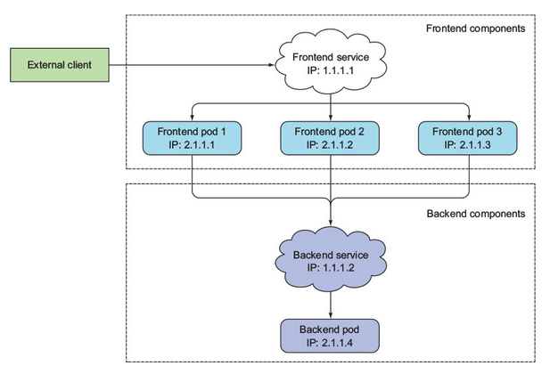
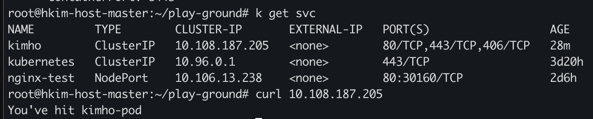
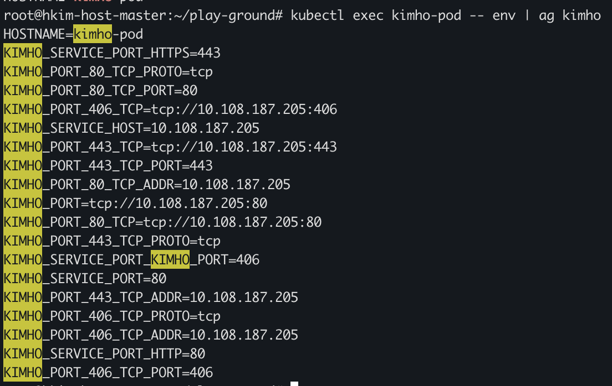
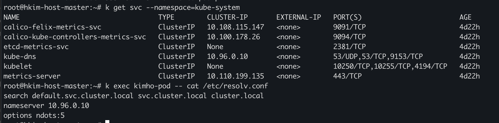
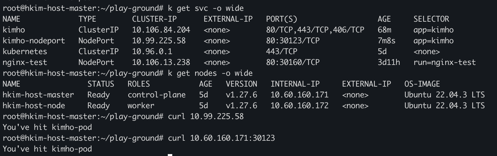
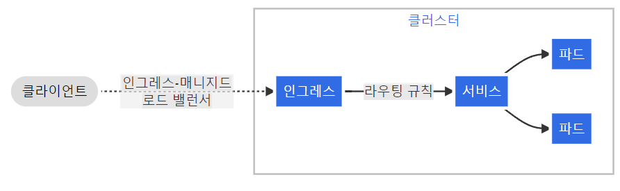
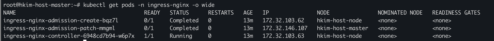
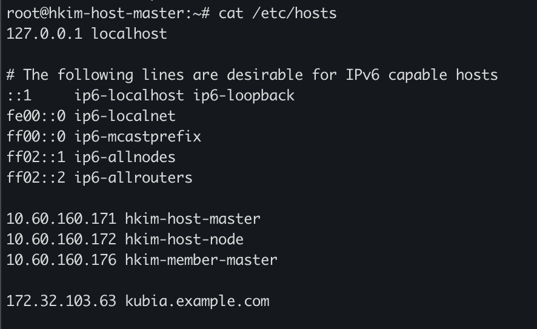
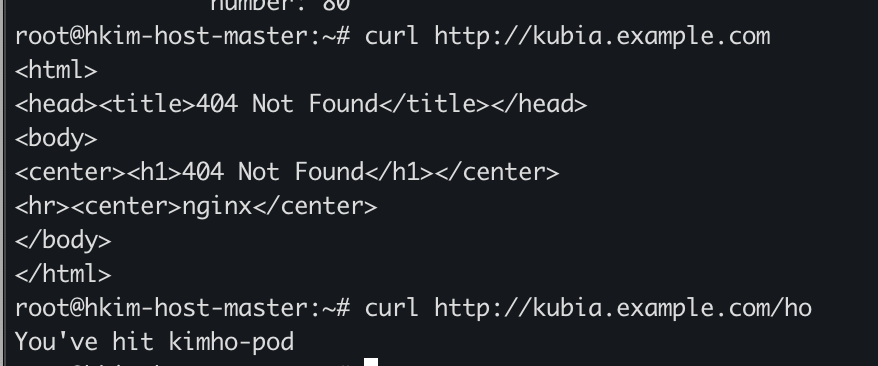
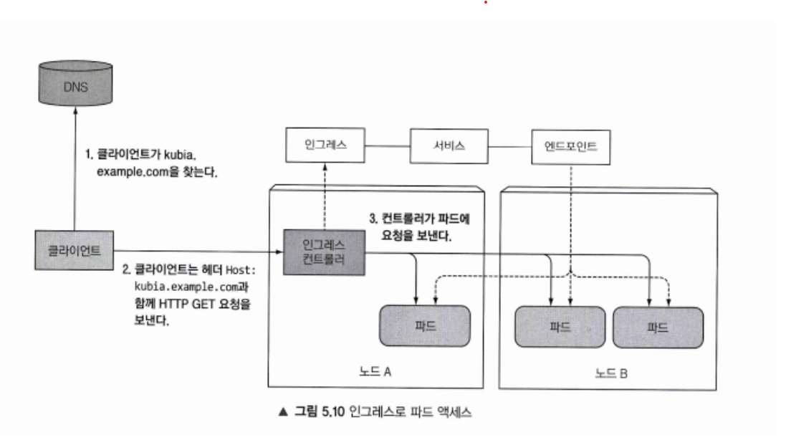

## 서비스
서비스는 파드 집합에서 실행 중인 애플리케이션을 네트워크 서비스로 노출하는 추상화 방법입니다. 서비스는 파드에게 고유한 IP주소와 파드 집합에 대한 DNS 이름을 부여하고 로드 밸런스를 수행할 수 있습니다.

### 서비스 동기
파드도 내부적으로 IP를 가지고 있지만 쿠버네티스의 파드는 굉장히 삭제되고 변경되기 쉽습니다. 외부에서 특정 파드의 IP를 알고 접속을 한다고 해도 IP가 변경될 수 있어 원하는 파드에 접근한건지 보장할 수 없습니다. 그리고 파드가 할당될 때 IP가 부여되므로 미리 파드의 IP를 알 수 없습니다.

서비스라는 리소스를 사용하여 파드 집합에 대한 로드밸런싱을 수행하여 파드는 계속 동적으로 생성하고 제거하여 클러스터의 목표 상태를 보장하도록 합니다.




사용자들이 접근하는 프론트 엔드 기능은 3개의 파드(2.1.1.0/24)로 구성되어 있고, 프론트엔드가 접근하는 백엔드 기능은 1개의 파드(2.1.1.4)로 되어 있습니다.

프론트엔드 서비스와 백엔드 서비스는 각각의 파드 집합에 대한 접점을 제공합니다.

사용자가 프론트엔드 서비스에 요청을 하면, 프론트엔드 서비스가 3개의 파드 중 하나로 요청을 라우팅하고, 프론트엔드 파드는 백엔드 서비스에 요청을 전달합니다.

이렇게 되면 사용자는 프론트엔드 서비스의 IP/PORT만 알면 되고, 프론트엔드 파드는 백엔드 서비스의 IP/포트만 알면 됩니다.
서비스의 IP/PORT는 고정되어 있어야 하며, 파드의 생성과 삭제에 따른 IP 변경은 서비스가 처리해야합니다.

### 서비스 정의
쿠버네티스의 서비스는 파드와 같은 오브젝트입니다. 서비스를 어떻게 정의하는지 알아봅니다.
```YAML
apiVersion: v1
kind: Service
metadata:
  name: my-service
spec:
  selector:
    app.kubernetes.io/name: MyApp
  ports:
    - protocol: TCP
      port: 80
      targetPort: 9376
```
이 서비스 오브젝트는 `app.kubernetes.io/name: MyApp` 레이블을 가진 파드의 TCP 9376 포트를 대상으로 합니다.
```
NAME         TYPE        CLUSTER-IP       EXTERNAL-IP   PORT(S)   AGE
kubernetes   ClusterIP   10.96.0.1        <none>        443/TCP   10d
my-service   ClusterIP   10.108.114.235   <none>        80/TCP    4s
```
실제로 이 서비스를 생성하고 조회한 결과입니다.

서비스 리소스가 클러스터 내부에서 통신할 때 사용되는 가상 IP 주소를 `cluster IP`라고 합니다.

이 서비스 80 포트로 요칭이 온 경우 `app.kubernetes.io/name: MyApp` 레이블을 가진 9376 포트로 파드에게 요청을 전달합니다.  

```YAML
apiVersion: v1
kind: Pod
metadata:
  name: nginx
  labels:
    app.kubernetes.io/name: proxy
spec:
  containers:
  - name: nginx
    image: nginx:stable
    ports:
      - containerPort: 80
        name: http-web-svc

---
apiVersion: v1
kind: Service
metadata:
  name: nginx-service
spec:
  selector:
    app.kubernetes.io/name: proxy
  ports:
  - name: name-of-service-port
    protocol: TCP
    port: 80
    targetPort: http-web-svc
```
파드에 `http-web-svc` 포트는 80번으러 정의되어 있습니다. 서비스의 targetPort 속성에선 이 이름을 참조할 수 있습니다. 그래서 서비스의 targetPort의 경우 80번 포트로 바인딩됩니다.

이렇게 함으로써 파드에서 포트가 바뀌어도 서비스는 추가적인 변경이 필요 없으며 이름을 구성함으로써 많은 유연성을 제공할 수 있습니다. 

### 셀렉터 없는 서비스
방금의 서비스들은 셀렉터를 사용하여 특정 레이블을 가진 파드에 트래픽을 전달했습니다. 특정 상황에선 셀렉터 없이 서비스를 정의 하고, 수동으로 `엔드포인트슬라이스` 오브젝트를 사용하여 외부 리소스나 특정 IP주소로 트래픽을 전달할 수 있습니다.
```YAML
apiVersion: v1
kind: Service
metadata:
  name: my-service
spec:
  ports:
    - protocol: TCP
      port: 80
      targetPort: 9376
```
셀렉터 없이 서비스를 정의하는 방법입니다. 이 서비스는 셀렉터가 없으므로 파드에 자동으로 연결되지 않고, 매칭되는 엔드포인트슬라이스 오브젝트가 자동으로 생성되지 않습니다.

수동으로 추가하여, 서비스를 실행중인 네트워크 주소 및 포트에 서비스를 수동으로 매핑해야 합니다.

```YAML
apiVersion: discovery.k8s.io/v1
kind: EndpointSlice
metadata:
  name: my-service-custom-endpoint
  labels:
    kubernetes.io/service-name: my-service
addressType: IPv4
ports:
  - name: ''
    appProtocol: http
    protocol: TCP
    port: 9376
endpoints:
  - addresses:
      - "10.4.5.6"
      - "10.1.2.3"
```
각 항목에 대해 설명합니다.
- metadta
  - name: 엔드포인트슬라이스 이름입니다 관용적으로 <서비스이름>을 접두어로 사용합니다.
  - labels: 레이블을 설정하여 서비스와 연결합니다. 사용할 서비스의 이름을 입력해야합니다.
- ports
  - name: 포트 이름은 알려진 포트(IANA에 의해 표준화되지 않은 포트)가 아닌 경우 굳이 이름을 지정하지 않아도 됩니다.
  - appProtocol: 프로토콜을 지정합니다. ex) http, https, tcp, grpc)
- endpoints
  - addresses: 트래픽을 전달할 IP 주소 목록입니다.


### 엔드포인트슬라이스
엔드포인트슬라이스는 특정 서비스의 네트워크 엔드포인트(IP/PORT 등등) 부분집합(슬라이스)을 나타내는 쿠버네티스 오브젝트입니다.

쿠버네티스는 엔드포인트슬라이스가 얼마나 많은 엔드포인트를 사용하는지 감시합니다. 기본적으로 하나의 엔드포인트슬라이스에는 최대 100개의 엔드포인트가 포함될 수 있고 이를 초과하면 새로운 엔드포인트슬라이스를 만들어 저장합니다.


### 엔드 포인트
쿠버네티스에서 엔드포인트는 서비스와 연결된 네트워크 엔드포인트(IP/PORT 등등) 목록을 정의하는 리소스입니다. 엔드포인트는 주로 서비스가 트래픽을 어떤 파드로 보낼지 결정할 떄 사용됩니다. 서비스가 트래픽을 라우팅할 때 사용할 IP/PORT를 포함하여 가지고 있습니다.

```YAML
apiVersion: v1
kind: Endpoints
metadata:
  name: my-service
subsets:
  - addresses:
      - ip: 192.168.1.1
      - ip: 192.168.1.2
    ports:
      - port: 80
        protocol: TCP
```
간단한 엔드포인트를 생성하는 매니페스트 파일입니다.

생성 후 엔드포인트를 조회한 결과입니다.
```YAML
Name:         ep-service
Namespace:    default
Labels:       <none>
Annotations:  <none>
Subsets:
  Addresses:          192.168.1.1,192.168.1.2
  NotReadyAddresses:  <none>
  Ports:
    Name     Port  Protocol
    ----     ----  --------
    <unset>  80    TCP
```
이 엔드포인트는 ep-service라는 서비스가 생성되면 자동으로 연결됩니다. 그리고 해당 서비스로 요청이 온 경우, 192.168.1~2:80 으로 요청을 전달합니다.

쿠버네티스에서 하나의 엔드포인트 오브젝트에는 최대 1000개의 엔드포인트가 포함될 수 있습니다.
만약 많은 엔드포인트가 필요한 경우 `엔드포인트슬라이스`를 사용을 권장하며, 그럼에도 불구하고 엔드포인트 오브젝트를 사용할 경우 최대 1000개 엔드포인트까지만 저장하고 이후는 저장하지 않습니다. 이후 어노테이션에 `endpoints.kubernetes.io/over-capacity: truncated` 값을 설정하여 용량을 초과했음을 알립니다.


### 서비스 검색(환경변수)

### 서비스 생성
파드와 서비스를 생성하여, 서비스에 요청이 온 경우, `kimho` 레이블을 파드로 요청을 전달해보겠습니다.


```YAML
# 서비스
apiVersion: v1
kind: Service
metadata:
  name: kimho
spec:
  ports:
  - name: http
    port: 80
    targetPort: http
  - name: https
    port: 443
    targetPort: https
  - name: kimho-port
    port: 406
    targetPort: kimhotarget
  selector:
    app: kimho

--
# 파드
apiVersion: v1
kind: Pod
metadata:
  name: kimho-pod
  labels:
    app: kimho
spec:
  containers:
  - image: luksa/kubia
    name: kimho-pod
    ports:
    - name: http
      containerPort: 8080
    - name: https
      containerPort: 8443
```

서비스, 파드에서 같은 label `app:kimho`이 정의되어 있습니다.

서비스를 조회하면, 서비스가 어떤 포트를 수신할 수 있는지 확인할 수 있습니다.

### 서비스 검색(환경변수)
파드는 서비스에 접근할 수 있어야 하며, 서비스에 대한 정보를 찾기 위해 환경변수를 사용하여 찾을 수 있습니다.

파드가 노드에서 실행되면 `kubelet`을 통해 활성화된 서비스의 정보를 환경변수로 가져와 저장합니다.

이때 각 환경변수는 <서비스이름>.환경변수명으로 정의가 됩니다. 이 경우 서비스에 정의된 정보를 환경변수에 추가하는 것이므로 `서비스가 먼저 정의`되어야 합니다.

```YAML
spec:
  ports:
  - name: http
    port: 80
    targetPort: http
  - name: https
    port: 443
    targetPort: https
  - name: kimho-port
    port: 406
    targetPort: kimhotarget
  selector:
```
각각의 포트는 http, https, kimho-port 이름을 가지고 있습니다. 이 각각의 포트에 대한 정보를 파드의 환경변수에서 조회할 수 있습니다.

`kubectl exec kimho-pod -- env | ag kimho`
명령을 통해 환경변수 리스트에서 kimho가 붙은 리스트를 조회합니다.


`SERVICE_PORT_KIMHO_PORT=406`을 통해 서비스 매니페스트 파일에 정의된 내용이 파드의 환경변수에 있는걸 확인할 수 있습니다.

### 서비스 검색(DNS)
쿠버네티스에서 DNS 서비스는 파드와 서비스 간 통신을 용이하게 하는 역할을 합니다.

DNS 서비스는 각 서비스와 파드에 대한 NDS 레코드를 생성하고 관리합니다.

모든 파는 기본적으로 `kube-dns` 서비스를 사용하도록 구성됩니다. 그리고 이 설정은 파드의 `/etc/resolv.conf` 파일에서 기본 DNS 서버가 kube-dns로 설정되어 있기 때문입니다. 파드에서 실행되는 모든 DNS 쿼리는 kube-dns로 전달됩니다. 이는 파드를 정의할 때 `dnsPolicy` 속성을 사용하여 kube-dns를 사용할지 말지를 설정할 수 있습니다.

파드가 DNS를 사용하여 서비스 정보를 얻는 방법은 다음과 같습니다.

네임스페이스 `ho-ns`에 `ho-service`라는 서비스가 있는 경우, 마스터노드와 DNS서비스가 함께 작동하여 `ho-service-ho-ns`에 대한 DNS 레코드를 생성합니다. `ho-ns` 네임스페이스의 파드들은 `ho-service`에 대한 DNS 조회를 수행하여 서비스를 찾을 수 있어야 합니다.

실제 예시를 통해 알아봅니다.
```YAML
# 네임스페이스
apiVersion: v1
kind: Namespace
metadata:
  name: ho-ns

--
# 서비스
apiVersion: v1
kind: Service
metadata:
  name: ho-service
  namespace: ho-ns
spec:
  selector:
    app: ho-app
  ports:
    - protocol: TCP
      port: 80
      targetPort: 8080

--
파드
apiVersion: v1
kind: Pod
metadata:
  name: ho-pod
  namespace: ho-ns
  labels:
    app: ho-app
spec:
  containers:
    - name: ho-container
      image: nginx
      ports:
        - containerPort: 8080
```
```
# /etc/resolve.conf
nameserver 10.96.0.10
search ho-ns.svc.cluster.local svc.cluster.local cluster.local
options ndots:5

# nslookup ho-service.ho-ns
Server:         10.96.0.10
Address:        10.96.0.10#53

Name:   ho-service.ho-ns.svc.cluster.local
Address: 10.101.207.211

# 서비스 조회
NAME         TYPE        CLUSTER-IP       EXTERNAL-IP   PORT(S)   AGE
ho-service   ClusterIP   10.101.207.211   <none>        80/TCP    11m
```
도메인을 요청하게되면 어떻게 동작되는지 하나씩 살펴봅니다.

먼저 resolve.conf 파일의 내용은 DNS 쿼리는 주소는 10.96.0.10에 요청한다는 의미입니다.

그리고 options ndots:5는 점이 5개를 초과하지 않으면 아래의 주소를 뒤에 붙이며 실패 시, 다음 주소를 사용합니다.
- ho-ns.svc.cluster.local
- svc.cluster.local
- cluster.local

`nslookup ho-service.ho-ns` 요청이 발생하면 아래의 도메인을 사용하여 DNS 쿼리를 실행합니다.
- <ho-service.ho-ns>.<ho-ns.svc.cluster.local>
- <ho-service.ho-ns>.<svc.cluster.local>
- <ho-service.ho-ns>.<cluster.local>
- ho-service.ho-ns

실제로 찾은 도메인은 `ho-service.ho-ns.svc.cluster.local` 이며 이 도메인은 다음과 같은 구조입니다.
- ho-service: 서비스 이름
- ho-ns: 네임스페이스
- svc: 서비스 리소스
- clouster.local: 기본 클러스터 도메인, 이는 클러스터 내의 모든 서비스와 파드의 기본 도메인 접미사

그래서 성공적으로 서비스의 IP를 조회하여 성공적으로 서비스에 접근한걸 확인할 수 있습니다.


파드에서 환경변수를 통해 서비스의 정보를 알 수 있지만 도메인을 사용할 수도 있다.
`kube-system` 안에 dns 서비스가 있고, 쿠버네티스의 모든 파드는 이 서비스를 사용하도록 구성된다.


사진을 보면 `kube-system` 네임스페이스 안에 `kube-dns` 서비스가 있고, 실제 실행된 파드에서 `/etc/resolv.conf` 경로에 기본 dns 서버로 구성된걸 확인할 수 있다.

그래서 파드에서 실행중인 프로세스에서 수행된 모든 dns 쿼리는 kube-system에서 실행중인 모든 서비스를 알고 있는 쿠버네티스의 자체 dns 서버로 처리된다.

파드가 내부 dns 서버를 사용할지 설정할 수 있는 옵션이 있는데, 파드를 정의할 때 스펙의 dnsPolicy속성으로 설정할 수 있다.

그래서 각 서비스는 내부 dns서버에서 dns 항목을 가져오고, 자기랑 매핑(셀렉터에 의해)된 서비스의 정보를 아는 파드는 환경변수 대신 `FQDN`으로 액세스할 수 있다.


### 서비스 검색(FQDN)
`FQDN(Fully Qualified Domain Name)`은 정규화된 도메인으로 정확한 호스트의 전체 도메인을 의미합니다.
예를 들어 `www.naver.com`의 주소가 있을 때, www.naver.com이 FQDN이고, 이는 www(호스트), naver.com(도메인)이 결합된 형태입니다.

쿠버네티스에서 FQDN 다음과 같이 정의된다.
```
<service-name>.<namespace>.svc(서비스 리소스).cluster.local
```
위의 [서비스 검색(환경변수)](#서비스-검색dns)에서 사용한 예시를 볼 수 있습니다.

### 헤드리스 서비스
헤드리스 서비스는 로드 밸런싱과 클러스터 IP없이 `파드들 간의 직접적인 통신`을 가능하게 하는 서비스입니다.

일반적인 서비스와는 다르게 헤드리스 서비스는 클러스터 IP를 할당받지 않습니다. 그래서 `spec.clusterIP` 필드를 None으로 설정합니다. 그리고 DNS를 통해 파드의 IP주소를 직접 노출합니다.

```YAML
# 서비스
apiVersion: v1
kind: Service
metadata:
  name: headless-service
spec:
  clusterIP: None
  selector:
    app: example-app
  ports:
    - port: 80
      targetPort: 8080
--
# 파드
apiVersion: v1
kind: Pod
metadata:
  name: example-pod
  labels:
    app: example-app
spec:
  containers:
    - name: example-container
      image: nginx
      ports:
        - containerPort: 8080
```
```
# nslookup headless-service.default
Server:         10.96.0.10
Address:        10.96.0.10#53

Name:   headless-service.default.svc.cluster.local
Address: 10.244.1.91
Name:   headless-service.default.svc.cluster.local
Address: 10.244.1.90
```
내부 파드에 접속하여 `<서비스이름>.<네임스페이스>`로 조회한 결과 다른 파드들의 IP를 확인 할 수 있었습니다.

셀렉터를 사용하는 경우 쿠버네티스 API 서버에서 직접 엔드포인트슬라이스 오브젝트를 생성하여 DNS를 구성해줍니다.

하지만 셀렉터가 없는 경우 직접 수동으로 설정해야합니다.

```YAML
# 서비스
apiVersion: v1
kind: Service
metadata:
  name: headless-service-no-selector
spec:
  clusterIP: None
  ports:
    - port: 80
      targetPort: 8080
--
# 파드
apiVersion: v1
kind: Endpoints
metadata:
  name: headless-service-no-selector
subsets:
  - addresses:
      - ip: 192.168.1.4
      - ip: 192.168.1.5
    ports:
      - port: 8080
```
```
#nslookup headless-service-no-selector.default
Server:         10.96.0.10
Address:        10.96.0.10#53

Name:   headless-service-no-selector.default.svc.cluster.local
Address: 192.168.1.4
Name:   headless-service-no-selector.default.svc.cluster.local
Address: 192.168.1.5
```
dns를 해보면 파드들에 대한 정보를 얻어올 수 있습니다.

헤드리스 서비스는 다음과 같은 상황에서 유용합니다.
- 클러스터 내부 통신
  - 클러스터 내부의 파드 간 통신을 위해 사용됩니다. 분산 시스템에서 각 노드가 서로를 인식해야 하는 경우 유용합니다.
  - ex) 카산드라 클러스터, 엘라스틱서치 클러스터
- 내부 시스템
  - 내부의 서비스 A가 서비스B와 직접 통신해야 하는 경우, 서비스 B의 파드 IP주소를 직접 사용하여 통신할 수 있습니다.

### 외부 클라이언트에 서비스 노출
애플리케이션을 클러스터 밖(외부)에 노출하고 싶은 경우가 있습니다. 쿠버네티스 ServiceType은 원하는 서비스 종류를 지정할 수 있습니다.

ServiceType은 다음과 같습니다.

- ClusterIP
  - 서비스를 클러스터 내부 IP에 노출 이 값은 클러스터 내에서만 접속할 수 있습니다. 기본 디폴트값 입니다.
- NodePort
  - 고정포트로 각 노드의 IP에 서비스를 노출시킵니다. 클러스터내의 모든 노드에 같은 포트로 할당됩니다.
  - 파드가 없는 노드에도 포트가 할당됩니다.
- LoadBalncer
  - 클라우드 공급자의 로드밸런서를 사용하여 서비스를 외부에 노출시킵니다.
- ExternalName
  - 외부 도메인 이름을 내부 서비스 이름으로 매핑합니다.

### 노드포트
노드포트는 클러스터 외부에 서비스를 노출시키는 방법 중 하나입니다. 

```
apiVersion: v1
kind: Service
metadata:
  name: kimho-nodeport
spec:
  type: NodePort
  ports:
  - port: 80            # 내부 클러스트 IP 포트
    targetPort: 8080    # 서비스 대상 파드의 포트
    nodePort: 30123     # 각 클러스터 노드의 포트(생략 시 임의로 생성(30000-32767))
  selector:
    app: kimho
```

매니페스트을 통해 직접 노드포트를 만들어봅니다. 이렇게 만들어진 노드포트는
- {내부 클러스트 IP}:80
- {노드 IP}:30123

을 통해 접근할 수 있습니다.


실제 클러스터 IP, 그리고 노드의 IP로 요청하고 요청이 성공적으로 이루어진걸 알 수 있습니다.

### 외부 연결을 사용하면서 발상핼 수 있는 문제(불필요흔 네트워크 홉)
쿠버네티스 클러스터에서 `Nodeport` 서비스 타입을 사용하는 경우 불필요한 네트워크 홉이 발생할 수 있습니다.

Nodeport를 사용하는 경우 외부의 요청은 클러스터의 모든 노드에 열려있는 특정 포트를 통해 들어올 수 있습니다.
이 요청은 각각의 `kube-proxy`에서 `iptables`를 사용하여 적절하게 라우팅됩니다.

kube-proxy에 의해 요청이 파드로 전달 됐을 때, 해당 파드가 실행중이지 않을 수 있습니다. 이 때 `kube-proxy는 클러스터 네트워크를 통해 다른 노드에 있는 적절한 파드로 전달`합니다. 이 과정을 네트워크 단계가 추가되는 `불필요한 네트워크 홉`이라고 합니다.

이 문제를 해결하기 위해 서비스 스펙의 `externalTrafficPolicy` 필드를 `Local`로 설정해야합니다. local로 설정한 경우, 서비스에 대응하는 파드가 있는 노드로만 전달됩니다.

하지만 이 옵션을 사용하는 경우, `서비스에 대응하는 파드가 있는 노드를 선택` 하므로 한 노드의 파드가 여러 개 실행중인 경우, `로드 밸런싱의 불균형`이 올 수 있다.
예를 들어 다음과 같은 클러스터가 있다.
- A 노드
  - Pod-A1
- B 노드
  - Pod-B1
  - Pod-B2
이렇게 되어 있는 경우, 요청이 들어왔을 때, A, B노드는 균등하게 분배되어 균등해 보이지만 실질적으로 파드 입장에서 보면 A1(50%), B1(25%), B2(25%)형태로 분배된다.

### 외부 연결을 사용하면서 발상핼 수 있는 문제(클라이언트 IP 보존)
먼저 SNAT(Source Network Address Translation)은 네트워크 트래픽의 소스 IP주소를 다른 IP주소로 변환하는 기술이다.
외부의 요청이 온 경우, 노드의 kube-proxy가 서비스의 파드로 요청을 전달한다. 이 때 요청의 소스 IP가 SNAT에 의해 노드의 IP주소로 변경한다.
그래서 쿠버네티스에선 외부에서 들어오는 트래픽을 처리할 때, SNAT를 통해 소스 IP 주소를 변경하여 클러스터 내부 네트워크와의 충돌을 방지한다.

하지만 요청의 소스 IP(클라이언트 실제 IP)를 알아야 하는 경우(웹서버의 IP로깅, 사용자 위치 기반 서비스 등) 문제가 발생할 수 있다. 이 문제를 해결하기 위해 `externalTrafficPolicy : Local` 옵션으로 설정하여 SNAT가 수행되지 않게 하면 해결할 수 있다.

하지만 local로 설정한 경우 위에서 언급한 `클러스터 내부 네트워크와의 충돌` 문제가 발생할 수 있다. 그래서 클러스터 내부 네트워크를 외부 클러스터 범위와 겹치지 않게 구성을 해야합니다.


### 로드밸런서
로드밸런서는 노드포트의 성격을 가지고 있으며 외부에서 오는 요청을 각각에 노드에 트래픽을 분산시켜주는 역할을 합니다.

클라우드 공급자(AWS등)에서 실행되는 쿠버네티스는 공급자에서 제공한 로드밸런서 기능을 제공합니다.

로드밸런서는 외부에 노출되는 IP주소를 가지며, 요청이 들어온 경우 로드밸런서에 트래픽을 분산시킵니다.

```
apiVersion: v1
kind: Service
metadata:
  name: kimho-loadbalancear
spec:
  type: LoadBalancer
  ports:
  - port: 80
    targetPort: 8080
  selector:
    app: kimho
```
- spce
  - ports
    - port : 80
      - targetPort: 8080
이 매니페스트가 의미하는건 해당 서비스에 80포트로 요청이 올 경우, 파드의 8080포트로 전달합니다.

실제 온프레미스 환경에 클러스터가 구축되어서 로드밸런서 서비스가 제대로 동작하지 않을 수 있습니다. 이런 경우, metalLB, ingress 같은 로드밸런싱 도구를 사용하여 문제를 해결할 수 있습니다.


### 인그레스
인그레스는 클러스터 외부에서 클러스터 내부의 서비스에 접근을 관리하는 오브젝트입니다. 트래픽 라우팅 규칙을 정의하여 외부에서 들어오는 트래픽을 서비스에 적절히 라우팅합니다.



인그레스의 주요 기능은 다음과 같습니다.
- 외부 접속 URL 제공
- 로드 밸런싱
- SSL / TLS 종료
- 이름 기산 가상 호스팅

인그레스로 위와 같은 기능을 사용하려면 `인그레스 컨트롤러`, `ingress-nginx`와 같은 도구들이 필요합니다.


### 인그레스 컨트롤러
인그레스 리소스를 동작하려면 인그레스 컨트롤러를 설치해야 한다.

```
# 인그레스 컨트롤러 설치
kubectl apply -f https://raw.githubusercontent.com/kubernetes/ingress-nginx/main/deploy/static/provider/cloud/deploy.yaml

# 설치 확인
kubectl get pods -n ingress-nginx -o wide
```



인그레스 설치를 확인한다.

```
apiVersion: networking.k8s.io/v1
kind: Ingress
metadata:
  name: kubia
spec:
  ingressClassName: nginx
  rules:
  - host: kubia.example.com
    http:
      paths:
      - path: /ho
        pathType: Prefix
        backend:
          service:
            name: kimho
            port:
              number: 80
```
그리고 이 매니페스트 파일을 통해 인그레스 리소스를 생성한다.
`kubia.example.com` 의 도메인을 가지고 도메인/ho로 요청한 경우 미리 정의된 `kimho` 서비스로 80포트로 요청한다는 내용이다.



로컬에서 도메인을 테스트할 수 있게 `/etc/hosts`에 `컨트롤러 ip 도메인`값을 추가 했다.



요청을 보면 도메인에 접근한 경우 404 에러, /ho 경로로 접근한 경우 요청이 잘 된걸 확인할 수 있다.

### 인그레스 동작 방식
실제로 도메인이 입력되었을 때, 인그레스가 어떻게 동작하는지 살펴본다.



1. DNS 조회
클라이언트가 도메인을 찾기 위해 DNS를 조회합니다. 이 과정에서 도메인은 서버의 IP주소로 변환됩니다.

2. HTTP 요청
클라이언트는 DNS 조회로 얻은 서버의 IP에 HTTP 요청을 보냅니다. 이 과정에서 HTTP Header에 도메인 주소를 포함합니다.

3. 인그레스 컨트롤러
인그레스 컨트롤러가 클라이언트의 요청을 수신합니다. 헤더에 있는 도메인 주소를 기반으로 어떤 서비스로 라우팅되어야 되는지 확인하고 요청을 전달합니다.

4. 요청 전달
인그레스 컨트롤러가 요청을 서비스 리소스에 직접 전달하는게 아닌 서비스와 관련된 엔드포인트를 확인하여 실제 요청이 파드까지 전달됩니다.

그럼 인그레스 컨트롤러는 어디에 위치할까??
인그레스 컨트롤러는 워커 노드에서 피드형태로 실행된다고 한다. 하지만 별도로 구성된 워커 노드 안에서 실행하는지, 아니면 임의의 노드에서 실행하는지는 명확하게 나와있지 않았다. 
