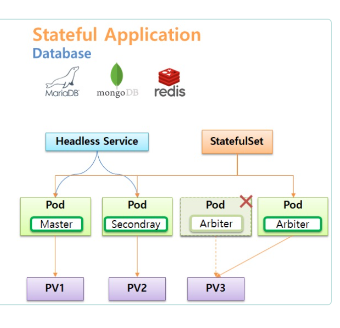
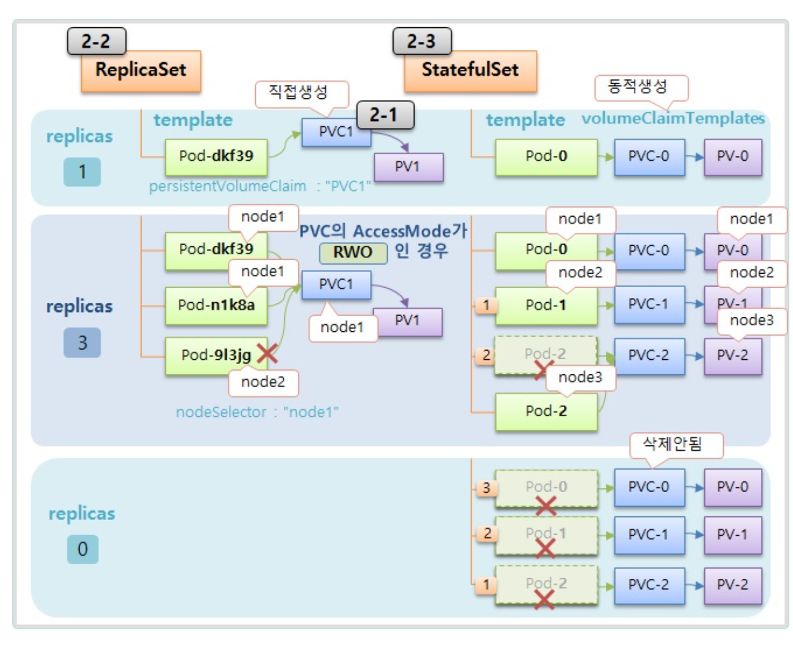

### 스테이트풀셋
스테이트풀셋은 쿠버네티스에서 상태를 가지는 애플리케이션을 관리하기 위한 워크로 API 오브젝트입니다.

스테이트풀셋은 다음과 같은 기능을 가지고 있습니다.
- 고유한 네트워크 식별자
  - 스테이트풀셋에 속한 각 파드는 고유한 식별자를 가집니다.
  - 파드의 이름이 <pod-name>-0, <pod-name>-1과 같이 순차적으로 부여됩니다.
- 지속적인 스토리지
  - 각 파드는 고유한 퍼시스턴트 볼륨(PV)를 사용하여 데이터를 저장합니다. 이는 파드가 재시작 되더라도 데이터가 유지됩니다.
- 순차적 배포와 스케일링
  - 스테이트풀셋은 파드들을 순서대로 생성하고 배포하며, 확장할 때도 순차적으로 진행합니다.

이런 기능을 가지는 스테이트풀셋은 다음과 같은 상황에서 유용합니다.
1. 고유한 네트워크 식별자가 필요한 경우(카산드라 클러스터 구축)
- 카산드라와 같은 분산 데이터베이스 클러스터는 각 노드가 고유한 네트워크 식별자를 필요로 합니다.
- 스테이트풀셋을 사용하면 각 파드는 cassandra-0, cassandra-1... 등으로 명명되며 이를 통해 클러스터 내에서 각 노드는 서로를 식별하고 통신할 수 있습니다.
- 고유한 네트워크 식별자를 제공하기 위해 헤드리스 서비스를 사용합니다.

1. 지속적으로 스토리지가 필요한 경우(Mysql)
- MySQL 같이 관계형 데이터베이스는 데이터를 지속적으로 저장할 필요가 있습니다.
- 스테이트풀셋을 사용하면 각 mysql 파드는 고유한 PV(Retain)를 가지며, 파드가 재시작되거나 다른 노드로 이동하더라도 데이터는 보존됩니다.
- 각각의 파드는 mysql-0, mysql-pv-0, mysql-1, mysql-pv-1과 같이 각각의 PV를 사용합니다.

