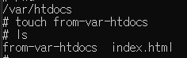
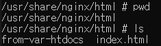
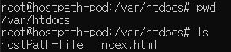
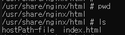
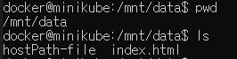
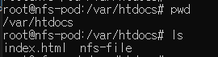
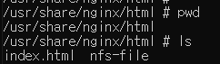
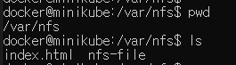
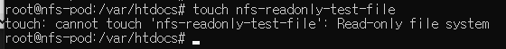
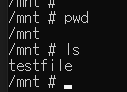

### 볼륨의 필요성 
새로 시작된 컨테이너는 이전의 실행되었던 컨테이너의 어떤 정보도 볼 수 없습니다.
하지만 상황에 따라 이전에 종료된 위치에서 이어서 시작하기 원할 수 있고, 컨테이너에서 발생한 데이터를 보존하고 싶을 수 있습니다.
이런 요구 사항을 위해 쿠버네티스는 `스토리지 볼륨` 기능을 제공합니다. 파드의 일부분으로 정의되고 파드와 동일한 라이프사이클을 가집니다. 그래서 파드가 시작되면 생성되고, 파드가 삭제되면 볼륨도 삭제됩니다.

파드가 삭제되면 볼륨도 삭제되는 문제를 해결하기 위해 쿠버네티스는 `퍼시스턴트 볼륨`을 통해 클러스터에 계속 존재하여 데이터를 지속적으로 사용할 수 있게 합니다. 이를 통해 파드가 삭제되더라도 데이터는 보존되고, 새로 생성된 파드가 동일한 데이터를 사용할 수 있습니다.

### 볼륨
쿠버네티스의 볼륨은 파드 구성 요소중 하나로 컨테이너와 동일하게 파드 스펙에서 정의됩니다.
독립적으로 생성/삭제 할 수 없고, 파드 내의 모든 컨테이너가 마운트하여 볼륨을 사용할 수 있습니다.

### 볼륨 사용 예시
세 개의 컨테이너가 있습니다. 각 컨테이너는 다음과 같은 기능들을 가지고 있습니다.
- 첫 번째 컨테이너(웹 서비스 컨테이너)
  - /var/htdocs 디렉토리에 HTML 페이지를 서비스
  - /var/logs 디렉토리에 액세스 로그를 저장
- 두 번째 컨테이너(HTML 에이전트 컨테이너)
  - /var/html 디렉토리에 HTML 파일을 생성하는 에이전트를 실행
- 세 번째 컨테이너(로깅 컨테이너)
  - /var/logs 디렉토리에서 로그 데이터를 처리(로그 순환, 압축 등)

이 상황에서 각 컨테이너는 단일 책임갖고 각자만의 기능을 가지고 있지만, 서로의 자원이 공유되지 않는 상황에서는 아무런 동작을 하지 않습니다.
볼륨 2개를 각각의 컨테이너에서 마운트하여 사용하면 문제를 해결할 수 있습니다.

- 첫 번째 볼륨(HTML)
  - 첫 번째 컨테이너에서 /var/htdocs에 마운트
  - 두 번째 컨테이너에서 /var/html에 마운트
- 두 번째 볼륨(Log)
  - 첫 번째 컨테이너에서 /var/logs에 마운트
  - 두 번쨰 컨테이너에서 /var/logs에 마운트
  
이와 같이 볼륨을 정의해서 에이전트 컨테이너에서 생성한 HTML 파일을 웹 서비스 컨테이너에서 처리할 수 있고, 이로 인해 발생한 로그들을 로깅 컨테이너에 의해 로그 데이터를 처리할 수 있습니다.


위 내용을 토대로 구성한 그림입니다.

### 볼륨 유형
볼륨은 파드가 존재하는 동안 유지되지만, 특정 볼륨 유형에 따라 파드가 사라진 후에도 볼륨이 유지되어 새로윤 볼륨으로 마운트될 수 있습니다.

- emptyDir
  - `일시적인 데이터를 저장하는데 사용되는 빈 디렉토리`
  - 임시 데이터 저장소로 사용되며, 파드 내의 컨테이너 간 데이터를 공유하는데 유용합니다.
- hostPath
  - `노드의 파일시스템을 파드의 디렉토리로 마운트`하여 사용
  - 많은 보안 위험이 있으며, 가능하면 사용하지 않는 것이 좋습니다.
  - 사용해야 하는 경우 필요한 파일, 디렉토리만 범위로 지정하여 ReadOnly로 마운트해야 합니다.
- NFS(Network File System)
  - `네트워크를 통해 파일 시스템을 공유`하는 방식입니다.
  - 여러 파드 간 데이터를 공유할 때 사용됩니다.
- Persistent Volume(PV) 및 Persistent Volume Claim(PVC)
  - PV는 `클러스터 관리자가 프로비저닝한 스토리지 리소스(미리 할당하고 사용가능 하도록 설정된 스토리지)`입니다.
  - PVC는 `사용자가 필요한 스토리지 크기와 접근 모드를 명시하여 스토리지에 요청`하는 것입니다. PV와 바인딩되어 파드에서 사용할 수 있게 됩니다.

### emptyDir
가장 간단한 볼륨 유형으로, 파드가 노드에 할당될 때 처음 생성됩니다. 파드가 실행 중일 때만 존재하며 처음 비어있는 상태로 생성됩니다.
파드내의 모든 컨테이너는 마운트하여 사용하여 사용할 수 있지만, 파드가 제거되면 해당 볼륨은 영구히 삭제됩니다.
동일 파드에서 컨테이너 간 파일을 공유할 떄 사용됩니다.

```
apiVersion: v1
kind: Pod
metadata:
  name: fortune
spec:
  containers:
  - image: luksa/fortune
    name: html-generator
    volumeMounts:
    - name: html
      mountPath: /var/htdocs        # 컨테이너의 /var/htdocs에 html이름의 볼륨을 마운트
  - image: nginx:alpine
    name: web-server
    volumeMounts:
    - name: html
      mountPath: /usr/share/nginx/html  # 컨테이너의 해당위치에 html이름의 볼륨을 마운트
      readOnly: true
    ports:
    - containerPort: 80
      protocol: TCP
  volumes: 
  - name: html        # html이란 단일 emptyDir 볼륨을 생성
    emptyDir: {}
```
볼륨을 사용할 땐 `.spec.volumes에 파드에 제공할 볼륨`을 지정합니다.

그리고 `.spec.containers[].volumeMounts`에서 컨테이너에 해당 볼륨을 마운트할 위치를 선언합니다.

해당 파드는 실행될 때 `emptyDir` 일시적인 볼륨이 생성됩니다. 그리고 각각의 컨테이너에서 마운트합니다.
- html-generator
  - /var/htdocs 경로에 마운트
- web-server
  - /usr/share/nginx/html 경로에 마운트

emptyDir 볼륨을 통해 컨테이너는 파일 시스템을 공유합니다. 그러므로 한 컨테이너에서 파일을 생성하면 다른 컨테이너에서 해당 파일을 사용할 수 있습니다.

```
# 각각의 컨테이너에 접속합니다.
kubectl exec -it <pod-name> -c <container-name> -- /bin/sh
```



`html-generator` 컨테이너 `/var/htdocs` 경로에 파일을 생성했습니다.



`web-server` 컨테이너에서 파일이 생성된 걸 확인할 수 있습니다.

emptyDir 볼륨은 파드가 노드에 할당될 때 처음 생성되며, 노드에서 파드가 실행되는 동안에만 존재합니다. 노드에서 파드가 제거되면 emptyDir의 데이터는 영구히 삭제됩니다.

emptyDir의 필드 옵션들을 더 자세히 알아봅니다.

- .spec.volumes.emptyDir
  - medium
    - `Memory` 값으로 설정하면 메모리(RAM) 기반 파일 시스템을 사용할 수 있습니다. 이 메모리는 컨테이너 리소스의 제한에 포함됩니다.
    - 이 필드를 명시하지 않으면 디스크 기반으로 사용됩니다.
  - sizeLimit
    - 볼륨의 용량을 제한할 수 있습니다. ex) 1Gi
    - 이 필드를 명시하지 않으면 용량을 무제한으로 사용합니다.

디스크 방식과 메모리 방식은 다음과 같은 차이를 가지고 있습니다.
- 디스크 기반 방식
  - 메모리 방식에 비해 느린 속도(읽기/쓰기)를 가집니다.
  - 대용량의 임시 데이터를 처리할 때 사용됩니다.
  - 상대적으로 속도가 느리지만 용량이 큰 데이터를 다룰 때 사용됩니다.
- 메모리 기반 방식
  - 디스크 방식에 비해 빠른 속도를 가집니다.
  - 메모리 용량이 제한적이므로 작은 용량의 데이터를 빠른 속도로 처리해야할 때 사용됩니다.

### hostPath
hostPath 볼륨은 노드의 파일 시스템에 있는 파일이나 디렉토리를 파드에 마운트합니다. 파드가 종료되면 데이터가 사라지는 emptyDir과는 다르게 파드가 종료되어도 `hostPath` 볼륨의 데이터는 유지됩니다.

하지만 파드가 다른 노드에 스케줄링 될 수 있으므로, 사용하는 파드는 노드에 의존적으로 사용하면 안됩니다.

```YAML
apiVersion: v1
kind: Pod
metadata:
  name: hostpath-pod
spec:
  containers:
  - image: luksa/fortune
    name: html-generator
    volumeMounts:
    - name: html
      mountPath: /var/htdocs       
  - image: nginx:alpine
    name: web-server
    volumeMounts:
    - name: html
      mountPath: /usr/share/nginx/html 
      readOnly: true
    ports:
    - containerPort: 80
      protocol: TCP
  volumes:
  - name: html  
    hostPath:
      path: /mnt/data
      type: DirectoryOrCreate
```
hostPath는 `.spec.volumes.hostPath.type` 필드를 사용하여 마운트할 경로의 유형을 지정합니다.

- .spec.volumes.hostPath.type
  - DirectoryOrCreate: 지정한 경로가 존재하지 않으면 빈 디렉토리를 생성합니다. (권한은 0755)
  - Directory: 지정한 경로가 반드시 디렉토리여야 합니다. 경로가 없으면 파드는 실패합니다.
  - FileOrCreate: 지정한 경로가 없으면 빈 파일을 생성합니다. (권한은 0644)
  - File: 지정한 경로가 반드시 파일이어야 합니다. 경로가 없으면 파드는 실패합니다.
  - 빈값(default): 아무런 검사를 수행하지 않습니다.

다음과 같이 결과를 확인해보겠습니다.
1. html-generator 컨테이너 /var/htdocs 디렉토리에 파일 생성
2. web-server 컨테이너 /usr/share/nginx/html 디렉토리에서 파일 확인
3. 노드 /mnt/data 디렉토리에서 파일 확인 



html-generator 컨테이너에서 파일을 생성합니다.



web-server 컨테이너에서 생성된 파일을 확인합니다.

```
# minukube를 사용했습니다.
minikube ssh
cd /mnt/data
pwd
ls
```


노드에 접속하여 `/mnt/data` 디렉토리를 확인합니다.

실제 노드의 파일시스템에 파일이 생성된 걸 확인할 수 있습니다.

hostPath는 노드의 파일 시스템을 마운트하여 노드 내의 모든 파드에서 접근할 수 있습니다. 보안 위험이 있을 수 있으며 가능하면 사용을 자제하되, 사용하는 경우 파일 또는 디렉토리만 범위를 지정하여 ReadOnly로 마운트 해야합니다.

한번 일부로 마운트를 실패하여 파드가 어떻게 동작되는지 확인해보겠습니다.

```YAML
  volumes:
  - name: html  
    hostPath:
      path: /hostpath/test
      type: Directory
```
`.spec.volumes.hostPath.type` 옵션을 존재하지 않는 Directory로 할당해보겠습니다.

```
# kubectl get pod
NAME                                READY   STATUS              RESTARTS      AGE
hostpath-pod                        0/2     ContainerCreating   0             3m15s
```
해당 파드는 시간이 지나도 계속 `ContainerCreating` 상태로 있습니다.

```
# kubectl describe pod <pod name>
Name:             hostpath-pod
Namespace:        default
Status:           Pending
Containers:
  html-generator:
    State:          Waiting
      Reason:       ContainerCreating
    Ready:          False
    Mounts:
      /var/htdocs from html (rw)
      /var/run/secrets/kubernetes.io/serviceaccount from kube-api-access-kl7pt (ro)
  web-server:
    Port:           80/TCP
    Host Port:      0/TCP
    State:          Waiting
      Reason:       ContainerCreating
    Ready:          False
    Mounts:
      /usr/share/nginx/html from html (ro)
      /var/run/secrets/kubernetes.io/serviceaccount from kube-api-access-kl7pt (ro)
Conditions:
  Type                        Status
  PodReadyToStartContainers   False
  Initialized                 True
  Ready                       False
  ContainersReady             False
  PodScheduled                True
Volumes:
  html:
    Type:          HostPath (bare host directory volume)
    Path:          /hostpath/test
    HostPathType:  Directory

Events:
  Type     Reason       Age                  From               Message
  ----     ------       ----                 ----               -------
  Normal   Scheduled    3m46s                default-scheduler  Successfully assigned default/hostpath-pod to minikube
  Warning  FailedMount  99s (x9 over 3m46s)  kubelet            MountVolume.SetUp failed for volume "html" : hostPath type check failed: /hostpath/test is not a directory
```
이벤트를 보면 `failed: /hostpath/test is not a directory` 마운트 실패 이벤트가 존재합니다.

```YAML
# kubectl get pod -o yaml
 - lastProbeTime: null
    lastTransitionTime: "2024-06-24T12:52:41Z"
    message: 'containers with unready status: [html-generator web-server]'
    reason: ContainersNotReady
    status: "False"
    type: Ready
  - lastProbeTime: null
    lastTransitionTime: "2024-06-24T12:52:41Z"
    message: 'containers with unready status: [html-generator web-server]'
    reason: ContainersNotReady
    status: "False"
    type: ContainersReady
```
파드의 컨디션을 확인 확인해보면 'containers with unready status: [html-generator web-server]' 메시지가 노출됩니다.

`.spec.volumes.hostPath.type.Directory`, `.spec.volumes.hostPath.type.File`같이 문제가 발생할 수 있는 옵션은 사용을 주의해야 합니다.

### nfs
nfs 볼륨은 기존 NFS(네트워크 파일 시스템) 볼륨을 파드에 마운트할 수 있습니다. emptyDir과는 다르게 마운트가 해제되어도 볼륨의 데이터는 유지됩니다. NFS 볼륨을 사용하여 파드간에 데이터를 공유할 수 있고, 여러 작성자가 동시에 마운트할 수 있습니다.

단 NFS 서버가 준비가 되어야 합니다. 아래의 예제는 minikube에 nfs 서버를 설정하여 사용합니다.

```YAML
apiVersion: v1
kind: Pod
metadata:
  name: nfs-pod
spec:
  containers:
  - image: luksa/fortune
    name: html-generator
    volumeMounts:
    - name: nfs-volume
      mountPath: /var/htdocs     
  - image: nginx:alpine
    name: web-server
    volumeMounts:
    - name: nfs-volume
      mountPath: /usr/share/nginx/html  
      readOnly: true
    ports:
    - containerPort: 80
      protocol: TCP
  volumes: 
  - name: nfs-volume      
    nfs:
      server: 192.168.49.2 # minikube를 통한 nfs 서버 사용
      path: /var/nfs
```

nfs는 `.spec.volumes.nfs`에 필드를 정의하여 사용합니다.
- .spec.volumes.nfs
  - server: nfs 서버의 주소입니다.
  - path: NFS 서버에서 공유된 디렉토리 경로입니다.
  - readOnly: True/False 볼륨을 읽기 전용으로 마운트합니다.
    - 기본값은 false입니다.

hostPath와 동일하게 다음의 단계로 확인합니다.
1. html-generator 컨테이너 /var/htdocs 디렉토리에 파일 생성
2. web-server 컨테이너 /usr/share/nginx/html 디렉토리에서 파일 확인
3. nfs서버 /var/nfs 디렉토리에서 파일 확인 



nfs-file 파일을 생성했습니다.



nfs-file이 생성되었습니다.



nfs server에서 nfs-file을 확인했습니다.

만약 ReadOnly 가 True로 설정된 디렉토리에 파일을 생성하면 어떻게 되는지 확인해보겠습니다.



파일을 생성할 때 에러가 나는걸 확인할 수 있습니다.

### 퍼시스턴트 볼륨
쿠버네티스는 퍼시스턴스 볼륨(PV), 퍼시스턴스 볼륨 클레임(PVC) 리소스를 제공함으로 써 사용자에게 스토리지를 제공합니다.

PV는 클러스터 관리자가 프로비저닝 하거나 스토리지 클래스를 사용하여 생성된 클러스터의 스토리지를 참조합니다. 스토리지는 관리자가 직접 NFS나 AWS같은 스토리지 클래스를 사용하여 구성합니다. 그리고 클러스터 내의 노드와 독립적으로 존재합니다. PV는 쿠버네티스 API 객체로 정의되며 사용 가능한 스토리지 리소스를 나타냅니다.


PVC는 파드가 PV리소스에 대한 요청입니다. 파드가 노드에게 특정 수준의 리로스(CPU, RAM)을 요청하는 것 처럼 클레임은 특정 크기, 접근 모드(Read, Write)를 요청합니다.

그림과 yaml 매니페스트를 통해 자세히 알아봅니다.


그림을 보면 사용자는 PVC를 참조하는 파드를 생성하여 적정한 크기와 접근 모드의 PV를 찾고 PVC를 PV에 바인딩합니다.

```
apiVersion: v1
kind: PersistentVolume
metadata:
  name: pv-nfs
spec:
  capacity:
    storage: 100Gi
  accessModes:
    - ReadWriteMany
  persistentVolumeReclaimPolicy: Retain

  nfs:
    path: /var/nfs
    server: 192.168.49.2
```
PV는 다음과 같이 구성됩니다.

- kind: PersistentVolume
- metadata
  - name: PV 이름
- spec
  - capacity
    - PV 저장 용량 ex) 100Gi
  - accessModes
    - ReadWriteOnce
      - 하나의 노드에서 해당 볼륨이 읽기/쓰기로 마운트 될 수 있다.
    - ReadOnlyMany
      - 볼륨이 다수의 노드에서 읽기 전용으로 마운트 될 수 있다.
    - ReadWriteMany
      - 볼륨이 다수의 노드에서 읽기/쓰기로 마운트 될 수 있다.
    - ReadWriteOncePod
      - 볼륨이 단일 파드에서 읽기/쓰기로 마운트 될 수 있다.(전체 클러스터에서 하나의 파드만 해당 PVC를 읽기/쓰기할 수 있습니다.)
  - persistentVolumeReclaimPolicy
    - Retain(default)
      - PV가 사용하지 않게 되어도, PV와 그 안의 데이터는 유지됩니다.
      - 클러스터 관리자가 수동으로 PV를 삭제하거나 다시 사용할 수 있습니다.
    - Recycle
      - PV가 사용하지 않게 되면, PV 안의 데이터가 삭제되고 기본 디렉토리만 남게됩니다.
      - 더 이상 사용하지 않는 데이터를 자동으로 정리할 때 유용합니다.
      - 최근 버전의 쿠버네티스는 권장하지 않는 옵션입니다.
    - Delete
      - PV가 사용하지 않게 되면, PV와 그 안의 데이터가 완전히 삭제됩니다.
      - 데이터가 더 이상 필요 없고, 자동으로 스토리지를 해제해야 할 때 유용합니다.
    - 
  - storageClassName(option)
    - 요청하는 스토리지 클래스


```
apiVersion: v1
kind: PersistentVolumeClaim
metadata:
  name: pvc-nfs
spec:
  accessModes:
    - ReadWriteMany
  resources:
    requests:
      storage: 50Gi
```
이 PVC는 PV로 부터 50Gib 스토리지를 사용을 요청하고, 해당 볼륨은 다수의 노드에서 읽기/쓰기로 마운트 될 수 있음을 의미합니다.


```
apiVersion: v1
kind: Pod
metadata:
  name: nfs-client
spec:
  containers:
  - name: app
    image: busybox
    volumeMounts:
    - mountPath: "/mnt"
      name: nfs-storage
    command: [ "sh", "-c", "touch /mnt/testfile && sleep 3600" ]
  volumes:
  - name: nfs-storage
    persistentVolumeClaim:
      claimName: pvc-nfs
```

이 매니페스트 파일은 `pvc-nfs` PVC를 사용하여 `/mnt` 디렉토리에 50GiB 크기만큼 NFS 볼륨을 마운트합니다. 그리고 파드가 실행될 때, /mnt 경로에 testfile을 생성합니다.

그럼 퍼시스턴스 볼륨을 사용했을 때 어떤 장점이 있을까요?
1. 개발자가 스토리기 요구 기술을 알 필요 없습니다.
초기엔 PV, PVC를 생성하고 설정을 해주어야 하지만 첫 생성 이후 개발자는 PVC를 이용해 필요한 스토리지를 가져올 수 있습니다.
1. 클러스터간 데이터 공유
스토리지를 클러스터 외부로 구성한 경우, 각각의 클러스터에서 PV, PVC 설정만 된다면 사용할 수 있고 클러스터 간 데이터의 공유도 가능합니다.



해당 컨테이너에 접속하여 /mnt 경로에 가면 파일이 생성된 걸 볼 수 있습니다.

생성된 PV를 조회해봅니다.
```
# kubectl get pv
NAME                                       CAPACITY   ACCESS MODES   RECLAIM POLICY   STATUS      CLAIM             STORAGECLASS   VOLUMEATTRIBUTESCLASS   REASON   AGE
pv-nfs                                     100Gi      RWX            Retain           Available                                    <unset>                          33s
pvc-07e615ad-1e42-4a03-8238-8165d365d761   50Gi       RWX            Delete           Bound       default/pvc-nfs   standard       <unset>                          18s

# kubectl get pvc
NAME      STATUS   VOLUME                                     CAPACITY   ACCESS MODES   STORAGECLASS   VOLUMEATTRIBUTESCLASS   AGE
pvc-nfs   Bound    pvc-07e615ad-1e42-4a03-8238-8165d365d761   50Gi       RWX            standard       <unset>                 8m22s
```
PVC 요청에 의해 생성된 PV를 확인할 수 있습니다. PV에 어떤 PVC에 의해 만들어졌는지 <namespace/pvc-name>을 확인할 수 있습니다.

PV, PVC의 status는 다음과 같이 정의됩니다.

PV Status
- Available
  - 사용 가능한 상태, PVC에 바인딩 되지 않음
- Bound
  - PVC에 바인딩된 상태
  - 위의 조회된 내용을 보면 Status가 Bound 인걸 확인할 수 있습니다.
- Released
  - PVC가 삭제되었지만 PV가 재사용되지 않음
  - PVC가 삭제되는 경우는 사용자가 직접 삭제, 네임스페이스가 삭제될 경우 삭제될 수 있습니다.
  - PVC가 삭제된 경우 `persistentVolumeReclaimPolicy` 옵션에 따라 다르게 처리됩니다.
- Failed
  - PV에 문제가 발생하여 사용할 수 없음

PVC Status
- Pending
  - PV에 바인딩 되지 않은 상태
- Bound
  - PV에 바인딩된 상태
- Lost
  - 바인딩된 PV를 더 이상 찾을 수 없는 상태

PV의 accessModes에서 실패하는 케이스를 만들어 확인해봅니다.

```
사용한 예제는 위에 정의된 매니페스트 파일과 동일하며, nfs 서버 주소, 경로만 달라집니다.

# 마스터 노드와 워커노드에 노드 셀렉팅용 레이블 추가

kubectl label nodes hkim-host-master nodetype=master

kubectl label nodes hkim-host-node notetype=node
```

- ReadWriteOnce
  - 하나의 노드에서 해당 볼륨이 읽기/쓰기로 마운트 될 수 있습니다.

실제 실습을 해보니 `하나의 노드에서 해당 볼륨이 읽기/쓰기`로 마운트 되어야 하는데 마스터, 워커 노드 둘 다 마운트가 되었고 볼륨에 파일을 읽기/쓰기할 수 있었습니다.

`ReadOnlyMany` 옵션도 읽기 전용으로 마운트해도 볼륨에 대해 쓰기할 수 있었습니다.

공식문서를 보면
```
접근 모드가 ReadWriteOnce, ReadOnlyMany 혹은 ReadWriteMany로 지정된 경우에도 접근 모드는 볼륨에 제약 조건을 설정하지 않는다. 예를 들어 퍼시스턴트볼륨이 ReadOnlyMany로 생성되었다 하더라도, 해당 퍼시스턴트 볼륨이 읽기 전용이라는 것을 보장하지 않는다. 만약 접근 모드가 ReadWriteOncePod로 지정된 경우, 볼륨에 제한이 설정되어 단일 파드에만 마운트 할 수 있게 된다.
```
이렇게 명시되어 있고, NFS의 경우 (ReadWriteOnce, ReadOnlyMany 혹은 ReadWriteMany)에 대해 읽기 전용을 보장하지 않습니다. 이런 경우 `accessModes`의 역할을 어떤 방식으로 사용하는지 궁금합니다. 

예시 매니페스트 파일입니다.
```YAML
## PV
apiVersion: v1
kind: PersistentVolumeClaim
metadata:
  name: pvc-nfs
spec:
  accessModes:
    - ReadWriteOnce
  resources:
    requests:
      storage: 1Gi

--
# PVC
apiVersion: v1
kind: PersistentVolumeClaim
metadata:
  name: pvc-nfs
spec:
  accessModes:
    - ReadWriteOnce
  resources:
    requests:
      storage: 1Gi
--
# POD(마스터 노드)
apiVersion: v1
kind: Pod
metadata:
  name: nfs-client-m
spec:
  nodeSelector:
    nodetype: master
  containers:
  - name: app
    image: busybox
    volumeMounts:
    - mountPath: "/mnt"
      name: nfs-storage
    command: [ "sh", "-c", "touch /mnt/masternode && sleep 36000" ]
  volumes:
  - name: nfs-storage
    persistentVolumeClaim:
      claimName: pvc-nfs
  
--
# POD(워커 노드)
apiVersion: v1
kind: Pod
metadata:
  name: nfs-client-n
spec:
  nodeSelector:
    nodetype: node
  containers:
  - name: app
    image: busybox
    volumeMounts:
    - mountPath: "/mnt"
      name: nfs-storage
    command: [ "sh", "-c", "touch /mnt/workernode && sleep 36000" ]
  volumes:
  - name: nfs-storage
    persistentVolumeClaim:
      claimName: pvc-nfs
```

- ReadWriteOncePod
  - 볼륨이 단일 파드에서 읽기/쓰기로 마운트 될 수 있습니다.(클러스터에서 하나의 파드만 해당 읽기/쓰기할 수 있습니다.)
```
# 파드 조회
NAME                          READY   STATUS      RESTARTS         AGE     IP               NODE               NOMINATED NODE   READINESS GATES
nfs-client-1                  1/1     Running     0                44m     172.32.146.103   hkim-host-master   <none>           <none>
nfs-client-2                  0/1     Pending     0                43m     <none>           <none>             <none>           <none>
```
`nfs-client-1` 파드가 생성이 되고 볼륨이 마운트되어 정상적으로 running 상태가 되었습니다.

이 후, `nfs-client-2` 파드를 생성하면 pending 상태가 되어 있습니다. 이벤트를 조회해보면 아래와 같은 에러 문구가 나옵니다.
```
0/2 nodes are available: 2 node has pod using PersistentVolumeClaim with the same name and ReadWriteOncePod access mode. preemption: 0/2 nodes are available: 2 No preemption victims found for incoming pod..
```
`ReadWriteOncePod` 모드인 상황에서 이미 1개의 파드가 선점되어 다른 파드에서 마운트를 수 없는걸 확인 할 수 있습니다.

### 동적 프로비저닝
퍼시스턴트 볼륨과 퍼시스턴트 볼륨 클레임을 통해 개발자가 내부적으로 별도의 과정없이 스토리지를 사용할 수 있는지 확인했습니다.

하지만 클러스터 관리자 입장에선 실제 스토리지를 pv에 바인딩을 미리 해놔야 합니다. 쿠버네티스는 동적 프로비저닝을 통해 이 작업을 자동으로 수행합니다.

클러스터 관리자는 pv을 직접 생성하는 대신 `퍼시스턴트볼륨 프로비저너`를 배포하고, 사용자가 선택 가능한 퍼시스턴트볼륨의 타입을 하나 이상의 `스토리지클래스` 오브젝트로 정의할 수 있습니다. 사용자가 pvc로 스토리지클래스를 참조하면 프로비저너가 스토리지를 프로비저닝 하는 방식으로 처리합니다.


그림을 보면 좀 더 이해하기 수월합니다. 여기서 PV를 얻는 방법은 다음과 같습니다.
1. 퍼시스턴트볼륨 프로비저너, 스토리지 클래스 정의

스토리지 클래스는 AWS EBS, GCE Persistent Disk 같은 클라우드 공급자의 서비스나 오픈소스 스토리지 솔루션인 NFS 등을 사용하여 동적 프로비저닝됩니다.

2. pvc 정의
   
pvc는 `필요한 스토리지 크기`와 `접근 모드`를 지정하고 사용할 스토리지 클래스틑 참조합니다.

클러스터에 `기본 스토리지 클래스`가 정의되어 있는 경우 사용할 스토리지 클래스를 지정하지 않으면 자동으로 기본 스토리지 클래스를 참조합니다.

3. 파드 생성 및 pvc 요청

파드 yaml 매니페스트에 명시된 pvc를 요청합니다.

pvc에 명시된 스토리지 클래스가 `프로비지너`를 호출하여 PV를 동적으로 할당합니다.


__필요한 패키지는 설치가 되어있다고 가정합니다(실제 환경에서 동작되지는 않았습니다.)__


1. 스토리지 클래스 생성
```YAML
apiVersion: storage.k8s.io/v1
kind: StorageClass
metadata:
  name: nfs-storage
provisioner: accordion-data-provisioner # 아코디언 프로비지너
parameters:
  path: /nfs/data
  server: <서버 주소>
```
`provisioner` 의 값은 실제 `aws-ebs`, `gce-pd`같은 서비스에서 제공하는 프로비지너 플러그인입니다.
매니페스트 파일은 사내에서 사용하는 아코디언 프로비지너를 사용하였습니다.

1. pvc 생성
```
apiVersion: v1
kind: PersistentVolumeClaim
metadata:
  name: dy-nfs-pvc
spec:
  accessModes:
    - ReadWriteMany
  resources:
    requests:
      storage: 10Gi
  storageClassName: nfs-storage
```
접근 모드는 `ReadWriteMany`, `10Gib`, 위에서 정의한 스토리지 클래스 `nfs-storage`를 참조합니다.

1. pvc 요청 파드
```
apiVersion: v1
kind: Pod
metadata:
  name: nfs-pod
spec:
  containers:
  - name: nginx
    image: nginx
    volumeMounts:
    - mountPath: "/usr/share/nginx/html"
      name: nfs-volume
  volumes:
  - name: nfs-volume
    persistentVolumeClaim:
      claimName: dy-nfs-pvc
```
이 파드가 생성될 때 `persistentVolumeClaim: claimName: dy-nfs-pvc` 설정에 의해 nfs-pvc 이름을 가진 pvc를 요청합니다.

pvc 요청이 오면 nfs-storage 클래스를 참조하여 실제 pv가 생성 및 할당이 됩니다.

결과를 확인해봅시다.
```
# PV
NAME                                       CAPACITY   ACCESS MODES   RECLAIM POLICY   STATUS        CLAIM                                                                                                 STORAGECLASS        REASON   AGE
pvc-f20df940-27f2-473a-988e-1bf308637fe0   1Gi        RWX            Delete           Bound         default/dy-nfs-pvc                                                                                    nfs-storage                  10s
```

```
# PVC
NAME         STATUS        VOLUME                                     CAPACITY   ACCESS MODES   STORAGECLASS   AGE
dy-nfs-pvc   Bound         pvc-f20df940-27f2-473a-988e-1bf308637fe0   1Gi        RWX            nfs-storage    2m27s
```
아코디언 프로비지너를 통해 동적으로 PV생성을 확인할 수 있었습니다.