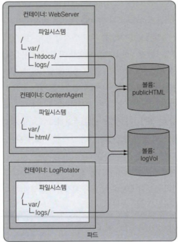
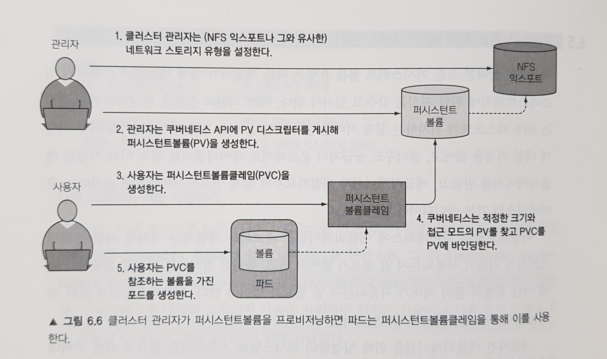
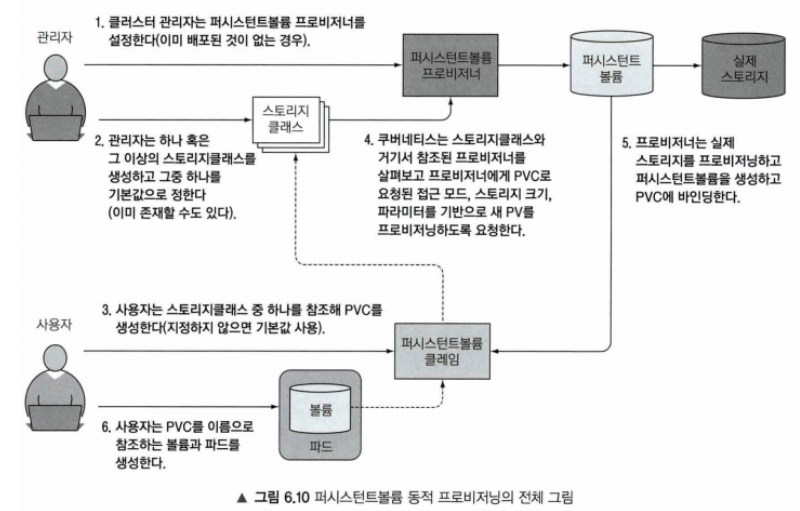

### 볼륨의 필요성 
새로 시작된 컨테이너는 이전의 실행되었던 컨테이너의 어떤 정보도 볼 수 없습니다.
하지만 상황에 따라 이전에 종료된 위치에서 이어서 시작하기 원할 수 있고, 컨테이너에서 발생한 데이터를 보존하고 싶을 수 있습니다.
이런 요구 사항을 위해 쿠버네티스는 `스토리지 볼륨` 기능을 제공합니다. 파드의 일부분으로 정의되고 파드와 동일한 라이프사이클을 가집니다.
그래서 파드 시작되면 생성되고, 파드가 삭제되면 볼륨도 삭제됩니다. 그래서 파드내의 컨테이너의 생성/종료 여부에 스토리지 볼륨에 기록한 데이터를 확인할 수 있습니다.

### 볼륨
쿠버네티스의 볼륨은 파드 구성 요소중 하나로 컨테이너와 동일하게 파드 스펙에서 정의됩니다.
독립적으로 생성/삭제 할 수 없고, 파드 내의 모든 컨테이너가 마운트하여 볼륨을 사용할 수 있습니다.

### 볼륨 사용 예시
세 개의 컨테이너가 있습니다. 각 컨테이너는 다음과 같은 기능들을 가지고 있습니다.
- 첫 번째 컨테이너(웹 서비스 컨테이너)
  - /var/htdocs 디렉토리에 HTML 페이지를 서비스
  - /var/logs 디렉토리에 액세스 로그를 저장
- 두 번째 컨테이너(HTML 에이전트 컨테이너)
  - /var/html 디렉토리에 HTML 파일을 생성하는 에이전트를 실행
- 세 번째 컨테이너(로깅 컨테이너)
  - /var/logs 디렉토리에서 로그 데이터를 처리(로그 순환, 압축 등)

이 상황에서 각 컨테이너는 단일 책임갖고 각자만의 기능을 가지고 있지만, 서로의 자원이 공유되지 않는 상황에서는 아무런 동작을 하지 않습니다.
볼륨 2개를 각각의 컨테이너에서 마운트하여 사용하면 문제를 해결할 수 있습니다.

- 첫 번째 볼륨(HTML)
  - 첫 번째 컨테이너에서 /var/htdocs에 마운트
  - 두 번째 컨테이너에서 /var/html에 마운트
- 두 번째 볼륨(Log)
  - 첫 번째 컨테이너에서 /var/logs에 마운트
  - 두 번쨰 컨테이너에사 /var/logs에 마운트
이와 같이 볼륨을 정의해서 에이전트 컨테이너에서 생성한 HTML 파일을 웹 서비스 컨테이너에서 처리할 수 있고, 이로 인해 발생한 로그들을 로깅 컨테이너에 의해 로그 데이터를 처리할 수 있습니다.



위 내용을 토대로 구성한 그림이다.

### 볼륨 유형
볼륨은 파드의 존재하는 동안 유지되지만, 특정 볼륨 유형에 따라 파드가 사라진 후에도 볼륨이 유지되어 새로윤 볼륨으로 마운트될 수 있습니다. 그래서 볼륨의 유형을 정리합니다.

### emptyDir
가장 간단한 볼륨 유형으로, 파드가 노드에 할당될 때 처음 생성됩니다. 파드가 실행 중일 때만 존재하며 처음 비어있는 상태로 생성됩니다.
파드내의 모든 컨테이너는 마운트하여 사용하여 사용할 수 있지만, 파드가 종료되면 해당 볼륨은 영구히 삭제됩니다.
동일 파드에서 컨테이너 간 파일을 공유할 떄 사용됩니다.

```
apiVersion: v1
kind: Pod
metadata:
  name: test-pd
spec:
  containers:
  - image: registry.k8s.io/test-webserver
    name: test-container
    volumeMounts:
    - mountPath: /cache
      name: cache-volume
  volumes:
  - name: cache-volume
    emptyDir:
      sizeLimit: 500Mi
```
매니페스트 파일을 보면 컨테이너의 /cache 디렉토리를 마운트하여 사용하고, 볼륨의 용량은 500MiB 크기이다.

```
volumes:
  - name: cache-volume
    emptyDir:
      sizeLimit: 500Mi
```
를 사용해서 디스크가 아닌 메모리를 사용하고 변경할 수 있다.

### hostPath
hostPath은 파드를 호스트하는 노드의 파일시스템 파일이나 디렉토리를 가리킨다.
파드가 삭제되면 볼륨이 사라지는 emptyDir과 달리 파드가 종료되어도 볼륨이 살아있어 데이터가 유지된다.
파드가 스케줄링되어 다른 노드에 저장되면 문제가 발생할 수 있으므로, 파드에 의존하여 사용하면 안된다.

### nfs
nfx 볼륨은 기존 NFS(네트워크 파일 시스템) 볼륨을 파드에 마운트할 수 있습니다. emptyDir과는 다르게 마운트가 해제되어도 볼륨의 데이터는 유지됩니다.
NFX는 미리 데이터를 채워 사용할 수 있고, 여러 파드가 데이터를 공유하여 사용할 수 있습니다.

```
apiVersion: v1
kind: Pod
metadata:
  name: test-pd
spec:
  containers:
  - image: registry.k8s.io/test-webserver
    name: test-container
    volumeMounts:
    - mountPath: /nfs-data
      name: test-volume
  volumes:
  - name: test-volume
    nfs:
      server: nfs-server.example.com
      path: /nfs-volume
      readOnly: true
```
매니페스트 파일을 확인하여 NFX서버가 동작 중인 상태에서 /nfs-volume 디렉토리를 마운트 하여 /nfs-data 경로를 통해 사용한 예시이다.


### 퍼시스턴트 볼륨
쿠버네티스는 퍼시스턴스 볼륨(PV), 퍼시스턴스 볼륨 클레임(PVC) 리소스를 제공함으로 써 사용자에게 스토리지를 제공한다.

PV는 클러스터 관리자가 프로비저닝 하거나 스토리지 클래스를 사용하여 생성된 클러스터의 스토리지를 참조합니다. 스토리지는 관리자가 직접 NFS나 AWS같은 스토리지 클래스를 사용하여 구성합니다. 
노드가 클러스터의 리소스(구성 요소)인 것처럼 PV는 클러스터의 리로스입니다. 

PVC는 파드가 PV리소스에 대한 요청입니다. 파드가 노드에게 특정 수준의 리로스(CPU, RAM)을 요청하는 것 처럼 클레임은 특정 크기, 접근 모드(Read, Write)를 요청합니다.

그림과 yaml 매니페스트를 통해 자세히 알아봅니다.


그림을 보면 쿠버네티스 API를 사용해 NFS 스토리에 대한 PV를 생성합니다.

```
apiVersion: v1
kind: PersistentVolume
metadata:
  name: pv-nfs
spec:
  capacity:
    storage: 100Gi
  accessModes:
    - ReadWriteMany
  nfs:
    path: /tmp
    server: nfs-server.com
```
이 pv 생성 매니페스트를 보면 `nfs-server.com` 의 NFS 파일 스토리지를 이용하여, NFS 서버의 /tmp 디렉토리를 참조하는 PV를 만듭니다.
이 PV는 100GiB 용량을 가지며 접근 모드는 `ReadWriteMany`입니다.

접근 모드는 다음과 같습니다
- ReadWriteOnce
  - 하나의 노드에서 해당 볼륨이 읽기/쓰기로 마운트 될 수 있다.
- ReadOnlyMany
  - 볼륨이 다수의 노드에서 읽기 전용으로 마운트 될 수 있다.
- ReadWriteMany
  - 볼륨이 다수의 노드에서 읽기/쓰기로 마운트 될 수 있다.
- ReadWriteOncePod
  - 볼륨이 단일 파드에서 읽기/쓰기로 마운트 될 수 있다.(전체 클러스터에서 하나의 파드만 해당 PVC를 읽기/쓰기할 수 있습니다.)

```
apiVersion: v1
kind: PersistentVolumeClaim
metadata:
  name: pvc-nfs
spec:
  accessModes:
    - ReadWriteMany
  resources:
    requests:
      storage: 50Gi
```
이 pvc는 pv로 부터 50Gib 스토리지를 사용을 요청하고, 해당 볼륨은 다수의 노드에서 읽기/쓰기로 마운트 될 수 있음을 의미한다.

```
apiVersion: v1
kind: Pod
metadata:
  name: nfs-client
spec:
  containers:
  - name: app
    image: busybox
    volumeMounts:
    - mountPath: "/mnt"
      name: nfs-storage
    command: [ "touch 'testfile'" ]
  volumes:
  - name: nfs-storage
    persistentVolumeClaim:
      claimName: pvc-nfs
```
파드에서 pvc를 이용해 볼륨을 마운트하는 매니페스트 파일입니다.
이미 전 과정으로 인해 pv와 바인딩된 pvc가 있고, `pvc-nfs` pvc를 사용하여 `/mnt` 디렉토리에 50Gib 크기만큼 마운트하고 최초 실행 시 testfile을 생성합니다.

그럼 퍼시스턴스 볼륨을 사용했을 때 어떤 장점이 있는가?
1. 개발자가 스토리기 요구 기술을 알 필요 없다.
초기엔 pv, pvc를 생성하고 설정을 해주어야 하지만 첫 생성 이후 개발자는 pvc를 이용해 필요한 스토리지를 가져올 수 있다.
2. 클러스터간 데이터 공유
스토리지를 클러스터 외부로 구성한 경우, 각각의 클러스터에서 pv, pvc 설정만 된다면 사용할 수 있고 클러스터 간 데이터의 공유도 가능하다.
<<<<<<< HEAD

### 동적 프로비저닝
퍼시스턴트 볼륨과 퍼시스턴트 볼륨 클레임을 통해 개발자가 내부적으로 별도의 과정없이 스토리지를 사용할 수 있는지 확인했습니다.
하지만 클러스터 관리자 입장에선 실제 스토리지를 pv에 바인딩을 미리 해놔야 합니다. 쿠버네티스는 동적 프로비저닝을 통해 이 작업을 자동으로 수행합니다.

클러스터 관리자는 pv을 직접 생성하는 대신 `퍼시스턴트볼륨 프로비저너`를 배포하고, 사용자가 선택 가능한 퍼시스턴트볼륨의 타입을 하나 이상의 `스토리지클래스` 오브젝트로 정의할 수 있습니다. 사용자가 pvc로 스토리지클래스를 참조하면 프로비저너가 스토리지를 프로비저닝 하는 방식으로 처리합니다.


그림을 보면 좀 더 이해하기 쉽다. 여기서 PV를 얻는 방법은 다음과 같다.
1. 퍼시스턴트볼륨 프로비저너, 스토리지 클래스 정의
스토리지 클래스는 AWS EBS, GCE Persistent Disk 같은 클라우드 공급자의 서비스나 오픈소스 스토리지 솔루션인 Ceph, NFS 등을 사용하여 동적 프로비저닝됩니다.
2. pvc 정의
pvc는 `필요한 스토리지 크기`와 `접근 모드`를 지정하고 사용할 스토리지 클래스틑 참조합니다.
클러스터에 `기본 스토리지 클래스`가 정의되어 있는 경우 사용할 스토리지 클래스를 지정하지 않으면 자동으로 기본 스토리지 클래스를 참조합니다.
3. 파드 생성 및 pvc 요청
파드 yaml 매니페스트에 명시된 pvc를 요청합니다.
pvc에 명시된 스토리지 클래스가 `프로비지너`를 호출하여 PV를 동적으로 할당합니다.


__필요한 패키지는 설치가 되어있다고 가정합니다__


1. 스토리지 클래스 생성
```
apiVersion: storage.k8s.io/v1
kind: StorageClass
metadata:
  name: nfs-storage
provisioner: kimho.com/nfs-provisioner
parameters:
  path: /srv/nfs/k8s
  server: nfs-server.kimho.com
```
`provisioner` 의 값은 실제 `aws-ebs`, `gce-pd`같은 서비스에서 제공하는 프로비지너 플러그인이다.

1. pvc 생성
```
apiVersion: v1
kind: PersistentVolumeClaim
metadata:
  name: nfs-pvc
spec:
  accessModes:
    - ReadWriteMany
  resources:
    requests:
      storage: 10Gi
  storageClassName: nfs-storage
```
접근 모드는 `ReadWriteMany`, `10Gib`, 위에서 정의한 스토리지 클래스 `nfs-storage`를 참조한다.

1. pvc 요청 파드
```
apiVersion: v1
kind: Pod
metadata:
  name: nfs-pod
spec:
  containers:
  - name: nginx
    image: nginx
    volumeMounts:
    - mountPath: "/usr/share/nginx/html"
      name: nfs-volume
  volumes:
  - name: nfs-volume
    persistentVolumeClaim:
      claimName: nfs-pvc
```
이 파드가 생성될 때 `persistentVolumeClaim: claimName: nfs-pvc` 설정에 의해 nfs-pvc 이름을 가진 pvc를 요청합니다.

pvc 요청이 오면 nfs-storage 클래스를 참조하여 실제 pv가 생성 및 할당이 됩니다.
